# 配电终端统一运维工具协议层 SDK 接口设计

## 版本变更记录

| 版本号 | 日期 | 修改人 | 变更说明 |
| --- | --- | --- | --- |
| V1.0 | 2026-05-12 | 姜俊丞 | 初始版本 |

## 1. 文档目的

本文档定义 `dtu-unified-maintenance-sdk` 的运维101、`IEC 60870-5-101`、`IEC 60870-5-104` 协议层动态库接口草案，用于接口冻结、实现对齐和跨平台交付。

当前阶段优先交付 Windows `.dll`；后续可按同一 ABI 思路扩展 Linux `.so` 产物。接口设计需避免绑定 Windows 专用类型。

本文档聚焦主站侧能力，采用以下设计原则：

- 对外按三套动态库分别暴露协议前缀：运维101 使用 `m101_`，标准101 使用 `iec101_`，标准104 使用 `iec104_`。
- 三套动态库复用公共类型、回调和错误语义，业务能力保持同形函数签名，便于上位机按协议选择接入。
- 公共对象模型固定为单会话句柄，内部状态机实现由库内部维护。
- 协议库通过外部 `transport` 收发明文协议帧，不直接操作串口、socket 或电科院安全接口库。
- 对外 ABI 使用 C ABI，便于 C/C++ 及其他语言绑定。
- 数据接口以高层点表对象为主，同时保留原始 ASDU 旁路能力。
- 参数读取、批量写入、回读校验、定值区切换、文件目录召唤、文件读写和断点续传等统一运维能力通过独立高层接口承载。
- 错误处理采用同步返回码 + 异步事件回调组合模型。

## 2. 适用范围

本文档当前聚焦 Windows 上位机主站侧协议层动态库接口，并兼顾后续 Linux 移植约束，覆盖以下能力：

- 运维101 主站会话创建、启动、停止、销毁。
- 标准101 主站会话创建、启动、停止、销毁。
- 标准104 主站会话创建、启动、停止、销毁。
- 三套协议库共享会话生命周期、transport、回调和错误模型。
- 点表上送事件建模，包括单点、双点、遥测、累计量等常见对象。
- 参数读取、批量写入、回读校验、定值区管理和终端自描述获取。
- 文件目录召唤、文件读取、文件写入、状态查询、取消和断点续传。
- 遥控、总召、电度量召唤、时钟同步等主站侧典型操作。
- 原始 ASDU 观察和透传发送能力。
- 链路状态、异常、日志、命令结果、参数结果、文件目录结果和文件传输结果等异步事件回调。

## 3. API 总览

### 3.1 整体架构与职责边界

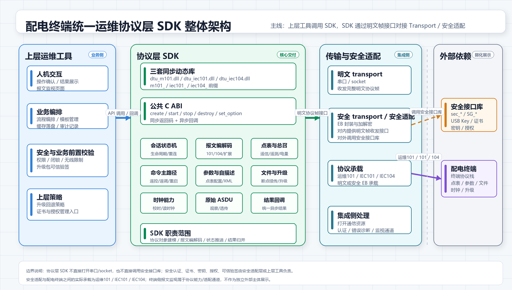

上图用于说明协议层 SDK 在统一运维工具中的位置和边界。图中的模块划分表达职责归属，不要求所有模块必须拆成独立进程或独立动态库。

- 上层运维工具负责人机交互、业务流程编排、权限闭锁、升级包可信验签、审计记录和证书授权管理入口。
- 协议层 SDK 是本文档的核心交付，负责三套同步动态库、公共 C ABI、协议对象建模、报文编解码、状态机推进、文件与升级流程以及统一异步结果回调。
- 传输与安全适配由调用方或集成侧实现，负责打开串口/socket、封装 `iec_transport_t`、调用安全接口库、完成安全认证和 EB 加解密，并向 SDK 暴露明文协议帧收发接口。
- 安全接口库和配电终端作为外部依赖或对端展示。SDK 不直接调用 `sec_*`、`SG_*` 等安全库接口，也不直接管理终端侧通信资源。
- 安全适配与配电终端之间的实际承载仍为运维101、IEC101 或 IEC104；报文监视由上层工具调用 SDK 或适配层能力实现，不作为协议层 SDK 直接对外暴露的独立外部主体。

### 3.2 设计总原则

- 三套协议库分别导出带协议前缀的函数集，不通过统一函数表分发。
- 公共类型负责生命周期、运行控制、点表事件、命令、旁路和统一错误语义。
- 串口参数、远端地址、端口、安全认证和真实物理收发由上位机或安全适配层处理，不进入协议库配置。
- 协议库通过 `iec_transport_t` 收发明文协议帧；明文传输、安全封装、串口或 socket 细节均由 transport 实现。
- 文件目录、文件读写和断点续传保持同形函数签名；运维101库导出 `m101_` 前缀，标准101/104库导出各自协议前缀。
- 公共结构体保持轻量字段布局，沿用项目既有接入习惯，不引入额外版本握手字段。
- 所有回调都在 `<prefix>_create` 阶段注册，由库内工作线程触发。
- 参数模板导入导出和界面生成由上层应用负责，动态库负责参数对象建模和协议交互。

建议交付产物与函数前缀如下：

| 动态库 | 协议定位 | 导出函数前缀 | 配置结构体 |
| --- | --- | --- | --- |
| `GW_m101.dll` | 运维101 主站协议库 | `m101_` | `m101_master_config_t` |
| `GW_iec101.dll` | 标准 IEC 60870-5-101 主站协议库 | `iec101_` | `iec101_master_config_t` |
| `GW_iec104.dll` | 标准 IEC 60870-5-104 主站协议库 | `iec104_` | `iec104_master_config_t` |

### 3.3 核心函数总表

以下为三套协议库保持同形的核心函数族。表中使用 `<prefix>` 表示协议前缀：运维101 为 `m101`，标准101 为 `iec101`，标准104 为 `iec104`。当目标协议或终端能力不支持某项运维能力时，动态库应返回明确的 `IEC_STATUS_UNSUPPORTED` 或异步结果码。

| API | 用途 | 关键输入 | 同步返回含义 | 关联异步结果 |
| --- | --- | --- | --- | --- |
| `<prefix>_create` | 创建会话对象并拷贝配置 | 公共配置、协议扩展配置、transport、回调集合 | 表示会话对象初始化阶段是否完成 | 无 |
| `<prefix>_destroy` | 销毁会话对象 | 会话句柄 | 表示资源释放阶段是否完成 | 无 |
| `<prefix>_get_runtime_state` | 查询当前会话生命周期状态 | 会话句柄 | 是否成功写出状态枚举 | 无 |
| `<prefix>_set_option` | 修改允许运行时变更的选项 | 选项枚举、值缓冲区 | 是否成功接受配置更新 | 部分改动会影响后续回调行为 |
| `<prefix>_start` | 启动工作线程并进入协议会话流程 | 会话句柄 | 启动请求是否被接受 | `on_session_state`、`on_link_event` |
| `<prefix>_stop` | 请求停止并等待会话退出 | 会话句柄、停止超时 | 停止请求是否完成 | `on_session_state` |
| `<prefix>_general_interrogation` | 发起总召 | 总召请求结构体 | 请求是否被接受 | `on_point_indication`、`on_link_event` |
| `<prefix>_counter_interrogation` | 发起电度量召唤 | 电度量召唤请求结构体 | 请求是否被接受 | `on_point_indication`、`on_link_event` |
| `<prefix>_read_point` | 按地址读取单个对象 | 点位地址 | 请求是否被接受 | `on_point_indication`、`on_link_event` |
| `<prefix>_control_point` | 下发遥控、设定值或扩展运维遥控命令 | 命令请求结构体 | 请求是否被接受并生成命令 ID | `on_command_result` |
| `<prefix>_get_device_description` | 获取终端自描述内容 | 自描述请求结构体 | 请求是否被接受并生成请求 ID | `on_device_description` |
| `<prefix>_read_parameters` | 读取参数或参数分组 | 参数读取请求结构体 | 请求是否被接受并生成请求 ID | `on_parameter_indication` |
| `<prefix>_write_parameters` | 批量写入参数 | 参数写入请求结构体 | 请求是否被接受并生成请求 ID | `on_parameter_result` |
| `<prefix>_verify_parameters` | 按期望值回读校验参数 | 参数校验请求结构体 | 请求是否被接受并生成请求 ID | `on_parameter_result`、`on_parameter_indication` |
| `<prefix>_switch_setting_group` | 查询或切换定值区 | 定值区请求结构体 | 请求是否被接受并生成请求 ID | `on_parameter_result` |
| `<prefix>_list_files` | 召唤远端文件目录 | 文件目录请求结构体 | 请求是否被接受并生成请求 ID | `on_file_list_indication`、`on_file_operation_result` |
| `<prefix>_read_file` | 读取远端文件，支持按偏移续传 | 文件读取请求结构体 | 请求是否被接受并生成传输 ID | `on_file_data_indication`、`on_file_operation_result` |
| `<prefix>_write_file` | 写入远端文件，支持按偏移续传 | 文件写入请求结构体 | 请求是否被接受并生成传输 ID | `on_file_operation_result` |
| `<prefix>_get_file_transfer_status` | 查询文件传输本地状态快照 | 传输 ID | 是否成功写出当前状态视图 | 无 |
| `<prefix>_cancel_file_transfer` | 请求取消进行中的文件传输 | 传输 ID | 取消请求是否被接受 | `on_file_operation_result` |
| `<prefix>_upgrade_firmware` | 启动程序升级状态机 | 升级请求结构体 | 请求是否被接受并生成升级 ID | `on_upgrade_progress`、`on_upgrade_result` |
| `<prefix>_cancel_upgrade` | 请求取消程序升级 | 升级 ID | 取消请求是否被接受 | `on_upgrade_progress`、`on_upgrade_result` |
| `<prefix>_clock_sync` | 发送校时命令 | 校时请求结构体 | 请求是否被接受并生成请求 ID | `on_clock_result` |
| `<prefix>_read_clock` | 读取终端当前时间 | 时钟读取请求结构体 | 请求是否被接受并生成请求 ID | `on_clock_result` |
| `<prefix>_send_raw_asdu` | 主动透传原始 ASDU | 原始发送请求结构体 | 请求是否被接受 | `on_raw_asdu`、`on_link_event` |

### 3.4 关键回调总表

| 回调 | 触发时机 | 主要用途 | 线程语义 |
| --- | --- | --- | --- |
| `on_session_state` | 生命周期状态变化时 | 观测会话从创建到运行、停止的状态流转 | 由库内工作线程触发 |
| `on_link_event` | 建链、断链、重连、链路异常时 | 感知链路健康状态 | 由库内工作线程触发 |
| `on_point_indication` | 收到高层点表对象时 | 接收单点、双点、遥测、累计量等对象 | 由库内工作线程触发 |
| `on_command_result` | 命令收到确认、否认或超时时 | 获取命令最终结果 | 由库内工作线程触发 |
| `on_device_description` | 收到终端自描述内容时 | 接收 XML 或 msg 自描述文件并供上层解析 | 由库内工作线程触发 |
| `on_file_list_indication` | 收到文件目录分帧结果时 | 接收目录项并构建远端文件视图 | 由库内工作线程触发 |
| `on_file_data_indication` | 收到文件读取数据块时 | 接收文件块、推进偏移并支撑断点续传 | 由库内工作线程触发 |
| `on_file_operation_result` | 文件目录、文件读写或取消完成时 | 获取文件类请求的最终结果 | 由库内工作线程触发 |
| `on_upgrade_progress` | 程序升级阶段或进度变化时 | 获取升级启动、执行、传输、结束等阶段进度 | 由库内工作线程触发 |
| `on_upgrade_result` | 程序升级完成、失败或取消时 | 获取升级最终结果和诊断信息 | 由库内工作线程触发 |
| `on_clock_result` | 校时或时钟读取完成时 | 获取校时确认、终端当前时间或失败诊断 | 由库内工作线程触发 |
| `on_parameter_indication` | 收到参数读取结果时 | 接收参数值和可选参数描述信息 | 由库内工作线程触发 |
| `on_parameter_result` | 参数写入、校验、切区完成时 | 获取参数类请求的最终结果 | 由库内工作线程触发 |
| `on_raw_asdu` | 启用旁路且收发原始 ASDU 时 | 调试抓包、特殊报文透传 | 由库内工作线程触发 |
| `on_log` | 产生日志时 | 联调、排障和接入监控 | 由库内工作线程触发 |

### 3.5 关键结构体总表

| 结构体 | 作用 | 关键字段 |
| --- | --- | --- |
| `iec_session_config_t` | 公共配置 | 超时、重连间隔、日志等级、`user_context` |
| `iec_transport_t` | 外部传输接口 | 明文帧发送函数、明文帧接收函数、上下文、最大明文帧长 |
| `iec_callbacks_t` | 回调集合 | 状态、链路、点表、命令、自描述、文件目录、文件数据、文件结果、升级、时钟、参数、原始 ASDU、日志回调 |
| `iec_point_address_t` | 协议原生地址 | 公共地址、信息体地址、类型标识、传送原因 |
| `iec_point_value_t` | 高层点值 | 点值类型、质量位、时间戳、实际数据 |
| `iec_command_request_t` | 控制命令 | 目标地址、命令类型、命令语义、命令模式、命令值 |
| `iec_parameter_item_t` | 单个参数值对象 | 参数 ID、地址、参数域、值类型、当前值 |
| `iec_parameter_descriptor_t` | 参数元数据 | 名称、分组、范围、缺省值、模板/校验能力 |
| `iec_parameter_read_request_t` | 参数读取请求 | 读取模式、参数域、地址范围、定值区 |
| `iec_parameter_write_request_t` | 参数写入请求 | 参数数组、目标定值区、写后校验开关 |
| `iec_device_description_t` | 自描述内容事件 | 格式、内容视图、分片完成标记 |
| `iec_file_list_request_t` | 文件目录请求 | 目录名、是否附带详情 |
| `iec_file_entry_t` | 单个目录项 | 文件名、文件大小、时间戳、校验摘要 |
| `iec_file_list_indication_t` | 文件目录结果 | 目录项数组、数量、结束标记 |
| `iec_file_read_request_t` | 文件读取请求 | 目录名、文件名、起始偏移、块大小 |
| `iec_file_write_request_t` | 文件写入请求 | 文件名、总大小、起始偏移、待发送内容 |
| `iec_file_data_indication_t` | 文件数据块事件 | 当前偏移、下一偏移、数据块视图 |
| `iec_file_transfer_status_t` | 文件传输状态快照 | 传输方向、状态、已确认偏移、是否可续传、最近一次底层错误信息 |
| `iec_file_operation_result_t` | 文件操作结果 | 操作类型、结果码、最终偏移、总大小、协议诊断细节 |
| `iec_upgrade_request_t` | 程序升级请求 | 远端文件位置、升级包大小、分块读取回调、分块大小、诊断校验文本 |
| `iec_upgrade_progress_t` | 程序升级进度 | 升级阶段、已传输字节数、总大小、关联文件传输 ID |
| `iec_upgrade_result_t` | 程序升级结果 | 结果码、最终阶段、已传输字节数、协议诊断细节 |
| `iec_clock_read_request_t` | 时钟读取请求 | 公共地址 |
| `iec_clock_result_t` | 时钟命令结果 | 操作类型、结果码、终端时标、协议诊断细节 |
| `iec_raw_asdu_event_t` | 原始报文事件 | 收发方向、类型标识、公共地址、载荷视图 |
| `m101_master_config_t` | 运维101 扩展配置 | 链路地址、字段长度、重发参数、运维文件能力约束 |
| `iec101_master_config_t` | 标准101 扩展配置 | 链路地址、字段长度、重发参数 |
| `iec104_master_config_t` | 104 扩展配置 | 地址字段长度、K/W/T 参数 |

### 3.6 对外句柄与头文件骨架

```c
#ifdef __cplusplus
extern "C" {
#endif

/* 对外通过不透明会话句柄访问会话，内部状态机和资源布局由库内部维护。 */
typedef struct iec_session iec_session_t;

#ifdef __cplusplus
}
#endif
```

## 4. 同形导出 API 详细定义

### 4.1 会话管理与运行控制

#### <prefix>_create

| 字段 | 内容 |
| --- | --- |
| 函数名称 | `iec_status_t <prefix>_create(const iec_session_config_t *config, const void *protocol_config, const iec_transport_t *transport, const iec_callbacks_t *callbacks, iec_session_t **out_session)` |
| 函数功能 | 创建会话对象，并拷贝公共配置、协议扩展配置、transport 和回调集合。 |
| 入参 | `const iec_session_config_t *config`: 公共配置，定义超时、运行时选项和用户上下文。 |
|  | `const void *protocol_config`: 协议扩展配置。运维101库应指向 `m101_master_config_t`；标准101库应指向 `iec101_master_config_t`；标准104库应指向 `iec104_master_config_t`。 |
|  | `const iec_transport_t *transport`: 外部传输接口，协议库通过它收发明文协议帧。 |
|  | `const iec_callbacks_t *callbacks`: 异步回调集合。创建成功后，库内部持有其副本。 |
| 出参 | `iec_session_t **out_session`: 输出会话句柄地址。成功时写入新建会话对象。 |
| 返回值 | `IEC_STATUS_OK`: 创建成功；失败返回其他错误码，详见返回码定义。 |
| 异步回调 | 无。 |
| 备注 | `<prefix>` 取 `m101`、`iec101` 或 `iec104`。`config`、`protocol_config`、`transport`、`callbacks` 和 `out_session` 均不能为空；成功时 `*out_session != NULL`。协议库不直接打开或持有串口/socket，只通过 transport 收发明文帧。 |

#### <prefix>_destroy

| 字段 | 内容 |
| --- | --- |
| 函数名称 | `iec_status_t <prefix>_destroy(iec_session_t *session)` |
| 函数功能 | 销毁会话对象，释放会话对象及其关联资源。 |
| 入参 | `iec_session_t *session`: 待销毁的会话句柄。 |
| 出参 | 无。 |
| 返回值 | `IEC_STATUS_OK`: 销毁成功；失败返回其他错误码，详见返回码定义。 |
| 异步回调 | 无。 |
| 备注 | 支持在 `CREATED`、`STOPPED` 或 `FAULTED` 状态下调用。成功后 `session` 立即失效，调用方不得再次使用。停止流程由 `<prefix>_stop` 承担。 |

#### <prefix>_get_runtime_state

| 字段 | 内容 |
| --- | --- |
| 函数名称 | `iec_status_t <prefix>_get_runtime_state(const iec_session_t *session, iec_runtime_state_t *out_state)` |
| 函数功能 | 查询当前会话生命周期状态。 |
| 入参 | `const iec_session_t *session`: 目标会话句柄。 |
| 出参 | `iec_runtime_state_t *out_state`: 生命周期状态输出地址。成功时写入当前生命周期状态。 |
| 返回值 | `IEC_STATUS_OK`: 查询成功；失败返回其他错误码，详见返回码定义。 |
| 异步回调 | 无。 |
| 备注 | 本函数返回调用时刻的生命周期状态快照，不主动触发状态流转。 |

#### <prefix>_set_option

| 字段 | 内容 |
| --- | --- |
| 函数名称 | `iec_status_t <prefix>_set_option(iec_session_t *session, iec_option_t option, const void *value, uint32_t value_size)` |
| 函数功能 | 修改运行时可变选项。 |
| 入参 | `iec_session_t *session`: 目标会话句柄。 |
|  | `iec_option_t option`: 选项标识，应从文档声明的可动态修改项中选择。 |
|  | `const void *value`: 选项值缓冲区。 |
|  | `uint32_t value_size`: `value` 对应的缓冲区大小。 |
| 出参 | 无。 |
| 返回值 | `IEC_STATUS_OK`: 修改成功；失败返回其他错误码，详见返回码定义。 |
| 异步回调 | 无固定回调。部分选项修改会影响后续异步回调行为。 |
| 备注 | `value` 和 `value_size` 由调用方提供，库内部会立即读取所需内容；调用返回后无需继续保持该缓冲区有效。 |

#### <prefix>_start

| 字段 | 内容 |
| --- | --- |
| 函数名称 | `iec_status_t <prefix>_start(iec_session_t *session)` |
| 函数功能 | 启动协议会话，创建内部工作线程并开始协议流程。 |
| 入参 | `iec_session_t *session`: 待启动的会话句柄。 |
| 出参 | 无。 |
| 返回值 | `IEC_STATUS_OK`: 启动请求已进入执行流程；失败返回其他错误码，详见返回码定义。 |
| 异步回调 | `on_session_state`、`on_link_event`。 |
| 备注 | 本函数不负责打开串口、不配置串口参数，也不主动创建 TCP 连接。协议库通过 create 阶段传入的 transport 收发明文协议帧。同步返回成功仅表示启动请求已被接受，最终运行状态通过异步回调体现。 |

#### <prefix>_stop

| 字段 | 内容 |
| --- | --- |
| 函数名称 | `iec_status_t <prefix>_stop(iec_session_t *session, uint32_t timeout_ms)` |
| 函数功能 | 请求会话退出并等待内部线程收敛。 |
| 入参 | `iec_session_t *session`: 待停止的会话句柄。 |
|  | `uint32_t timeout_ms`: 停止等待窗口，单位为毫秒。 |
| 出参 | 无。 |
| 返回值 | `IEC_STATUS_OK`: 停止流程已完成；`IEC_STATUS_TIMEOUT`: 等待窗口结束，但停止流程仍可能继续收敛；其他值为错误码。 |
| 异步回调 | `on_session_state`。 |
| 备注 | 本函数负责停止流程，句柄释放由 `<prefix>_destroy` 承担。 |

行为约束如下：

- `<prefix>_create` 覆盖参数校验、transport 绑定和对象初始化；串口/socket 打开、明文或安全传输选择由调用方在创建前完成。
- `<prefix>_start` 成功返回表示启动请求已进入执行流程，链路建立结果由后续回调体现。
- `<prefix>_stop` 负责请求退出并等待线程收敛，句柄释放由 `<prefix>_destroy` 承担。
- `<prefix>_destroy` 负责资源释放阶段。

### 4.2 数据面、命令与旁路接口

#### <prefix>_general_interrogation

| 字段 | 内容 |
| --- | --- |
| 函数名称 | `iec_status_t <prefix>_general_interrogation(iec_session_t *session, const iec_interrogation_request_t *request)` |
| 函数功能 | 发起总召。 |
| 入参 | `iec_session_t *session`: 目标会话句柄。 |
|  | `const iec_interrogation_request_t *request`: 总召请求，描述目标公共地址和总召限定词。 |
| 出参 | 无。 |
| 返回值 | `IEC_STATUS_OK`: 请求已进入发送流程；失败返回其他错误码，详见返回码定义。 |
| 异步回调 | `on_point_indication`、`on_link_event`。 |
| 备注 | 同步返回成功仅表示请求已进入发送流程，后续数据通过点表回调异步返回。 |

#### <prefix>_counter_interrogation

| 字段 | 内容 |
| --- | --- |
| 函数名称 | `iec_status_t <prefix>_counter_interrogation(iec_session_t *session, const iec_counter_interrogation_request_t *request)` |
| 函数功能 | 发起电度量召唤。 |
| 入参 | `iec_session_t *session`: 目标会话句柄。 |
|  | `const iec_counter_interrogation_request_t *request`: 电度量召唤请求，描述目标公共地址、召唤限定词和冻结语义。 |
| 出参 | 无。 |
| 返回值 | `IEC_STATUS_OK`: 请求已进入发送流程；失败返回其他错误码，详见返回码定义。 |
| 异步回调 | `on_point_indication`、`on_link_event`。 |
| 备注 | 同步返回成功仅表示请求已进入发送流程，后续结果通过异步回调体现。 |

#### <prefix>_read_point

| 字段 | 内容 |
| --- | --- |
| 函数名称 | `iec_status_t <prefix>_read_point(iec_session_t *session, const iec_point_address_t *address)` |
| 函数功能 | 按单点地址读取对象。 |
| 入参 | `iec_session_t *session`: 目标会话句柄。 |
|  | `const iec_point_address_t *address`: 点位地址，采用协议原生地址建模，直接表达公共地址和信息体地址。 |
| 出参 | 无。 |
| 返回值 | `IEC_STATUS_OK`: 请求已进入发送流程；失败返回其他错误码，详见返回码定义。 |
| 异步回调 | `on_point_indication`、`on_link_event`。 |
| 备注 | 同步返回成功仅表示请求已进入发送流程，读取结果通过异步回调体现。 |

#### <prefix>_control_point

| 字段 | 内容 |
| --- | --- |
| 函数名称 | `iec_status_t <prefix>_control_point(iec_session_t *session, const iec_command_request_t *request, uint32_t *out_command_id)` |
| 函数功能 | 下发控制命令、设定值命令或以遥控格式承载的扩展运维命令。 |
| 入参 | `iec_session_t *session`: 目标会话句柄。 |
|  | `const iec_command_request_t *request`: 命令请求，描述目标地址、命令类型、命令语义、命令模式和命令值。 |
| 出参 | `uint32_t *out_command_id`: 命令 ID 输出地址。成功时由库生成，用于关联异步命令结果。 |
| 返回值 | `IEC_STATUS_OK`: 请求已进入发送流程；失败返回其他错误码，详见返回码定义。 |
| 异步回调 | `on_command_result`。 |
| 备注 | 命令最终结果以 `on_command_result` 回调为准。恢复出厂设置、设备重启等危险操作仍走本接口，但调用前的用户确认、权限校验、安全校核和操作审计由上层应用负责。 |

#### <prefix>_clock_sync

| 字段 | 内容 |
| --- | --- |
| 函数名称 | `iec_status_t <prefix>_clock_sync(iec_session_t *session, const iec_clock_sync_request_t *request, uint32_t *out_request_id)` |
| 函数功能 | 发送校时命令。 |
| 入参 | `iec_session_t *session`: 目标会话句柄。 |
|  | `const iec_clock_sync_request_t *request`: 校时请求，可指定固定时间戳，也可要求库在发送时自动采集系统时间。 |
| 出参 | `uint32_t *out_request_id`: 请求 ID 输出地址。成功时由库生成，用于关联异步结果。 |
| 返回值 | `IEC_STATUS_OK`: 请求已进入发送流程；失败返回其他错误码，详见返回码定义。 |
| 异步回调 | `on_clock_result`。 |
| 备注 | 若 `use_current_system_time` 为真，库应在实际组帧前采集当前系统时间，避免排队造成时标偏差。 |

#### <prefix>_read_clock

| 字段 | 内容 |
| --- | --- |
| 函数名称 | `iec_status_t <prefix>_read_clock(iec_session_t *session, const iec_clock_read_request_t *request, uint32_t *out_request_id)` |
| 函数功能 | 读取终端当前时间。 |
| 入参 | `iec_session_t *session`: 目标会话句柄。 |
|  | `const iec_clock_read_request_t *request`: 时钟读取请求，描述目标公共地址。 |
| 出参 | `uint32_t *out_request_id`: 请求 ID 输出地址。成功时由库生成，用于关联异步结果。 |
| 返回值 | `IEC_STATUS_OK`: 请求已进入发送流程；失败返回其他错误码，详见返回码定义。 |
| 异步回调 | `on_clock_result`。 |
| 备注 | 同步返回成功不表示已经读取到终端时间；终端时间通过 `on_clock_result` 返回。若目标协议或终端不支持主动读时钟，应返回 `IEC_STATUS_UNSUPPORTED` 或在异步结果中返回不支持。 |

#### <prefix>_send_raw_asdu

| 字段 | 内容 |
| --- | --- |
| 函数名称 | `iec_status_t <prefix>_send_raw_asdu(iec_session_t *session, const iec_raw_asdu_tx_t *request)` |
| 函数功能 | 发送原始 ASDU。 |
| 入参 | `iec_session_t *session`: 目标会话句柄。 |
|  | `const iec_raw_asdu_tx_t *request`: 原始 ASDU 发送请求，提供只读负载视图和旁路控制标志。 |
| 出参 | 无。 |
| 返回值 | `IEC_STATUS_OK`: 请求已进入发送流程；失败返回其他错误码，详见返回码定义。 |
| 异步回调 | `on_raw_asdu`、`on_link_event`。 |
| 备注 | 默认执行基础协议合法性检查，`bypass_high_level_validation` 仅影响高层对象约束。后续报文观察结果可通过 `on_raw_asdu` 或 `on_link_event` 回调体现。 |

行为约束如下：

- 高层数据接口是主路径，点表对象通过 `on_point_indication` 返回。
- `<prefix>_control_point` 的最终结果以 `on_command_result` 为准。
- `<prefix>_clock_sync` 和 `<prefix>_read_clock` 分别表达写终端时间和读终端时间，不应通过原始 ASDU 旁路或参数接口拼装实现。
- 恢复出厂设置按技术方案附录 G 定义为单点或双点遥控，语义为“遥控合闸：恢复出厂设置”，因此不单独新增 `<prefix>_factory_reset` 函数；上层应根据自描述、点表模板或附录 G 配置确定信息体地址、单点/双点类型和合闸命令值后调用 `<prefix>_control_point`。
- 设备重启或复位进程属于远方初始化语义，终端确认复位命令后可能主动重启并导致链路断开；命令受理结果通过 `on_command_result` 返回，后续链路断开、重连和重新总召通过 `on_link_event` 及普通初始化流程处理。
- 协议库只执行已经确认的协议命令，不负责弹窗确认、无线运维模式禁用遥控、安全闭锁、角色权限和审计落库。
- 原始 ASDU 旁路作为扩展和排障通道，与高层对象模型并行存在。

### 4.3 参数接口

#### <prefix>_get_device_description

| 字段 | 内容 |
| --- | --- |
| 函数名称 | `iec_status_t <prefix>_get_device_description(iec_session_t *session, const iec_device_description_request_t *request, uint32_t *out_request_id)` |
| 函数功能 | 获取终端自描述内容。 |
| 入参 | `iec_session_t *session`: 目标会话句柄。 |
|  | `const iec_device_description_request_t *request`: 自描述请求，描述目标公共地址、内容格式偏好和最大期望长度。 |
| 出参 | `uint32_t *out_request_id`: 请求 ID 输出地址。成功时由库生成，用于关联异步结果。 |
| 返回值 | `IEC_STATUS_OK`: 请求已进入发送流程；失败返回其他错误码，详见返回码定义。 |
| 异步回调 | `on_device_description`。 |
| 备注 | 自描述内容通过 `on_device_description` 回调异步返回。XML 或 msg 内容解析、缓存和界面生成由上层应用负责。 |

#### <prefix>_read_parameters

| 字段 | 内容 |
| --- | --- |
| 函数名称 | `iec_status_t <prefix>_read_parameters(iec_session_t *session, const iec_parameter_read_request_t *request, uint32_t *out_request_id)` |
| 函数功能 | 读取参数。 |
| 入参 | `iec_session_t *session`: 目标会话句柄。 |
|  | `const iec_parameter_read_request_t *request`: 参数读取请求，支持读取全部参数、按参数域读取、按分组读取或按地址范围读取。 |
| 出参 | `uint32_t *out_request_id`: 请求 ID 输出地址。成功时由库生成，用于关联异步结果。 |
| 返回值 | `IEC_STATUS_OK`: 请求已进入发送流程；失败返回其他错误码，详见返回码定义。 |
| 异步回调 | `on_parameter_indication`。 |
| 备注 | 读取结果通过 `on_parameter_indication` 回调分帧返回。 |

#### <prefix>_write_parameters

| 字段 | 内容 |
| --- | --- |
| 函数名称 | `iec_status_t <prefix>_write_parameters(iec_session_t *session, const iec_parameter_write_request_t *request, uint32_t *out_request_id)` |
| 函数功能 | 批量写入参数。 |
| 入参 | `iec_session_t *session`: 目标会话句柄。 |
|  | `const iec_parameter_write_request_t *request`: 参数写入请求，提供目标定值区、参数数组和写后校验控制位。 |
| 出参 | `uint32_t *out_request_id`: 请求 ID 输出地址。成功时由库生成，用于关联异步结果。 |
| 返回值 | `IEC_STATUS_OK`: 请求已进入发送流程；失败返回其他错误码，详见返回码定义。 |
| 异步回调 | `on_parameter_result`；若启用写后校验，还可能触发 `on_parameter_indication`。 |
| 备注 | 写入最终结果以 `on_parameter_result` 回调为准。`verify_after_write` 不代表同步返回时已经完成校验。 |

#### <prefix>_verify_parameters

| 字段 | 内容 |
| --- | --- |
| 函数名称 | `iec_status_t <prefix>_verify_parameters(iec_session_t *session, const iec_parameter_verify_request_t *request, uint32_t *out_request_id)` |
| 函数功能 | 发起参数回读校验。 |
| 入参 | `iec_session_t *session`: 目标会话句柄。 |
|  | `const iec_parameter_verify_request_t *request`: 参数校验请求，提供期望值数组和目标定值区。 |
| 出参 | `uint32_t *out_request_id`: 请求 ID 输出地址。成功时由库生成，用于关联异步结果。 |
| 返回值 | `IEC_STATUS_OK`: 请求已进入发送流程；失败返回其他错误码，详见返回码定义。 |
| 异步回调 | `on_parameter_indication`、`on_parameter_result`。 |
| 备注 | 校验过程中回读的参数值通过 `on_parameter_indication` 返回，校验结论通过 `on_parameter_result` 返回。 |

#### <prefix>_switch_setting_group

| 字段 | 内容 |
| --- | --- |
| 函数名称 | `iec_status_t <prefix>_switch_setting_group(iec_session_t *session, const iec_setting_group_request_t *request, uint32_t *out_request_id)` |
| 函数功能 | 查询或切换定值区。 |
| 入参 | `iec_session_t *session`: 目标会话句柄。 |
|  | `const iec_setting_group_request_t *request`: 定值区请求，支持查询当前区和切换目标区。 |
| 出参 | `uint32_t *out_request_id`: 请求 ID 输出地址。成功时由库生成，用于关联异步结果。 |
| 返回值 | `IEC_STATUS_OK`: 请求已进入发送流程；失败返回其他错误码，详见返回码定义。 |
| 异步回调 | `on_parameter_result`。 |
| 备注 | 本接口只建模当前区查询和切换动作，不在接口层扩展定值区批量管理策略。 |

行为约束如下：

- 参数读取、写入、校验和定值区管理均通过专用参数接口承载，不复用 `<prefix>_read_point` 或 `<prefix>_control_point`。
- 参数模板导入导出由上层应用负责，动态库只负责参数对象和协议交互，不承担模板文件持久化职责。
- `<prefix>_write_parameters` 的 `verify_after_write` 只表示库在写入成功后继续发起回读校验，不代表同步返回时已经完成校验。
- `<prefix>_verify_parameters` 用于模板下发后的显式回读校验，也可用于上层对关键参数做抽查。
- `<prefix>_switch_setting_group` 只建模当前区查询和切换动作，不在接口层扩展定值区批量管理策略。
- `<prefix>_get_device_description` 负责从终端取回 XML 或 msg 自描述内容，解析、缓存和界面生成由上层应用负责。

### 4.4 文件接口

#### <prefix>_list_files

| 字段 | 内容 |
| --- | --- |
| 函数名称 | `iec_status_t <prefix>_list_files(iec_session_t *session, const iec_file_list_request_t *request, uint32_t *out_request_id)` |
| 函数功能 | 召唤远端文件目录。 |
| 入参 | `iec_session_t *session`: 目标会话句柄。 |
|  | `const iec_file_list_request_t *request`: 文件目录请求，描述目标公共地址、目录名和是否附带文件详情。 |
| 出参 | `uint32_t *out_request_id`: 请求 ID 输出地址。成功时由库生成，用于关联异步结果。 |
| 返回值 | `IEC_STATUS_OK`: 请求已进入发送流程；失败返回其他错误码，详见返回码定义。 |
| 异步回调 | `on_file_list_indication`、`on_file_operation_result`。 |
| 备注 | 目录项通过 `on_file_list_indication` 分帧返回，目录请求最终结果通过 `on_file_operation_result` 返回。 |

#### <prefix>_read_file

| 字段 | 内容 |
| --- | --- |
| 函数名称 | `iec_status_t <prefix>_read_file(iec_session_t *session, const iec_file_read_request_t *request, uint32_t *out_transfer_id)` |
| 函数功能 | 读取远端文件，支持按偏移断点续传。 |
| 入参 | `iec_session_t *session`: 目标会话句柄。 |
|  | `const iec_file_read_request_t *request`: 文件读取请求，提供文件名、起始偏移和期望块大小。 |
| 出参 | `uint32_t *out_transfer_id`: 传输 ID 输出地址。成功时由库生成，用于关联进度与最终结果。 |
| 返回值 | `IEC_STATUS_OK`: 请求已进入发送流程；失败返回其他错误码，详见返回码定义。 |
| 异步回调 | `on_file_data_indication`、`on_file_operation_result`。 |
| 备注 | 文件数据块通过 `on_file_data_indication` 回调返回，最终结果通过 `on_file_operation_result` 回调返回。 |

#### <prefix>_write_file

| 字段 | 内容 |
| --- | --- |
| 函数名称 | `iec_status_t <prefix>_write_file(iec_session_t *session, const iec_file_write_request_t *request, uint32_t *out_transfer_id)` |
| 函数功能 | 写入远端文件，支持按偏移断点续传。 |
| 入参 | `iec_session_t *session`: 目标会话句柄。 |
|  | `const iec_file_write_request_t *request`: 文件写入请求，提供目标文件名、总大小、起始偏移和待发送内容窗口。 |
| 出参 | `uint32_t *out_transfer_id`: 传输 ID 输出地址。成功时由库生成，用于关联状态与最终结果。 |
| 返回值 | `IEC_STATUS_OK`: 请求已进入发送流程；失败返回其他错误码，详见返回码定义。 |
| 异步回调 | `on_file_operation_result`。 |
| 备注 | `request->content` 与 `request->content_size` 描述本次待发送窗口。若需要断点续传，调用方可在后续重新发起 `<prefix>_write_file`，并使用新的 `start_offset` 与剩余内容窗口。 |

#### <prefix>_get_file_transfer_status

| 字段 | 内容 |
| --- | --- |
| 函数名称 | `iec_status_t <prefix>_get_file_transfer_status(const iec_session_t *session, uint32_t transfer_id, iec_file_transfer_status_t *out_status)` |
| 函数功能 | 查询文件传输状态快照。 |
| 入参 | `const iec_session_t *session`: 目标会话句柄。 |
|  | `uint32_t transfer_id`: 传输 ID。 |
| 出参 | `iec_file_transfer_status_t *out_status`: 文件传输状态输出地址。成功时写入当前本地状态视图。 |
| 返回值 | `IEC_STATUS_OK`: 查询成功；失败返回其他错误码，详见返回码定义。 |
| 异步回调 | 无。 |
| 备注 | 本函数返回库内维护的本地状态快照，不主动触发远端轮询。 |

#### <prefix>_cancel_file_transfer

| 字段 | 内容 |
| --- | --- |
| 函数名称 | `iec_status_t <prefix>_cancel_file_transfer(iec_session_t *session, uint32_t transfer_id)` |
| 函数功能 | 请求取消当前文件传输。 |
| 入参 | `iec_session_t *session`: 目标会话句柄。 |
|  | `uint32_t transfer_id`: 传输 ID。 |
| 出参 | 无。 |
| 返回值 | `IEC_STATUS_OK`: 取消请求已进入处理流程；失败返回其他错误码，详见返回码定义。 |
| 异步回调 | `on_file_operation_result`。 |
| 备注 | 取消是否最终生效以 `on_file_operation_result` 回调为准。 |

行为约束如下：

- 文件目录、文件读取、文件写入和断点续传属于统一高层运维能力，不通过 `<prefix>_send_raw_asdu` 直接暴露。
- `start_offset = 0` 表示首次完整传输；非零偏移表示调用方根据已确认偏移发起断点续传。
- 运维101库的文件传输单块数据长度应按运维101的 `1024` 字节扩展上限建模，同时不得超过 transport 的 `max_plain_frame_len`；标准101场景仍应遵守传统 `255` 字节边界。
- 若上层给出的 `max_chunk_size` 或 `preferred_chunk_size` 超过当前协议库和 transport 可承载上限，库内部应自动裁剪或分块，不要求调用方手工按帧拆分。
- `<prefix>_get_file_transfer_status` 只提供当前会话内可见的本地状态快照，适合外部轮询读取进度或恢复点。
- 文件读写最终结果统一以 `on_file_operation_result` 为准；调用返回 `IEC_STATUS_OK` 仅表示请求已被受理。
- 若对端返回否定确认、传送原因异常或厂商扩展错误，库应尽量填充 `iec_file_operation_result_t.cause_of_transmission`、`native_error_code` 和 `detail_message`，便于上层排障。
- 文件接口与自描述接口并行存在；`<prefix>_get_device_description` 仍负责终端模型文件的专用获取语义，不要求上层自行拼装文件传输报文。
- 程序升级应优先使用 `<prefix>_upgrade_firmware`，不建议上层直接用 `<prefix>_write_file` 拼装完整升级流程。

### 4.5 程序升级接口

#### <prefix>_upgrade_firmware

| 字段 | 内容 |
| --- | --- |
| 函数名称 | `iec_status_t <prefix>_upgrade_firmware(iec_session_t *session, const iec_upgrade_request_t *request, uint32_t *out_upgrade_id)` |
| 函数功能 | 启动程序升级状态机，由动态库依次完成启动升级、升级执行、文件写入、升级结束等协议流程。 |
| 入参 | `iec_session_t *session`: 目标会话句柄。 |
|  | `const iec_upgrade_request_t *request`: 升级请求，描述远端目标文件、升级包大小、分块读取回调和分块大小。 |
| 出参 | `uint32_t *out_upgrade_id`: 升级 ID 输出地址。成功时由库生成，用于关联进度、取消和最终结果。 |
| 返回值 | `IEC_STATUS_OK`: 升级请求已被接受并进入异步状态机；失败返回其他错误码，详见返回码定义。 |
| 异步回调 | `on_upgrade_progress`、`on_upgrade_result`；内部文件写入阶段不要求额外触发 `on_file_operation_result`。 |
| 备注 | 同步返回成功不表示升级完成。升级包可信验签、MD5/SM3 校验、本地文件读取和用户确认由上层完成；协议库只按 `request->image.read` 读取待发送内容窗口并推进协议流程。 |

#### <prefix>_cancel_upgrade

| 字段 | 内容 |
| --- | --- |
| 函数名称 | `iec_status_t <prefix>_cancel_upgrade(iec_session_t *session, uint32_t upgrade_id)` |
| 函数功能 | 请求取消指定程序升级流程。 |
| 入参 | `iec_session_t *session`: 目标会话句柄。 |
|  | `uint32_t upgrade_id`: 升级 ID。 |
| 出参 | 无。 |
| 返回值 | `IEC_STATUS_OK`: 取消请求已进入处理流程；失败返回其他错误码，详见返回码定义。 |
| 异步回调 | `on_upgrade_progress`、`on_upgrade_result`。 |
| 备注 | 取消是否最终生效以 `on_upgrade_result` 回调为准；若协议要求发送升级撤销命令，库内部负责封装并等待确认。 |

程序升级状态机约束如下：

- `<prefix>_upgrade_firmware` 是高层编排接口，不要求上层按启动升级、执行升级、写文件和升级结束逐步调用多个底层 API。
- 动态库内部应按“启动升级命令 -> 升级确认/否认 -> 升级执行命令 -> 文件写入与断点续传 -> 升级结束命令 -> 最终结果”的顺序推进。
- 文件写入阶段复用库内部文件传输能力和断点续传状态；进度通过 `on_upgrade_progress` 汇总返回给上层。
- 若链路中断后会话可恢复，库可依据已确认偏移继续调用 `request->image.read` 获取剩余内容窗口；若状态不可恢复，应返回明确的升级失败结果。
- 升级包内容读取失败、终端否定确认、偏移不匹配、协议错误或用户取消均应通过 `on_upgrade_result` 给出最终结果。
- 协议库不负责升级包来源校验、可信验签、散列计算、版本策略、失败回退策略和 UI 交互。

## 5. 公共类型与回调

### 5.1 Transport、状态、返回码与运行时选项

本节类型说明如下：

| 类型 | 分类 | 作用 | 关键字段或取值 |
| --- | --- | --- | --- |
| `iec_runtime_state_t` | 枚举 | 表达会话生命周期状态 | `CREATED`、`STARTING`、`RUNNING`、`STOPPING`、`STOPPED`、`FAULTED` |
| `iec_status_t` | 枚举 | 表达同步 API 返回码 | 成功、参数错误、不支持、状态错误、超时、内存、I/O、协议、忙、内部错误 |
| `iec_option_t` | 枚举 | 表达可运行时修改的配置项 | 日志等级、重连间隔、命令超时、原始 ASDU 旁路开关 |
| `iec_transport_send_fn` | 函数指针 | 发送一帧明文协议帧 | `ctx`、`data`、`len`、`timeout_ms` |
| `iec_transport_recv_fn` | 函数指针 | 接收一帧明文协议帧 | `ctx`、`buffer`、`capacity`、`out_len`、`timeout_ms` |
| `iec_transport_t` | 结构体 | 外部传输适配接口 | `send`、`recv`、`ctx`、`max_plain_frame_len` |

对应 C 定义如下：

```c
typedef enum iec_runtime_state {
    IEC_RUNTIME_CREATED = 0,  /* create 完成, 等待启动 */
    IEC_RUNTIME_STARTING = 1, /* 正在启动链路和工作线程 */
    IEC_RUNTIME_RUNNING = 2,  /* 已进入正常运行态 */
    IEC_RUNTIME_STOPPING = 3, /* 正在执行停止流程 */
    IEC_RUNTIME_STOPPED = 4,  /* 已停止, 可安全销毁 */
    IEC_RUNTIME_FAULTED = 5   /* 进入故障态, 由上层决定恢复或销毁 */
} iec_runtime_state_t;

typedef enum iec_status {
    IEC_STATUS_OK = 0,               /* 同步调用成功 */
    IEC_STATUS_INVALID_ARGUMENT = 1, /* 参数非法 */
    IEC_STATUS_UNSUPPORTED = 2,      /* 预留能力或当前实现范围外的能力 */
    IEC_STATUS_BAD_STATE = 3,        /* 当前生命周期状态与调用语义不匹配 */
    IEC_STATUS_TIMEOUT = 4,          /* 同步等待超时 */
    IEC_STATUS_NO_MEMORY = 5,        /* 内存不足 */
    IEC_STATUS_IO_ERROR = 6,         /* 底层 I/O 错误 */
    IEC_STATUS_PROTOCOL_ERROR = 7,   /* 协议处理错误 */
    IEC_STATUS_BUSY = 8,             /* 当前对象忙, 暂不可重入 */
    IEC_STATUS_INTERNAL_ERROR = 9    /* 内部未分类错误 */
} iec_status_t;

typedef enum iec_option {
    IEC_OPTION_LOG_LEVEL = 1,             /* 日志等级, 允许运行时修改 */
    IEC_OPTION_RECONNECT_INTERVAL_MS = 2, /* 重连间隔, 允许运行时修改 */
    IEC_OPTION_COMMAND_TIMEOUT_MS = 3,    /* 命令超时, 允许运行时修改 */
    IEC_OPTION_ENABLE_RAW_ASDU = 4        /* 是否启用原始 ASDU 旁路, 允许运行时修改 */
} iec_option_t;

typedef int (*iec_transport_send_fn)(
    void *ctx,
    const uint8_t *data,
    uint32_t len,
    uint32_t timeout_ms);

typedef int (*iec_transport_recv_fn)(
    void *ctx,
    uint8_t *buffer,
    uint32_t capacity,
    uint32_t *out_len,
    uint32_t timeout_ms);

typedef struct iec_transport {
    iec_transport_send_fn send;      /* 发送明文协议帧 */
    iec_transport_recv_fn recv;      /* 接收明文协议帧 */
    void *ctx;                       /* transport 私有上下文 */
    uint32_t max_plain_frame_len;    /* 当前 transport 可接受的最大明文帧长度 */
} iec_transport_t;
```

协议建模约束如下：

- 协议库只通过 `iec_transport_t` 收发明文协议帧，不解析串口路径、远端地址或端口。
- 明文 transport 可直接读写串口/socket；安全 transport 可在内部调用运维工具侧安全接口库完成 EB 封装、加解密和真实收发。
- `recv` 应向协议库返回一帧完整的明文协议帧；粘包、半包、EB 报文重组和安全解封装由 transport 实现处理。
- `send` 和 `recv` 的返回值由 transport 实现定义；建议返回 `0` 表示成功，非 `0` 表示传输层错误，并通过日志或扩展诊断保留原始错误码。
- `max_plain_frame_len` 必须小于等于 transport 在当前模式下可承载的明文协议帧上限；安全模式下应扣除 EB 头尾、MAC 和加密开销。

以下参数在 `<prefix>_create` 阶段确定：

- transport 函数表与上下文。
- 回调集合。
- 用户上下文指针。
- 101 链路层地址参数。
- 104 K/W/T 超时和窗口参数。
- 公共地址长度、信息体地址长度等协议建模参数。

### 5.2 点位地址与点值模型

本节类型说明如下：

| 类型 | 分类 | 作用 | 关键字段或取值 |
| --- | --- | --- | --- |
| `iec_point_address_t` | 结构体 | 表达协议原生点位地址 | 公共地址、信息体地址、类型标识、传送原因、发起者地址 |
| `iec_point_type_t` | 枚举 | 表达高层点值类型 | 单点、双点、步位值、归一化遥测、标度化遥测、短浮点遥测、累计量、32 位比特串 |
| `iec_timestamp_t` | 结构体 | 表达规约时标 | 毫秒、分、时、日、月、年、有效性标志 |
| `iec_point_data_t` | 联合体 | 承载点值实际数据 | `single`、`doubled`、`scaled`、`short_float`、`integrated_total`、`bitstring32`、`step` |
| `iec_point_value_t` | 结构体 | 表达上送点值对象 | 点值类型、质量位、时标标志、序列标志、数据、时标 |

对应 C 定义如下：

```c
typedef struct iec_point_address {
    uint16_t common_address;              /* ASDU 公共地址 */
    uint32_t information_object_address;  /* 信息体地址 */
    uint8_t type_id;                      /* 类型标识 */
    uint8_t cause_of_transmission;        /* 传送原因 */
    uint8_t originator_address;           /* 发起者地址 */
} iec_point_address_t;

typedef enum iec_point_type {
    IEC_POINT_SINGLE = 1,               /* 单点信息 */
    IEC_POINT_DOUBLE = 2,               /* 双点信息 */
    IEC_POINT_STEP = 3,                 /* 步位值 */
    IEC_POINT_MEASURED_NORMALIZED = 4,  /* 归一化遥测 */
    IEC_POINT_MEASURED_SCALED = 5,      /* 标度化遥测 */
    IEC_POINT_MEASURED_SHORT_FLOAT = 6, /* 短浮点遥测 */
    IEC_POINT_INTEGRATED_TOTAL = 7,     /* 累计量 */
    IEC_POINT_BITSTRING32 = 8           /* 32 位比特串 */
} iec_point_type_t;

typedef struct iec_timestamp {
    uint16_t msec;       /* 毫秒值 */
    uint8_t minute;      /* 分 */
    uint8_t hour;        /* 时 */
    uint8_t day;         /* 日 */
    uint8_t month;       /* 月 */
    uint8_t year;        /* 年, 按规约约定保存 */
    uint8_t invalid;     /* 时间有效性标志 */
} iec_timestamp_t;

typedef union iec_point_data {
    uint8_t single;           /* 单点值 */
    uint8_t doubled;          /* 双点值 */
    int16_t scaled;           /* 标度化数值 */
    float short_float;        /* 短浮点数值 */
    int32_t integrated_total; /* 累计量 */
    uint32_t bitstring32;     /* 32 位比特串 */
    int8_t step;              /* 步位值 */
} iec_point_data_t;

typedef struct iec_point_value {
    iec_point_type_t point_type; /* 点值类型 */
    uint8_t quality;             /* 质量位集合 */
    uint8_t has_timestamp;       /* 是否携带时标 */
    uint8_t is_sequence;         /* 是否来自连续信息体序列 */
    iec_point_data_t data;       /* 具体点值数据 */
    iec_timestamp_t timestamp;   /* 时标, 当 has_timestamp != 0 时有效 */
} iec_point_value_t;
```

当前高层点表覆盖以下对象：

| 对象 | 对应类型 | 典型用途 |
| --- | --- | --- |
| 单点遥信 | `IEC_POINT_SINGLE` | 开关量状态上送 |
| 双点遥信 | `IEC_POINT_DOUBLE` | 双点状态上送 |
| 归一化遥测 | `IEC_POINT_MEASURED_NORMALIZED` | 归一化模拟量上送 |
| 标度化遥测 | `IEC_POINT_MEASURED_SCALED` | 标度化模拟量上送 |
| 短浮点遥测 | `IEC_POINT_MEASURED_SHORT_FLOAT` | 浮点模拟量上送 |
| 累计量 | `IEC_POINT_INTEGRATED_TOTAL` | 电度量、计数量上送 |
| 步位值 | `IEC_POINT_STEP` | 分接头、步位状态上送 |
| 32 位比特串 | `IEC_POINT_BITSTRING32` | 位图状态或扩展状态上送 |

### 5.3 命令、召唤、校时与原始 ASDU 模型

本节类型说明如下：

| 类型 | 分类 | 作用 | 关键字段或取值 |
| --- | --- | --- | --- |
| `iec_command_type_t` | 枚举 | 表达遥控或遥调命令类型 | 单命令、双命令、步调节、归一化设定值、标度化设定值、浮点设定值 |
| `iec_command_semantic_t` | 枚举 | 表达命令业务语义 | 普通命令、恢复出厂设置、设备重启 |
| `iec_command_mode_t` | 枚举 | 表达命令执行模式 | 直接执行、选择、执行、撤销选择 |
| `iec_command_data_t` | 联合体 | 承载命令值 | `single`、`doubled`、`normalized`、`scaled`、`short_float`、`step` |
| `iec_command_request_t` | 结构体 | 表达遥控或遥调请求 | 目标地址、命令类型、命令语义、命令模式、限定词、超时、命令值 |
| `iec_interrogation_request_t` | 结构体 | 表达总召请求 | 公共地址、总召限定词 |
| `iec_counter_interrogation_request_t` | 结构体 | 表达电度量召唤请求 | 公共地址、召唤限定词、冻结语义 |
| `iec_clock_sync_request_t` | 结构体 | 表达校时请求 | 公共地址、是否使用系统时间、指定时标 |
| `iec_clock_read_request_t` | 结构体 | 表达时钟读取请求 | 公共地址 |
| `iec_clock_operation_t` | 枚举 | 表达时钟操作类型 | 校时、读时钟 |
| `iec_clock_result_code_t` | 枚举 | 表达时钟操作结果 | 接受、拒绝、超时、否定确认、协议错误、不支持 |
| `iec_clock_result_t` | 结构体 | 表达时钟操作异步结果 | 请求 ID、操作类型、结果、终端时标、诊断信息 |
| `iec_raw_asdu_direction_t` | 枚举 | 表达原始 ASDU 方向 | 接收、发送 |
| `iec_raw_asdu_event_t` | 结构体 | 表达原始 ASDU 观察事件 | 方向、公共地址、类型标识、传送原因、载荷、时间戳 |
| `iec_raw_asdu_tx_t` | 结构体 | 表达原始 ASDU 透传发送请求 | 载荷、长度、是否绕过高层校验 |

命令类型覆盖如下：

| 命令类型 | 业务语义 | `iec_command_data_t` 字段 | 适用接口 |
| --- | --- | --- | --- |
| `IEC_COMMAND_SINGLE` | 单点遥控 | `single` | `<prefix>_control_point` |
| `IEC_COMMAND_DOUBLE` | 双点遥控 | `doubled` | `<prefix>_control_point` |
| `IEC_COMMAND_STEP` | 步调节遥调 | `step` | `<prefix>_control_point` |
| `IEC_COMMAND_SETPOINT_NORMALIZED` | 归一化设定值遥调 | `normalized` | `<prefix>_control_point` |
| `IEC_COMMAND_SETPOINT_SCALED` | 标度化设定值遥调 | `scaled` | `<prefix>_control_point` |
| `IEC_COMMAND_SETPOINT_FLOAT` | 浮点设定值遥调 | `short_float` | `<prefix>_control_point` |

命令业务语义覆盖如下：

| 命令语义 | 业务含义 | 协议编码关系 |
| --- | --- | --- |
| `IEC_COMMAND_SEMANTIC_GENERAL` | 普通遥控或遥调命令 | 完全由 `command_type`、`address` 和 `value` 决定 |
| `IEC_COMMAND_SEMANTIC_FACTORY_RESET` | 恢复出厂设置 | 仍编码为单点或双点遥控，语义为恢复三遥和遥调参数出厂值 |
| `IEC_COMMAND_SEMANTIC_DEVICE_REBOOT` | 设备重启或复位进程 | 仍编码为终端支持的复位/重启遥控或复位命令，确认后终端可能重启 |

对应 C 定义如下：

```c
typedef enum iec_command_type {
    IEC_COMMAND_SINGLE = 1,          /* 单命令 */
    IEC_COMMAND_DOUBLE = 2,          /* 双命令 */
    IEC_COMMAND_STEP = 3,            /* 步调节命令 */
    IEC_COMMAND_SETPOINT_SCALED = 4,     /* 标度化设定值 */
    IEC_COMMAND_SETPOINT_FLOAT = 5,      /* 浮点设定值 */
    IEC_COMMAND_SETPOINT_NORMALIZED = 6  /* 归一化设定值 */
} iec_command_type_t;

typedef enum iec_command_semantic {
    IEC_COMMAND_SEMANTIC_GENERAL = 0,       /* 普通命令 */
    IEC_COMMAND_SEMANTIC_FACTORY_RESET = 1, /* 恢复出厂设置 */
    IEC_COMMAND_SEMANTIC_DEVICE_REBOOT = 2  /* 设备重启或复位进程 */
} iec_command_semantic_t;

typedef enum iec_command_mode {
    IEC_COMMAND_MODE_DIRECT = 1,  /* 直接执行 */
    IEC_COMMAND_MODE_SELECT = 2,  /* 选择阶段 */
    IEC_COMMAND_MODE_EXECUTE = 3, /* 执行阶段 */
    IEC_COMMAND_MODE_CANCEL = 4   /* 撤销选择 */
} iec_command_mode_t;

typedef union iec_command_data {
    uint8_t single;     /* 单命令值 */
    uint8_t doubled;    /* 双命令值 */
    int16_t normalized; /* 归一化设定值 */
    int16_t scaled;     /* 标度化设定值 */
    float short_float;  /* 浮点设定值 */
    int8_t step;        /* 步调节值 */
} iec_command_data_t;

typedef struct iec_command_request {
    iec_point_address_t address;     /* 目标点位地址 */
    iec_command_type_t command_type; /* 命令类型 */
    iec_command_semantic_t semantic; /* 命令业务语义 */
    iec_command_mode_t mode;         /* 命令模式 */
    uint8_t qualifier;               /* 命令限定词 */
    uint8_t execute_on_ack;          /* 是否在确认后继续执行本地流程 */
    uint16_t timeout_ms;             /* 本次命令自定义超时 */
    iec_command_data_t value;        /* 命令值 */
} iec_command_request_t;

typedef struct iec_interrogation_request {
    uint16_t common_address; /* 目标公共地址 */
    uint8_t qualifier;       /* 总召限定词 */
} iec_interrogation_request_t;

typedef struct iec_counter_interrogation_request {
    uint16_t common_address; /* 目标公共地址 */
    uint8_t qualifier;       /* 电度量召唤限定词 */
    uint8_t freeze;          /* 冻结语义 */
} iec_counter_interrogation_request_t;

typedef struct iec_clock_sync_request {
    uint16_t common_address;         /* 目标公共地址 */
    uint8_t use_current_system_time; /* 是否由库自动填充当前系统时间 */
    iec_timestamp_t timestamp;       /* 指定时标, 当 use_current_system_time == 0 时使用 */
} iec_clock_sync_request_t;

typedef struct iec_clock_read_request {
    uint16_t common_address;         /* 目标公共地址 */
} iec_clock_read_request_t;

typedef enum iec_clock_operation {
    IEC_CLOCK_OPERATION_SYNC = 1,     /* 校时 */
    IEC_CLOCK_OPERATION_READ = 2      /* 读取终端当前时间 */
} iec_clock_operation_t;

typedef enum iec_clock_result_code {
    IEC_CLOCK_RESULT_ACCEPTED = 1,         /* 对端接受 */
    IEC_CLOCK_RESULT_REJECTED = 2,         /* 对端拒绝 */
    IEC_CLOCK_RESULT_TIMEOUT = 3,          /* 等待超时 */
    IEC_CLOCK_RESULT_NEGATIVE_CONFIRM = 4, /* 收到否定确认 */
    IEC_CLOCK_RESULT_PROTOCOL_ERROR = 5,   /* 协议处理异常 */
    IEC_CLOCK_RESULT_UNSUPPORTED = 6       /* 目标协议或终端不支持 */
} iec_clock_result_code_t;

typedef struct iec_clock_result {
    uint32_t request_id;                   /* 与 clock_sync/read_clock 返回的请求 ID 对应 */
    iec_clock_operation_t operation;       /* 时钟操作类型 */
    iec_clock_result_code_t result;        /* 操作结果 */
    uint16_t common_address;               /* 目标公共地址 */
    uint8_t has_timestamp;                 /* 是否携带终端时标 */
    iec_timestamp_t timestamp;             /* 终端当前时间, 仅读时钟成功时有效 */
    uint8_t cause_of_transmission;         /* 协议传送原因, 0 表示未知 */
    int32_t native_error_code;             /* 底层或厂商扩展错误码 */
    const char *detail_message;            /* 可选诊断文本 */
} iec_clock_result_t;

typedef enum iec_raw_asdu_direction {
    IEC_RAW_ASDU_RX = 1, /* 接收方向 */
    IEC_RAW_ASDU_TX = 2  /* 发送方向 */
} iec_raw_asdu_direction_t;

typedef struct iec_raw_asdu_event {
    iec_raw_asdu_direction_t direction;  /* 收发方向 */
    uint16_t common_address;             /* 公共地址 */
    uint8_t type_id;                     /* 类型标识 */
    uint8_t cause_of_transmission;       /* 传送原因 */
    const uint8_t *payload;              /* 原始载荷视图, 在当前回调期间有效 */
    uint32_t payload_size;               /* 原始载荷长度 */
    uint64_t monotonic_ns;               /* 单调时钟时间戳 */
} iec_raw_asdu_event_t;

typedef struct iec_raw_asdu_tx {
    const uint8_t *payload;              /* 待发送原始载荷 */
    uint32_t payload_size;               /* 待发送长度 */
    uint8_t bypass_high_level_validation; /* 是否绕过高层对象约束 */
} iec_raw_asdu_tx_t;
```

命令模型约束如下：

- `iec_command_request_t.semantic` 只表达业务语义，不改变底层规约类型标识；实际编码仍由 `command_type`、`address`、`mode` 和 `value` 决定。
- 归一化设定值遥调使用 `IEC_COMMAND_SETPOINT_NORMALIZED` 和 `value.normalized`，取值按 IEC 60870 归一化值语义表达；标度化和短浮点设定值分别继续使用 `IEC_COMMAND_SETPOINT_SCALED` 与 `IEC_COMMAND_SETPOINT_FLOAT`。
- 恢复出厂设置使用 `IEC_COMMAND_SEMANTIC_FACTORY_RESET`，`command_type` 应为 `IEC_COMMAND_SINGLE` 或 `IEC_COMMAND_DOUBLE`，目标信息体地址和合闸命令值来自终端自描述、点表模板或技术方案附录 G 的扩展遥控配置。
- 恢复出厂设置属于危险操作；上层应用收到用户或外部系统的恢复出厂设置指令后，应先完成二次确认、权限校验、安全闭锁、无线运维模式检查和审计记录，再调用 `<prefix>_control_point`。
- 设备重启或复位进程使用 `IEC_COMMAND_SEMANTIC_DEVICE_REBOOT`。终端确认命令后可能立即重启并断开链路，`on_command_result` 只表示命令确认结果，后续链路变化通过 `on_link_event` 上报。
- 恢复出厂设置或设备重启完成后，终端数据和参数缓存应视为失效；上层应在链路恢复后重新总召、读取参数或重新获取自描述内容。
- `iec_clock_result_t.has_timestamp` 仅在读时钟成功且终端返回有效时标时为真；校时结果主要关注 `result` 和诊断字段。

### 5.4 参数、自描述、文件与升级模型

自描述类型说明如下：

| 类型 | 分类 | 作用 | 关键字段或取值 |
| --- | --- | --- | --- |
| `iec_device_description_format_t` | 枚举 | 表达终端自描述内容格式 | 自动、XML、msg |
| `iec_device_description_request_t` | 结构体 | 表达自描述获取请求 | 公共地址、格式偏好、最大内容长度 |
| `iec_device_description_t` | 结构体 | 表达自描述返回内容 | 请求 ID、公共地址、实际格式、内容视图、分片长度、完成标志 |

文件类型说明如下：

| 类型 | 分类 | 作用 | 关键字段或取值 |
| --- | --- | --- | --- |
| `iec_file_operation_t` | 枚举 | 表达文件操作类型 | 目录召唤、读取、写入、取消 |
| `iec_file_transfer_direction_t` | 枚举 | 表达文件传输方向 | 远端到本地、本地到远端 |
| `iec_file_transfer_state_t` | 枚举 | 表达文件传输本地状态 | 已受理、传输中、已完成、已取消、失败 |
| `iec_file_result_code_t` | 枚举 | 表达文件操作结果 | 已受理、完成、取消、拒绝、否定确认、偏移不匹配、超时、协议错误、不存在 |
| `iec_file_list_request_t` | 结构体 | 表达目录召唤请求 | 公共地址、目录名、是否附带详情 |
| `iec_file_entry_t` | 结构体 | 表达目录项 | 目录名、文件名、大小、修改时间、目录标志、只读标志、校验摘要 |
| `iec_file_list_indication_t` | 结构体 | 表达目录召唤返回分片 | 请求 ID、公共地址、目录名、目录项数组、数量、完成标志 |
| `iec_file_read_request_t` | 结构体 | 表达文件读取请求 | 公共地址、目录名、文件名、起始偏移、期望分块、已知总大小 |
| `iec_file_write_request_t` | 结构体 | 表达文件写入请求 | 公共地址、目录名、文件名、起始偏移、总大小、内容窗口、建议分块、覆盖标志 |
| `iec_file_data_indication_t` | 结构体 | 表达文件数据块返回 | 传输 ID、方向、文件定位、总大小、当前偏移、下个偏移、数据视图、完成标志 |
| `iec_file_transfer_status_t` | 结构体 | 表达文件传输状态快照 | 传输 ID、方向、状态、文件定位、已确认偏移、续传标志、最近结果 |
| `iec_file_operation_result_t` | 结构体 | 表达文件类操作最终或阶段结果 | 请求 ID、传输 ID、操作、方向、结果、文件定位、最终偏移、诊断信息 |

程序升级类型说明如下：

| 类型 | 分类 | 作用 | 关键字段或取值 |
| --- | --- | --- | --- |
| `iec_upgrade_read_chunk_fn` | 函数指针 | 由上层按偏移提供升级包内容窗口 | 上下文、偏移、输出缓冲区、输出长度 |
| `iec_upgrade_image_source_t` | 结构体 | 表达升级包内容来源 | 上下文、总大小、分块读取函数 |
| `iec_upgrade_stage_t` | 枚举 | 表达升级状态机阶段 | 启动、等待启动确认、执行、文件传输、结束、撤销、完成、失败、已取消 |
| `iec_upgrade_result_code_t` | 枚举 | 表达升级最终结果 | 完成、拒绝、取消、超时、传输失败、否定确认、协议错误、不支持、内容读取失败 |
| `iec_upgrade_request_t` | 结构体 | 表达程序升级请求 | 公共地址、远端文件位置、升级包来源、分块大小、校验文本、超时 |
| `iec_upgrade_progress_t` | 结构体 | 表达程序升级进度 | 升级 ID、阶段、已传输字节数、总大小、关联文件传输 ID |
| `iec_upgrade_result_t` | 结构体 | 表达程序升级最终结果 | 升级 ID、结果码、最终阶段、已传输字节数、诊断信息 |

参数类型说明如下：

| 类型 | 分类 | 作用 | 关键字段或取值 |
| --- | --- | --- | --- |
| `iec_parameter_scope_t` | 枚举 | 表达参数域 | 全部、固有、运行、动作、无线、电源、线损、点表配置 |
| `iec_parameter_access_t` | 枚举 | 表达参数访问属性 | 只读、只写、可读写 |
| `iec_parameter_value_type_t` | 枚举 | 表达参数值类型 | 布尔、有符号整型、无符号整型、浮点、枚举、字符串 |
| `iec_parameter_scalar_t` | 联合体 | 承载参数标量值 | `bool_value`、`int_value`、`uint_value`、`float_value`、`enum_value`、`string_value` |
| `iec_parameter_item_t` | 结构体 | 表达当前参数值或待写入参数 | 参数 ID、地址、参数域、值类型、值 |
| `iec_parameter_descriptor_t` | 结构体 | 表达参数描述信息 | 参数 ID、地址、参数域、值类型、读写属性、名称、分组、单位、范围、模板与校验能力 |
| `iec_parameter_read_mode_t` | 枚举 | 表达参数读取模式 | 全部、按域、按分组、按地址范围 |
| `iec_parameter_read_request_t` | 结构体 | 表达参数读取请求 | 公共地址、读取模式、参数域、分组、地址范围、定值区、是否返回描述 |
| `iec_parameter_write_request_t` | 结构体 | 表达参数写入请求 | 公共地址、定值区、参数数组、数量、写后校验标志 |
| `iec_parameter_verify_request_t` | 结构体 | 表达参数回读校验请求 | 公共地址、定值区、期望参数数组、数量 |
| `iec_setting_group_action_t` | 枚举 | 表达定值区动作 | 查询当前区、切换到目标区 |
| `iec_setting_group_request_t` | 结构体 | 表达定值区请求 | 公共地址、动作、目标定值区 |
| `iec_parameter_operation_t` | 枚举 | 表达参数操作类型 | 读取、写入、校验、定值区操作 |
| `iec_parameter_result_code_t` | 枚举 | 表达参数操作结果 | 接受、拒绝、校验一致、校验不一致、只读、越限、切区成功、超时、协议错误、当前区返回 |
| `iec_parameter_indication_t` | 结构体 | 表达参数读取返回 | 请求 ID、操作、定值区、完成标志、描述标志、参数值、参数描述 |
| `iec_parameter_result_t` | 结构体 | 表达参数操作结果 | 请求 ID、操作、结果码、参数 ID、地址、定值区、最终标志 |

对应 C 定义如下：

```c
typedef enum iec_device_description_format {
    IEC_DEVICE_DESCRIPTION_FORMAT_AUTO = 0, /* 由库按终端能力选择 */
    IEC_DEVICE_DESCRIPTION_FORMAT_XML = 1,  /* XML 自描述 */
    IEC_DEVICE_DESCRIPTION_FORMAT_MSG = 2   /* msg 自描述 */
} iec_device_description_format_t;

typedef struct iec_device_description_request {
    uint16_t common_address;                     /* 目标公共地址 */
    iec_device_description_format_t preferred_format; /* 内容格式偏好 */
    uint32_t max_content_size;                  /* 上层期望的最大内容长度 */
} iec_device_description_request_t;

typedef struct iec_device_description {
    uint32_t request_id;                        /* 与请求 ID 对应 */
    uint16_t common_address;                    /* 目标公共地址 */
    iec_device_description_format_t format;     /* 实际返回格式 */
    const uint8_t *content;                     /* 自描述内容视图 */
    uint32_t content_size;                      /* 当前分片长度 */
    uint8_t is_complete;                        /* 是否已接收完整内容 */
} iec_device_description_t;

typedef enum iec_file_operation {
    IEC_FILE_OPERATION_LIST = 1,   /* 文件目录召唤 */
    IEC_FILE_OPERATION_READ = 2,   /* 文件读取 */
    IEC_FILE_OPERATION_WRITE = 3,  /* 文件写入 */
    IEC_FILE_OPERATION_CANCEL = 4  /* 取消文件传输 */
} iec_file_operation_t;

typedef enum iec_file_transfer_direction {
    IEC_FILE_TRANSFER_DIRECTION_READ = 1,  /* 远端到本地 */
    IEC_FILE_TRANSFER_DIRECTION_WRITE = 2  /* 本地到远端 */
} iec_file_transfer_direction_t;

typedef enum iec_file_transfer_state {
    IEC_FILE_TRANSFER_STATE_ACCEPTED = 1,  /* 请求已被受理 */
    IEC_FILE_TRANSFER_STATE_RUNNING = 2,   /* 正在传输 */
    IEC_FILE_TRANSFER_STATE_COMPLETED = 3, /* 已完成 */
    IEC_FILE_TRANSFER_STATE_CANCELED = 4,  /* 已取消 */
    IEC_FILE_TRANSFER_STATE_FAILED = 5     /* 传输失败 */
} iec_file_transfer_state_t;

typedef enum iec_file_result_code {
    IEC_FILE_RESULT_ACCEPTED = 1,          /* 请求被受理 */
    IEC_FILE_RESULT_COMPLETED = 2,         /* 传输完成 */
    IEC_FILE_RESULT_CANCELED = 3,          /* 传输被取消 */
    IEC_FILE_RESULT_REJECTED = 4,          /* 对端拒绝 */
    IEC_FILE_RESULT_NEGATIVE_CONFIRM = 5,  /* 收到否定确认 */
    IEC_FILE_RESULT_OFFSET_MISMATCH = 6,   /* 偏移不匹配 */
    IEC_FILE_RESULT_TIMEOUT = 7,           /* 文件请求超时 */
    IEC_FILE_RESULT_PROTOCOL_ERROR = 8,    /* 协议处理错误 */
    IEC_FILE_RESULT_NOT_FOUND = 9          /* 目标文件不存在 */
} iec_file_result_code_t;

typedef struct iec_file_list_request {
    uint16_t common_address;                /* 目标公共地址 */
    const char *directory_name;             /* 目录名或路径 */
    uint8_t include_details;                /* 是否附带文件详情 */
} iec_file_list_request_t;

typedef struct iec_file_entry {
    const char *directory_name;             /* 所属目录 */
    const char *file_name;                  /* 文件名 */
    uint32_t file_size;                     /* 文件大小 */
    uint64_t modified_timestamp_ms;         /* 最后修改时间戳 */
    uint8_t is_directory;                   /* 是否为目录 */
    uint8_t is_read_only;                   /* 是否只读 */
    const char *checksum_text;              /* 可选校验摘要文本 */
} iec_file_entry_t;

typedef struct iec_file_list_indication {
    uint32_t request_id;                    /* 与目录请求 ID 对应 */
    uint16_t common_address;                /* 目标公共地址 */
    const char *directory_name;             /* 当前目录 */
    const iec_file_entry_t *entries;        /* 目录项数组视图 */
    uint32_t entry_count;                   /* 本帧目录项数量 */
    uint8_t is_final;                       /* 是否为最后一帧 */
} iec_file_list_indication_t;

typedef struct iec_file_read_request {
    uint16_t common_address;                /* 目标公共地址 */
    const char *directory_name;             /* 文件所在目录 */
    const char *file_name;                  /* 目标文件名 */
    uint32_t start_offset;                  /* 起始偏移, 0 表示首次读取 */
    uint32_t max_chunk_size;                /* 期望分块大小 */
    uint32_t expected_file_size;            /* 上层已知的总大小, 0 表示未知 */
} iec_file_read_request_t;

typedef struct iec_file_write_request {
    uint16_t common_address;                /* 目标公共地址 */
    const char *directory_name;             /* 文件所在目录 */
    const char *file_name;                  /* 目标文件名 */
    uint32_t start_offset;                  /* 起始偏移, 0 表示首次写入 */
    uint32_t total_size;                    /* 远端目标文件总大小 */
    const uint8_t *content;                 /* 本次待发送内容窗口 */
    uint32_t content_size;                  /* 本次待发送窗口大小 */
    uint32_t preferred_chunk_size;          /* 建议分块大小 */
    uint8_t overwrite_existing;             /* 是否允许覆盖已有文件 */
} iec_file_write_request_t;

typedef struct iec_file_data_indication {
    uint32_t transfer_id;                   /* 文件传输 ID */
    iec_file_transfer_direction_t direction; /* 传输方向 */
    uint16_t common_address;                /* 目标公共地址 */
    const char *directory_name;             /* 文件所在目录 */
    const char *file_name;                  /* 文件名 */
    uint32_t total_size;                    /* 文件总大小 */
    uint32_t current_offset;                /* 当前块起始偏移 */
    uint32_t next_offset;                   /* 下一个建议偏移 */
    const uint8_t *data;                    /* 当前数据块视图 */
    uint32_t data_size;                     /* 当前数据块大小 */
    uint8_t is_final;                       /* 是否为最后一块 */
} iec_file_data_indication_t;

typedef struct iec_file_transfer_status {
    uint32_t transfer_id;                   /* 文件传输 ID */
    iec_file_transfer_direction_t direction; /* 传输方向 */
    iec_file_transfer_state_t state;        /* 当前状态 */
    uint16_t common_address;                /* 目标公共地址 */
    const char *directory_name;             /* 文件所在目录 */
    const char *file_name;                  /* 文件名 */
    uint32_t total_size;                    /* 文件总大小 */
    uint32_t acknowledged_offset;           /* 已确认偏移 */
    uint8_t is_resumable;                   /* 是否可按当前偏移续传 */
    iec_file_result_code_t last_result;     /* 最近一次结果码 */
    uint8_t last_cause_of_transmission;     /* 最近一次协议传送原因, 0 表示未知 */
    int32_t last_native_error_code;         /* 最近一次底层或厂商扩展错误码 */
} iec_file_transfer_status_t;

typedef struct iec_file_operation_result {
    uint32_t request_id;                    /* 与目录请求 ID 对应, 非目录时可为 0 */
    uint32_t transfer_id;                   /* 与传输 ID 对应, 非读写时可为 0 */
    iec_file_operation_t operation;         /* 对应操作 */
    iec_file_transfer_direction_t direction; /* 传输方向, 非读写时可忽略 */
    iec_file_result_code_t result;          /* 结果码 */
    uint16_t common_address;                /* 目标公共地址 */
    const char *directory_name;             /* 文件所在目录 */
    const char *file_name;                  /* 文件名 */
    uint32_t final_offset;                  /* 最终确认偏移 */
    uint32_t total_size;                    /* 文件总大小 */
    uint8_t cause_of_transmission;          /* 协议传送原因, 0 表示未知 */
    int32_t native_error_code;              /* 底层或厂商扩展错误码 */
    const char *detail_message;             /* 可选诊断文本 */
    uint8_t is_final;                       /* 是否为最终结果 */
} iec_file_operation_result_t;

typedef int (*iec_upgrade_read_chunk_fn)(
    void *ctx,
    uint32_t offset,
    uint8_t *buffer,
    uint32_t capacity,
    uint32_t *out_len);

typedef struct iec_upgrade_image_source {
    void *ctx;                         /* 上层升级包读取上下文 */
    uint32_t total_size;               /* 升级包总大小 */
    iec_upgrade_read_chunk_fn read;    /* 按偏移读取升级包内容 */
} iec_upgrade_image_source_t;

typedef enum iec_upgrade_stage {
    IEC_UPGRADE_STAGE_STARTING = 1,           /* 正在发送启动升级命令 */
    IEC_UPGRADE_STAGE_WAIT_START_CONFIRM = 2, /* 等待启动升级确认 */
    IEC_UPGRADE_STAGE_EXECUTING = 3,          /* 正在发送升级执行命令 */
    IEC_UPGRADE_STAGE_TRANSFERRING = 4,       /* 正在写入升级文件 */
    IEC_UPGRADE_STAGE_FINISHING = 5,          /* 正在发送升级结束命令 */
    IEC_UPGRADE_STAGE_CANCELING = 6,          /* 正在发送升级撤销命令 */
    IEC_UPGRADE_STAGE_COMPLETED = 7,          /* 升级流程完成 */
    IEC_UPGRADE_STAGE_FAILED = 8,             /* 升级流程失败 */
    IEC_UPGRADE_STAGE_CANCELED = 9            /* 升级流程已取消 */
} iec_upgrade_stage_t;

typedef enum iec_upgrade_result_code {
    IEC_UPGRADE_RESULT_COMPLETED = 1,        /* 升级完成 */
    IEC_UPGRADE_RESULT_REJECTED = 2,         /* 对端拒绝 */
    IEC_UPGRADE_RESULT_CANCELED = 3,         /* 已取消 */
    IEC_UPGRADE_RESULT_TIMEOUT = 4,          /* 等待确认或传输超时 */
    IEC_UPGRADE_RESULT_TRANSFER_FAILED = 5,  /* 文件传输失败 */
    IEC_UPGRADE_RESULT_NEGATIVE_CONFIRM = 6, /* 收到否定确认 */
    IEC_UPGRADE_RESULT_PROTOCOL_ERROR = 7,   /* 协议处理错误 */
    IEC_UPGRADE_RESULT_UNSUPPORTED = 8,      /* 目标协议或终端不支持 */
    IEC_UPGRADE_RESULT_READ_FAILED = 9       /* 升级包内容读取失败 */
} iec_upgrade_result_code_t;

typedef struct iec_upgrade_request {
    uint16_t common_address;                 /* 目标公共地址 */
    const char *remote_directory;            /* 远端升级目录 */
    const char *remote_file_name;            /* 远端升级文件名 */
    iec_upgrade_image_source_t image;        /* 升级包内容来源 */
    uint32_t preferred_chunk_size;           /* 建议分块大小 */
    const char *checksum_text;               /* 可选校验摘要文本, 用于诊断或对端扩展 */
    uint8_t overwrite_existing;              /* 是否允许覆盖已有文件 */
    uint32_t command_timeout_ms;             /* 升级命令确认超时 */
    uint32_t transfer_timeout_ms;            /* 文件传输阶段超时 */
} iec_upgrade_request_t;

typedef struct iec_upgrade_progress {
    uint32_t upgrade_id;                     /* 升级 ID */
    iec_upgrade_stage_t stage;               /* 当前阶段 */
    uint32_t transfer_id;                    /* 关联文件传输 ID, 非传输阶段可为 0 */
    uint32_t bytes_transferred;              /* 已确认传输字节数 */
    uint32_t total_size;                     /* 升级包总大小 */
    uint8_t percent;                         /* 进度百分比, 0~100 */
} iec_upgrade_progress_t;

typedef struct iec_upgrade_result {
    uint32_t upgrade_id;                     /* 升级 ID */
    iec_upgrade_result_code_t result;        /* 最终结果码 */
    iec_upgrade_stage_t final_stage;         /* 结束时所在阶段 */
    uint32_t bytes_transferred;              /* 已确认传输字节数 */
    uint32_t total_size;                     /* 升级包总大小 */
    uint8_t cause_of_transmission;           /* 协议传送原因, 0 表示未知 */
    int32_t native_error_code;               /* 底层或厂商扩展错误码 */
    const char *detail_message;              /* 可选诊断文本 */
} iec_upgrade_result_t;

typedef enum iec_parameter_scope {
    IEC_PARAMETER_SCOPE_ALL = 0,         /* 全部参数 */
    IEC_PARAMETER_SCOPE_FIXED = 1,       /* 固有参数 */
    IEC_PARAMETER_SCOPE_RUNNING = 2,     /* 运行参数 */
    IEC_PARAMETER_SCOPE_ACTION = 3,      /* 动作参数 */
    IEC_PARAMETER_SCOPE_WIRELESS = 4,    /* 无线模块参数 */
    IEC_PARAMETER_SCOPE_POWER = 5,       /* 电源模块参数 */
    IEC_PARAMETER_SCOPE_LINE_LOSS = 6,   /* 线损模块参数 */
    IEC_PARAMETER_SCOPE_POINT_TABLE = 7  /* 点表配置参数 */
} iec_parameter_scope_t;

typedef enum iec_parameter_access {
    IEC_PARAMETER_ACCESS_READ_ONLY = 1,  /* 只读 */
    IEC_PARAMETER_ACCESS_WRITE_ONLY = 2, /* 只写 */
    IEC_PARAMETER_ACCESS_READ_WRITE = 3  /* 可读可写 */
} iec_parameter_access_t;

typedef enum iec_parameter_value_type {
    IEC_PARAMETER_VALUE_BOOL = 1,   /* 布尔值 */
    IEC_PARAMETER_VALUE_INT = 2,    /* 有符号整型 */
    IEC_PARAMETER_VALUE_UINT = 3,   /* 无符号整型 */
    IEC_PARAMETER_VALUE_FLOAT = 4,  /* 浮点型 */
    IEC_PARAMETER_VALUE_ENUM = 5,   /* 枚举值 */
    IEC_PARAMETER_VALUE_STRING = 6  /* 字符串 */
} iec_parameter_value_type_t;

typedef union iec_parameter_scalar {
    uint8_t bool_value;       /* 布尔值 */
    int32_t int_value;        /* 有符号整型 */
    uint32_t uint_value;      /* 无符号整型 */
    float float_value;        /* 浮点值 */
    uint32_t enum_value;      /* 枚举索引值 */
    const char *string_value; /* 字符串值 */
} iec_parameter_scalar_t;

typedef struct iec_parameter_item {
    uint32_t parameter_id;                    /* 参数标识 */
    uint32_t address;                         /* 参数地址 */
    iec_parameter_scope_t scope;             /* 参数域 */
    iec_parameter_value_type_t value_type;   /* 参数值类型 */
    iec_parameter_scalar_t value;            /* 当前值或待写入值 */
} iec_parameter_item_t;

typedef struct iec_parameter_descriptor {
    uint32_t parameter_id;                    /* 参数标识 */
    uint32_t address;                         /* 参数地址 */
    iec_parameter_scope_t scope;             /* 参数域 */
    iec_parameter_value_type_t value_type;   /* 参数值类型 */
    iec_parameter_access_t access;           /* 读写属性 */
    const char *name;                         /* 参数名称 */
    const char *group_name;                   /* 参数分组名 */
    const char *unit;                         /* 单位 */
    double min_value;                         /* 最小值 */
    double max_value;                         /* 最大值 */
    double step_value;                        /* 建议步长 */
    const char *default_value_text;           /* 缺省值文本 */
    uint8_t supports_template;                /* 是否支持模板 */
    uint8_t supports_verify;                  /* 是否支持回读校验 */
} iec_parameter_descriptor_t;

typedef enum iec_parameter_read_mode {
    IEC_PARAMETER_READ_ALL = 1,             /* 读取全部参数 */
    IEC_PARAMETER_READ_BY_SCOPE = 2,        /* 按参数域读取 */
    IEC_PARAMETER_READ_BY_GROUP = 3,        /* 按分组读取 */
    IEC_PARAMETER_READ_BY_ADDRESS_RANGE = 4 /* 按地址范围读取 */
} iec_parameter_read_mode_t;

typedef struct iec_parameter_read_request {
    uint16_t common_address;                 /* 目标公共地址 */
    iec_parameter_read_mode_t read_mode;     /* 读取模式 */
    iec_parameter_scope_t scope;             /* 目标参数域 */
    const char *group_name;                  /* 分组名 */
    uint32_t start_address;                  /* 起始地址 */
    uint32_t end_address;                    /* 结束地址 */
    uint8_t setting_group;                   /* 目标定值区, 0 表示当前区 */
    uint8_t include_descriptor;              /* 是否同时返回参数描述信息 */
} iec_parameter_read_request_t;

typedef struct iec_parameter_write_request {
    uint16_t common_address;                 /* 目标公共地址 */
    uint8_t setting_group;                   /* 目标定值区, 0 表示当前区 */
    const iec_parameter_item_t *items;       /* 待写入参数数组 */
    uint32_t item_count;                     /* 参数数量 */
    uint8_t verify_after_write;              /* 写入后是否自动回读校验 */
} iec_parameter_write_request_t;

typedef struct iec_parameter_verify_request {
    uint16_t common_address;                 /* 目标公共地址 */
    uint8_t setting_group;                   /* 目标定值区, 0 表示当前区 */
    const iec_parameter_item_t *expected_items; /* 期望值数组 */
    uint32_t item_count;                     /* 参数数量 */
} iec_parameter_verify_request_t;

typedef enum iec_setting_group_action {
    IEC_SETTING_GROUP_ACTION_GET_CURRENT = 1, /* 查询当前定值区 */
    IEC_SETTING_GROUP_ACTION_SWITCH = 2       /* 切换到目标定值区 */
} iec_setting_group_action_t;

typedef struct iec_setting_group_request {
    uint16_t common_address;                   /* 目标公共地址 */
    iec_setting_group_action_t action;         /* 定值区动作 */
    uint8_t target_group;                      /* 目标定值区 */
} iec_setting_group_request_t;

typedef enum iec_parameter_operation {
    IEC_PARAMETER_OPERATION_READ = 1,         /* 参数读取 */
    IEC_PARAMETER_OPERATION_WRITE = 2,        /* 参数写入 */
    IEC_PARAMETER_OPERATION_VERIFY = 3,       /* 参数校验 */
    IEC_PARAMETER_OPERATION_SWITCH_GROUP = 4  /* 定值区操作 */
} iec_parameter_operation_t;

typedef enum iec_parameter_result_code {
    IEC_PARAMETER_RESULT_ACCEPTED = 1,        /* 请求被接受 */
    IEC_PARAMETER_RESULT_REJECTED = 2,        /* 请求被拒绝 */
    IEC_PARAMETER_RESULT_VERIFY_OK = 3,       /* 回读校验一致 */
    IEC_PARAMETER_RESULT_VERIFY_MISMATCH = 4, /* 回读校验不一致 */
    IEC_PARAMETER_RESULT_READ_ONLY = 5,       /* 参数只读 */
    IEC_PARAMETER_RESULT_OUT_OF_RANGE = 6,    /* 参数越限 */
    IEC_PARAMETER_RESULT_GROUP_SWITCHED = 7,  /* 定值区切换成功 */
    IEC_PARAMETER_RESULT_TIMEOUT = 8,         /* 参数请求超时 */
    IEC_PARAMETER_RESULT_PROTOCOL_ERROR = 9,  /* 协议处理错误 */
    IEC_PARAMETER_RESULT_CURRENT_GROUP = 10   /* 当前定值区返回 */
} iec_parameter_result_code_t;

typedef struct iec_parameter_indication {
    uint32_t request_id;                       /* 与请求 ID 对应 */
    iec_parameter_operation_t operation;       /* 对应操作 */
    uint8_t setting_group;                     /* 当前定值区 */
    uint8_t is_final;                          /* 是否为该次读取最后一条 */
    uint8_t has_descriptor;                    /* 是否附带参数描述信息 */
    iec_parameter_item_t item;                 /* 参数值对象 */
    iec_parameter_descriptor_t descriptor;     /* 参数描述对象 */
} iec_parameter_indication_t;

typedef struct iec_parameter_result {
    uint32_t request_id;                       /* 与请求 ID 对应 */
    iec_parameter_operation_t operation;       /* 对应操作 */
    iec_parameter_result_code_t result;        /* 结果码 */
    uint32_t parameter_id;                     /* 关联参数 ID */
    uint32_t address;                          /* 关联参数地址 */
    uint8_t setting_group;                     /* 当前或目标定值区 */
    uint8_t is_final;                          /* 是否为最终结果 */
} iec_parameter_result_t;
```

参数、自描述、文件与升级模型约束如下：

- `iec_parameter_scope_t` 用于统一表达固有参数、运行参数、动作参数、点表配置和各类模块参数，不在接口层为无线、电源、线损单独派生函数族。
- 点表在线读取、修改和模板下发校验通过参数接口承载，使用 `IEC_PARAMETER_SCOPE_POINT_TABLE` 表达点表配置域；实时遥信、遥测、电量等运行点值仍通过点表接口和 `on_point_indication` 承载。
- `iec_parameter_descriptor_t` 用于承载参数名称、范围、缺省值和模板/校验能力，便于上层构建模板和参数编辑界面。
- `iec_parameter_item_t` 只表达当前参数值；若上层需要保留参数名称、单位等元数据，应结合 `descriptor` 一并缓存。
- `include_descriptor` 适合首次建模或模板加载场景；频繁轮询场景下可关闭以减少冗余数据。
- `setting_group` 统一使用 `0` 表示当前定值区，上层无需预先知道实际区号即可发起读取或写入。
- `iec_file_list_request_t` 和 `iec_file_list_indication_t` 只表达目录召唤语义，不承担文件内容传输职责。
- `start_offset = 0` 表示首次完整传输；调用方可使用 `iec_file_data_indication_t.next_offset` 或 `iec_file_transfer_status_t.acknowledged_offset` 作为断点续传恢复点。
- 运维101文件传输场景下，单块数据窗口建议不超过 `1024` 字节；标准101场景下，单块数据窗口建议不超过 `255` 字节。
- `iec_file_write_request_t.total_size` 描述远端目标文件总长度，`content_size` 描述本次待发送窗口长度；上层可一次性提供完整文件，也可在续传场景只提供剩余窗口。
- `iec_file_operation_result_t.cause_of_transmission`、`native_error_code` 和 `detail_message` 用于承接否定确认、传送原因失败、偏移非法等诊断细节；`detail_message` 为空时，上层至少应结合 `result` 与 `cause_of_transmission` 做错误归因。
- `iec_file_list_indication_t.entries`、`iec_file_data_indication_t.data` 以及文件回调结果中的字符串字段仅在当前回调期间有效，若需跨线程保留应立即拷贝。
- `iec_upgrade_image_source_t.read` 由上层提供升级包内容窗口；协议库不直接打开本地文件，也不持有升级包文件路径。
- 升级过程中 `iec_upgrade_image_source_t.ctx` 和 `read` 必须保持有效，直到收到 `on_upgrade_result` 最终回调。
- `iec_upgrade_request_t.checksum_text` 只作为诊断或对端扩展字段；升级包 MD5/SM3 计算和可信验签由上层或安全适配层完成。

### 5.5 回调类型与回调集合

辅助类型说明如下：

| 类型 | 分类 | 作用 | 关键字段或取值 |
| --- | --- | --- | --- |
| `iec_link_event_t` | 枚举 | 表达链路事件类型 | 建链中、已连接、已断开、重连中、对端复位、链路错误 |
| `iec_log_level_t` | 枚举 | 表达日志等级 | 错误、警告、信息、调试 |
| `iec_command_result_code_t` | 枚举 | 表达遥控或遥调命令结果 | 接受、拒绝、超时、否定确认、协议错误 |
| `iec_command_result_t` | 结构体 | 表达命令异步结果 | 命令 ID、命令语义、结果码、目标地址、最终标志 |
| `iec_clock_result_t` | 结构体 | 表达校时或时钟读取异步结果 | 请求 ID、操作类型、结果码、终端时标、诊断信息 |

回调集合说明如下：

| 回调字段 | 回调类型 | 触发时机 | 关键数据 | 数据生命周期 |
| --- | --- | --- | --- | --- |
| `on_session_state` | `iec_on_session_state_fn` | 会话生命周期状态变化 | `iec_runtime_state_t` | 值传递 |
| `on_link_event` | `iec_on_link_event_fn` | 建链、断链、重连或链路异常 | `iec_link_event_t`、`iec_status_t` | 值传递 |
| `on_point_indication` | `iec_on_point_indication_fn` | 收到遥信、遥测、累计量等点表数据 | `iec_point_address_t`、`iec_point_value_t` | 当前回调期间有效 |
| `on_command_result` | `iec_on_command_result_fn` | 遥控或遥调命令出现确认、否认、超时或最终结果 | `iec_command_result_t` | 当前回调期间有效 |
| `on_device_description` | `iec_on_device_description_fn` | 收到终端自描述内容或分片 | `iec_device_description_t` | 当前回调期间有效 |
| `on_file_list_indication` | `iec_on_file_list_indication_fn` | 收到文件目录项分片 | `iec_file_list_indication_t` | 当前回调期间有效 |
| `on_file_data_indication` | `iec_on_file_data_indication_fn` | 收到文件读取数据块或写入进度数据 | `iec_file_data_indication_t` | 当前回调期间有效 |
| `on_file_operation_result` | `iec_on_file_operation_result_fn` | 文件目录、读取、写入或取消操作产生结果 | `iec_file_operation_result_t` | 当前回调期间有效 |
| `on_upgrade_progress` | `iec_on_upgrade_progress_fn` | 程序升级阶段或进度变化 | `iec_upgrade_progress_t` | 当前回调期间有效 |
| `on_upgrade_result` | `iec_on_upgrade_result_fn` | 程序升级完成、失败或取消 | `iec_upgrade_result_t` | 当前回调期间有效 |
| `on_clock_result` | `iec_on_clock_result_fn` | 校时或时钟读取完成 | `iec_clock_result_t` | 当前回调期间有效 |
| `on_parameter_indication` | `iec_on_parameter_indication_fn` | 收到参数读取结果或参数描述 | `iec_parameter_indication_t` | 当前回调期间有效 |
| `on_parameter_result` | `iec_on_parameter_result_fn` | 参数写入、校验或定值区切换产生结果 | `iec_parameter_result_t` | 当前回调期间有效 |
| `on_raw_asdu` | `iec_on_raw_asdu_fn` | 启用旁路后观察到原始 ASDU 收发 | `iec_raw_asdu_event_t` | 当前回调期间有效 |
| `on_log` | `iec_on_log_fn` | 动态库产生日志 | 日志等级、日志文本 | 当前回调期间有效 |

对应 C 定义如下：

```c
typedef enum iec_link_event {
    IEC_LINK_EVENT_CONNECTING = 1,   /* 正在建链 */
    IEC_LINK_EVENT_CONNECTED = 2,    /* 建链成功 */
    IEC_LINK_EVENT_DISCONNECTED = 3, /* 链路断开 */
    IEC_LINK_EVENT_RECONNECTING = 4, /* 正在重连 */
    IEC_LINK_EVENT_REMOTE_RESET = 5, /* 对端复位或链路重置 */
    IEC_LINK_EVENT_LINK_ERROR = 6    /* 链路或传输错误 */
} iec_link_event_t;

typedef enum iec_log_level {
    IEC_LOG_ERROR = 1, /* 错误日志 */
    IEC_LOG_WARN = 2,  /* 警告日志 */
    IEC_LOG_INFO = 3,  /* 常规信息 */
    IEC_LOG_DEBUG = 4  /* 调试信息 */
} iec_log_level_t;

typedef enum iec_command_result_code {
    IEC_COMMAND_RESULT_ACCEPTED = 1,         /* 对端接受命令 */
    IEC_COMMAND_RESULT_REJECTED = 2,         /* 对端拒绝命令 */
    IEC_COMMAND_RESULT_TIMEOUT = 3,          /* 命令等待超时 */
    IEC_COMMAND_RESULT_NEGATIVE_CONFIRM = 4, /* 收到否定确认 */
    IEC_COMMAND_RESULT_PROTOCOL_ERROR = 5    /* 协议层处理异常 */
} iec_command_result_code_t;

typedef struct iec_command_result {
    uint32_t command_id;              /* 与 control_point 返回的命令 ID 对应 */
    iec_command_semantic_t semantic;  /* 命令业务语义 */
    iec_command_result_code_t result; /* 命令结果 */
    iec_point_address_t address;      /* 目标点位地址 */
    uint8_t is_final;                 /* 是否最终结果 */
} iec_command_result_t;

/**
 * @brief 生命周期状态回调。
 *
 * @param[in] session      触发回调的会话句柄。
 * @param[in] state        新的会话状态。
 * @param[in] user_context 用户上下文，原样来自 `iec_session_config_t.user_context`。
 */
typedef void (*iec_on_session_state_fn)(
    iec_session_t *session,
    iec_runtime_state_t state,
    void *user_context);

/**
 * @brief 链路事件回调。
 *
 * @param[in] session      触发回调的会话句柄。
 * @param[in] event        链路事件类型。
 * @param[in] reason       本次事件对应的返回码或错误原因。
 * @param[in] user_context 用户上下文，原样来自 `iec_session_config_t.user_context`。
 */
typedef void (*iec_on_link_event_fn)(
    iec_session_t *session,
    iec_link_event_t event,
    iec_status_t reason,
    void *user_context);

/**
 * @brief 点表上送回调。
 *
 * @param[in] session      触发回调的会话句柄。
 * @param[in] address      点位地址视图，在当前回调期间有效。
 * @param[in] value        点值视图，在当前回调期间有效。
 * @param[in] user_context 用户上下文，原样来自 `iec_session_config_t.user_context`。
 *
 * @note `address` 和 `value` 仅在当前回调期间有效，适合立即解析或拷贝到业务队列。
 */
typedef void (*iec_on_point_indication_fn)(
    iec_session_t *session,
    const iec_point_address_t *address,
    const iec_point_value_t *value,
    void *user_context);

/**
 * @brief 命令结果回调。
 *
 * @param[in] session      触发回调的会话句柄。
 * @param[in] result       命令结果视图，用于表达确认、否认或超时等状态。
 * @param[in] user_context 用户上下文，原样来自 `iec_session_config_t.user_context`。
 */
typedef void (*iec_on_command_result_fn)(
    iec_session_t *session,
    const iec_command_result_t *result,
    void *user_context);

/**
 * @brief 终端自描述回调。
 *
 * @param[in] session      触发回调的会话句柄。
 * @param[in] description  自描述内容视图。
 * @param[in] user_context 用户上下文，原样来自 `iec_session_config_t.user_context`。
 *
 * @note `description->content` 仅在当前回调期间有效，若需长期保留应立即拷贝。
 */
typedef void (*iec_on_device_description_fn)(
    iec_session_t *session,
    const iec_device_description_t *description,
    void *user_context);

/**
 * @brief 文件目录结果回调。
 *
 * @param[in] session      触发回调的会话句柄。
 * @param[in] indication   目录项视图。
 * @param[in] user_context 用户上下文，原样来自 `iec_session_config_t.user_context`。
 *
 * @note `indication->entries` 及其中的字符串字段仅在当前回调期间有效。
 */
typedef void (*iec_on_file_list_indication_fn)(
    iec_session_t *session,
    const iec_file_list_indication_t *indication,
    void *user_context);

/**
 * @brief 文件数据块回调。
 *
 * @param[in] session      触发回调的会话句柄。
 * @param[in] indication   文件数据块视图。
 * @param[in] user_context 用户上下文，原样来自 `iec_session_config_t.user_context`。
 *
 * @note `indication->data` 仅在当前回调期间有效；若需持久化文件内容，应立即拷贝。
 */
typedef void (*iec_on_file_data_indication_fn)(
    iec_session_t *session,
    const iec_file_data_indication_t *indication,
    void *user_context);

/**
 * @brief 文件类操作结果回调。
 *
 * @param[in] session      触发回调的会话句柄。
 * @param[in] result       文件目录、文件读写或取消请求结果视图。
 * @param[in] user_context 用户上下文，原样来自 `iec_session_config_t.user_context`。
 */
typedef void (*iec_on_file_operation_result_fn)(
    iec_session_t *session,
    const iec_file_operation_result_t *result,
    void *user_context);

/**
 * @brief 程序升级进度回调。
 *
 * @param[in] session      触发回调的会话句柄。
 * @param[in] progress     升级阶段与进度视图。
 * @param[in] user_context 用户上下文，原样来自 `iec_session_config_t.user_context`。
 */
typedef void (*iec_on_upgrade_progress_fn)(
    iec_session_t *session,
    const iec_upgrade_progress_t *progress,
    void *user_context);

/**
 * @brief 程序升级最终结果回调。
 *
 * @param[in] session      触发回调的会话句柄。
 * @param[in] result       升级最终结果视图。
 * @param[in] user_context 用户上下文，原样来自 `iec_session_config_t.user_context`。
 */
typedef void (*iec_on_upgrade_result_fn)(
    iec_session_t *session,
    const iec_upgrade_result_t *result,
    void *user_context);

/**
 * @brief 时钟操作结果回调。
 *
 * @param[in] session      触发回调的会话句柄。
 * @param[in] result       校时或时钟读取结果视图。
 * @param[in] user_context 用户上下文，原样来自 `iec_session_config_t.user_context`。
 */
typedef void (*iec_on_clock_result_fn)(
    iec_session_t *session,
    const iec_clock_result_t *result,
    void *user_context);

/**
 * @brief 参数读取结果回调。
 *
 * @param[in] session      触发回调的会话句柄。
 * @param[in] indication   参数值与参数描述视图。
 * @param[in] user_context 用户上下文，原样来自 `iec_session_config_t.user_context`。
 *
 * @note 若需要跨线程保留字符串类型参数值或参数描述，应在回调内立即拷贝。
 */
typedef void (*iec_on_parameter_indication_fn)(
    iec_session_t *session,
    const iec_parameter_indication_t *indication,
    void *user_context);

/**
 * @brief 参数操作结果回调。
 *
 * @param[in] session      触发回调的会话句柄。
 * @param[in] result       参数写入、校验或定值区切换结果视图。
 * @param[in] user_context 用户上下文，原样来自 `iec_session_config_t.user_context`。
 */
typedef void (*iec_on_parameter_result_fn)(
    iec_session_t *session,
    const iec_parameter_result_t *result,
    void *user_context);

/**
 * @brief 原始 ASDU 回调。
 *
 * @param[in] session      触发回调的会话句柄。
 * @param[in] event        原始 ASDU 事件视图。
 * @param[in] user_context 用户上下文，原样来自 `iec_session_config_t.user_context`。
 *
 * @note `event->payload` 仅在当前回调期间有效，适合即时观察或拷贝。
 */
typedef void (*iec_on_raw_asdu_fn)(
    iec_session_t *session,
    const iec_raw_asdu_event_t *event,
    void *user_context);

/**
 * @brief 日志回调。
 *
 * @param[in] session      触发回调的会话句柄。
 * @param[in] level        日志级别。
 * @param[in] message      只读日志字符串视图。
 * @param[in] user_context 用户上下文，原样来自 `iec_session_config_t.user_context`。
 *
 * @note 若需要跨线程保留 `message`，调用方应自行拷贝。
 */
typedef void (*iec_on_log_fn)(
    iec_session_t *session,
    iec_log_level_t level,
    const char *message,
    void *user_context);

typedef struct iec_callbacks {
    iec_on_session_state_fn on_session_state; /* 生命周期回调 */
    iec_on_link_event_fn on_link_event;       /* 链路事件回调 */
    iec_on_point_indication_fn on_point_indication; /* 点表回调 */
    iec_on_command_result_fn on_command_result; /* 命令结果回调 */
    iec_on_device_description_fn on_device_description; /* 自描述回调 */
    iec_on_file_list_indication_fn on_file_list_indication; /* 文件目录回调 */
    iec_on_file_data_indication_fn on_file_data_indication; /* 文件数据回调 */
    iec_on_file_operation_result_fn on_file_operation_result; /* 文件结果回调 */
    iec_on_upgrade_progress_fn on_upgrade_progress; /* 升级进度回调 */
    iec_on_upgrade_result_fn on_upgrade_result;     /* 升级结果回调 */
    iec_on_clock_result_fn on_clock_result;          /* 时钟结果回调 */
    iec_on_parameter_indication_fn on_parameter_indication; /* 参数读取回调 */
    iec_on_parameter_result_fn on_parameter_result; /* 参数结果回调 */
    iec_on_raw_asdu_fn on_raw_asdu;           /* 原始 ASDU 回调 */
    iec_on_log_fn on_log;                     /* 日志回调 */
} iec_callbacks_t;
```

回调线程约束如下：

- 所有回调均由动态库内部工作线程触发。
- 同一会话内回调严格串行，不并发进入用户代码。
- 不同会话之间回调允许并发发生。
- 回调函数必须尽快返回，禁止执行长时间阻塞操作。
- 回调中采用业务队列、轻量级拷贝和异步处理模式最稳妥。
- 若需要跨线程保留回调中的地址、点值、参数描述、自描述内容、文件目录项、文件数据块、升级结果、时钟结果、日志内容或原始 ASDU 数据，调用方应自行拷贝。

回调重入规则如下：

- `on_point_indication`、`on_command_result`、`on_file_list_indication`、`on_file_data_indication`、`on_file_operation_result`、`on_upgrade_progress`、`on_upgrade_result`、`on_clock_result`、`on_parameter_indication`、`on_parameter_result`、`on_raw_asdu` 允许在其他业务线程触发新的控制 API。
- 库内部保证线程安全，业务时序由上层状态机或串行控制线程协调。
- 生命周期控制 API 与回调之间的竞态由调用方控制。

## 6. 配置与协议扩展

### 6.1 公共配置

```c
typedef struct iec_session_config {
    void *user_context;             /* 用户上下文, 回调原样透传 */
    uint32_t startup_timeout_ms;    /* 启动等待窗口 */
    uint32_t stop_timeout_ms;       /* 停止等待窗口 */
    uint32_t reconnect_interval_ms; /* 重连间隔, 允许运行时修改 */
    uint32_t command_timeout_ms;    /* 默认命令超时, 允许运行时修改 */
    uint8_t enable_raw_asdu;        /* 是否开启原始 ASDU 旁路, 允许运行时修改 */
    uint8_t enable_log_callback;    /* 是否开启日志回调 */
    uint8_t initial_log_level;      /* 初始日志等级 */
} iec_session_config_t;
```

公共配置字段约束如下：

- `user_context` 透传给所有回调。
- `startup_timeout_ms` 和 `stop_timeout_ms` 定义同步等待窗口。
- `reconnect_interval_ms`、`command_timeout_ms`、`enable_raw_asdu` 允许运行时通过 `iec_set_option` 修改。
- `command_timeout_ms` 同时作为命令类请求、参数类请求和文件类请求的缺省等待窗口。
- `initial_log_level` 作为 `IEC_OPTION_LOG_LEVEL` 的初始值。

### 6.2 运维101 / IEC 101 扩展配置

```c
typedef enum iec101_link_mode {
    IEC101_LINK_MODE_UNBALANCED = 1, /* 非平衡链路 */
    IEC101_LINK_MODE_BALANCED = 2    /* 平衡链路 */
} iec101_link_mode_t;

typedef struct iec101_master_config {
    iec101_link_mode_t link_mode;             /* 链路模式 */
    uint16_t link_address;                    /* 对端链路地址 */
    uint8_t link_address_length;              /* 链路地址长度 */
    uint8_t common_address_length;            /* 公共地址长度 */
    uint8_t information_object_address_length; /* 信息体地址长度 */
    uint8_t cot_length;                       /* 传送原因长度 */
    uint8_t use_single_char_ack;              /* 是否启用单字符确认 */
    uint32_t ack_timeout_ms;                  /* 确认超时 */
    uint32_t repeat_timeout_ms;               /* 重发间隔 */
    uint32_t repeat_count;                    /* 最大重发次数 */
} iec101_master_config_t;

typedef struct m101_master_config {
    iec101_link_mode_t link_mode;             /* 链路模式 */
    uint16_t link_address;                    /* 对端链路地址 */
    uint8_t link_address_length;              /* 链路地址长度 */
    uint8_t common_address_length;            /* 公共地址长度 */
    uint8_t information_object_address_length; /* 信息体地址长度 */
    uint8_t cot_length;                       /* 传送原因长度 */
    uint8_t use_single_char_ack;              /* 是否启用单字符确认 */
    uint32_t ack_timeout_ms;                  /* 确认超时 */
    uint32_t repeat_timeout_ms;               /* 重发间隔 */
    uint32_t repeat_count;                    /* 最大重发次数 */
    uint32_t preferred_file_chunk_size;        /* 运维文件传输建议明文分块大小 */
} m101_master_config_t;
```

101 / 运维101 扩展配置约束如下：

- 运维101和标准101由不同动态库承载，不再通过 `profile` 字段区分。
- `iec101_master_config_t` 用于标准101库，`m101_master_config_t` 用于运维101库。
- 运维101文件传输场景支持将单块数据窗口从传统 `255` 字节扩展到 `1024` 字节；实际发送块大小还必须小于等于 `iec_transport_t.max_plain_frame_len`。
- 101 串口设备路径、波特率、数据位、停止位和奇偶校验由调用方或 transport 完成配置，不纳入协议扩展配置。
- `link_mode` 默认建议取 `IEC101_LINK_MODE_UNBALANCED`。
- `link_address_length`、`common_address_length`、`information_object_address_length`、`cot_length` 在创建阶段确定。
- `ack_timeout_ms`、`repeat_timeout_ms`、`repeat_count` 作为创建期参数管理。

### 6.3 IEC 104 扩展配置

```c
typedef struct iec104_master_config {
    uint8_t common_address_length;             /* 公共地址长度 */
    uint8_t information_object_address_length; /* 信息体地址长度 */
    uint8_t cot_length;                        /* 传送原因长度 */
    uint16_t k;                                /* 发送窗口 */
    uint16_t w;                                /* 接收确认窗口 */
    uint32_t t0_ms;                            /* 建链超时 */
    uint32_t t1_ms;                            /* 报文确认超时 */
    uint32_t t2_ms;                            /* 延迟确认超时 */
    uint32_t t3_ms;                            /* 空闲测试周期 */
} iec104_master_config_t;
```

104 扩展配置约束如下：

- TCP 远端地址、端口、本地绑定地址、连接模式和真实 socket 收发由调用方或 transport 处理，不纳入协议扩展配置。
- `iec104_master_config_t` 只描述 104 协议字段长度和 K/W/T 参数，不携带平台 socket 句柄。
- `k`、`w`、`t0_ms`、`t1_ms`、`t2_ms`、`t3_ms` 作为创建期参数管理。

### 6.4 协议专用辅助函数

```c
/**
 * @brief 校验 101 扩展配置合法性。
 *
 * @param[in] config 待校验的 101 主站扩展配置。
 *
 * @return 配置校验阶段的执行结果。
 * @retval IEC_STATUS_OK 配置静态校验通过。
 *
 * @note 本函数仅执行参数静态校验，不做硬件访问，也不打开串口。
 */
iec_status_t iec101_validate_config(const iec101_master_config_t *config);

iec_status_t m101_validate_config(const m101_master_config_t *config);

/**
 * @brief 校验 104 扩展配置合法性。
 *
 * @param[in] config 待校验的 104 主站扩展配置。
 *
 * @return 配置校验阶段的执行结果。
 * @retval IEC_STATUS_OK 配置静态校验通过。
 *
 * @note 本函数仅执行参数静态校验，不做 socket 连通性检查。
 */
iec_status_t iec104_validate_config(const iec104_master_config_t *config);
```

### 6.5 参数、自描述与文件传输协议映射约定

- 参数读取与参数写入统一映射到库内部参数通道，对上层保持协议无关；对接 101/104 时，库内部按 `TI=202`、`TI=203` 及对应传送原因完成封装和解析。
- 当 `<prefix>_read_parameters` 选择“读取全部参数”时，库内部应优先采用 `VSQ=0x00` 的整表读取语义，并在最终分帧到达后发出 `is_final = 1` 的参数回调。
- 对于远程参数上送的结束判定，库内部应识别参数特征标识 `PI` 的后续状态位结束语义；上层只感知结构化参数事件，不直接感知原始字段。
- `<prefix>_switch_setting_group` 在接口层只表达“查询当前区”和“切换目标区”两类动作，具体采用的 101/104 过程或厂商扩展过程由库内部封装。
- 运维101库可启用运维101专用文件目录、文件读写和升级类运维能力；标准101或104若目标终端不支持该能力，应返回明确的 `IEC_STATUS_UNSUPPORTED` 或异步结果码。
- 运维101文件传输采用从 `255` 字节扩展到 `1024` 字节的单块数据窗口语义；若上层请求更大块大小，库应自动拆分为多个 `1024` 字节以内且不超过 `iec_transport_t.max_plain_frame_len` 的发送或接收窗口。
- 文件目录召唤通过统一文件通道返回 `iec_file_list_indication_t` 分帧结果，并以 `iec_file_operation_result_t` 作为目录请求最终结果。
- 文件读取与文件写入统一采用 `start_offset` 断点语义；首次传输使用 `start_offset = 0`，续传使用最近已确认的 `next_offset` 或 `acknowledged_offset`。
- `<prefix>_get_file_transfer_status` 返回库内部维护的本地快照，适合外部轮询进度、恢复点和是否可续传状态，不要求上层自行跟踪协议分帧细节。
- 文件类异步结果除 `result` 外，还应尽量回填原始 `cause_of_transmission`、底层错误码和诊断文本，用于表达“传送原因失败”“否定确认”“厂商拒绝”等细粒度失败原因。
- 程序升级通过 `<prefix>_upgrade_firmware` 启动高层状态机；库内部按技术方案要求依次封装启动升级命令、升级执行命令、文件写入过程和升级结束命令。
- 升级文件写入阶段复用文件传输与断点续传能力，但对上层统一呈现为 `on_upgrade_progress` 和 `on_upgrade_result`，避免上层同时协调命令结果和文件结果。
- `<prefix>_cancel_upgrade` 对应升级撤销语义；若目标协议或终端不支持撤销，库应返回 `IEC_STATUS_UNSUPPORTED` 或通过 `on_upgrade_result` 返回不支持结果。
- `<prefix>_get_device_description` 支持 XML 或 msg 自描述内容。库内部可通过专用文件传输通道或扩展 ASDU 通道获取，上层只接收最终的结构化内容视图。
- 即使 `<prefix>_get_device_description` 底层复用了文件传输通道，上层仍应优先使用专用自描述 API，而不是用通用文件 API 自行拼装终端模型文件读取过程。
- 自描述文件建议控制在 64KB 以内。若终端返回分片内容，库内部负责重组，并通过 `iec_device_description_t.is_complete` 标记是否接收完成。

## 7. 最小调用流程

### 7.1 IEC 101 主站创建与启动流程

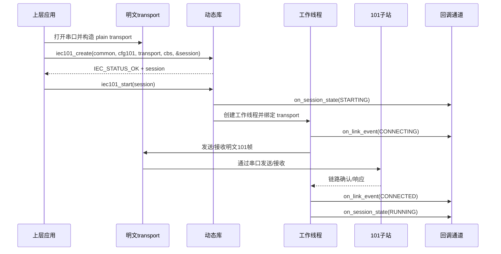
```mermaid
sequenceDiagram
    participant 应用 as 上层应用
    participant 传输 as 明文transport
    participant 库 as 动态库
    participant 线程 as 工作线程
    participant 子站 as 101子站
    participant 回调 as 回调通道

    应用->>传输: 打开串口并构造 plain transport
    应用->>库: iec101_create(common, cfg101, transport, cbs, &session)
    库-->>应用: IEC_STATUS_OK + session
    应用->>库: iec101_start(session)
    库->>回调: on_session_state(STARTING)
    库->>线程: 创建工作线程并绑定 transport
    线程->>回调: on_link_event(CONNECTING)
    线程->>传输: 发送/接收明文101帧
    传输->>子站: 通过串口发送/接收
    子站-->>线程: 链路确认/响应
    线程->>回调: on_link_event(CONNECTED)
    线程->>回调: on_session_state(RUNNING)
```

```c
/* 公共配置: 定义超时、重连策略和回调上下文。 */
iec_session_config_t common = {
    .user_context = app_ctx,                 /* 原样透传给所有回调 */
    .startup_timeout_ms = 3000,              /* 启动等待窗口 */
    .stop_timeout_ms = 3000,                 /* 停止等待窗口 */
    .reconnect_interval_ms = 1000,           /* 重连间隔, 允许运行时调整 */
    .command_timeout_ms = 2000,              /* 命令超时, 允许运行时调整 */
    .enable_raw_asdu = 0,                    /* 初始保持原始 ASDU 旁路关闭 */
    .enable_log_callback = 1,                /* 初始开启日志回调 */
    .initial_log_level = IEC_LOG_INFO        /* 日志初始等级 */
};

/* Transport: 调用方先打开并配置串口，再提供明文帧收发函数。
 * plain_serial_send/recv 内部可直接调用 Windows 串口 API 或平台适配层。
 */
plain_serial_ctx_t serial_ctx = app_open_configured_serial();
iec_transport_t transport = {
    .send = plain_serial_send,
    .recv = plain_serial_recv,
    .ctx = &serial_ctx,
    .max_plain_frame_len = 255
};

/* 101 扩展配置: 只定义链路模式和地址长度。 */
iec101_master_config_t cfg101 = {
    .link_mode = IEC101_LINK_MODE_UNBALANCED, /* 链路模式 */
    .link_address = 1,                       /* 对端链路地址 */
    .link_address_length = 1,                /* 链路地址长度 */
    .common_address_length = 2,              /* 公共地址长度 */
    .information_object_address_length = 3,  /* 信息体地址长度 */
    .cot_length = 2,                         /* 传送原因长度 */
    .use_single_char_ack = 1,                /* 是否启用单字符确认 */
    .ack_timeout_ms = 1000,                  /* 等待确认超时 */
    .repeat_timeout_ms = 1000,               /* 重发间隔 */
    .repeat_count = 3                        /* 最大重发次数 */
};

/* 回调集合: 所有异步事件都在 create 阶段一次性注册。 */
iec_callbacks_t cbs = {
    .on_session_state = on_session_state,    /* 生命周期状态变化 */
    .on_link_event = on_link_event,          /* 链路事件 */
    .on_point_indication = on_point_indication, /* 高层点表上送 */
    .on_command_result = on_command_result,  /* 命令结果 */
    .on_device_description = on_device_description, /* 自描述回调 */
    .on_parameter_indication = on_parameter_indication, /* 参数读取回调 */
    .on_parameter_result = on_parameter_result, /* 参数结果回调 */
    .on_raw_asdu = NULL,                     /* 本例聚焦高层点表主路径 */
    .on_log = on_log                         /* 日志回调 */
};

/* 会话句柄由库分配, create 成功后由调用方持有。 */
iec_session_t *session = NULL;

/* create 完成参数校验、transport 绑定和对象初始化。 */
iec101_create(&common, &cfg101, &transport, &cbs, &session);

/* start 创建工作线程，并通过 transport 进入 101 主站建链流程。 */
iec101_start(session);
```

典型事件顺序如下：

1. `on_session_state(STARTING)`
2. `on_link_event(CONNECTING)`
3. `on_link_event(CONNECTED)`
4. `on_session_state(RUNNING)`

### 7.2 IEC 104 主站创建与启动流程

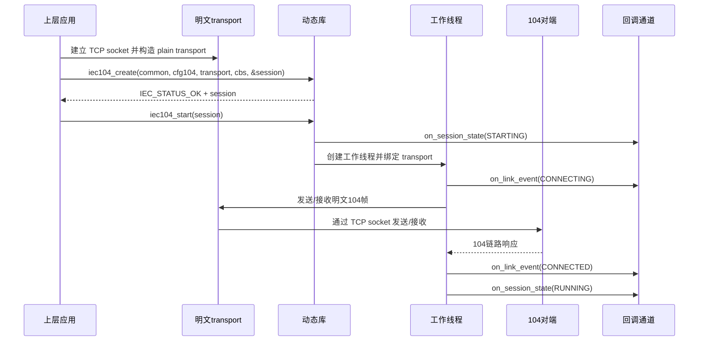
```mermaid
sequenceDiagram
    participant 应用 as 上层应用
    participant 传输 as 明文transport
    participant 库 as 动态库
    participant 线程 as 工作线程
    participant 对端 as 104对端
    participant 回调 as 回调通道

    应用->>传输: 建立 TCP socket 并构造 plain transport
    应用->>库: iec104_create(common, cfg104, transport, cbs, &session)
    库-->>应用: IEC_STATUS_OK + session
    应用->>库: iec104_start(session)
    库->>回调: on_session_state(STARTING)
    库->>线程: 创建工作线程并绑定 transport
    线程->>回调: on_link_event(CONNECTING)
    线程->>传输: 发送/接收明文104帧
    传输->>对端: 通过 TCP socket 发送/接收
    对端-->>线程: 104链路响应
    线程->>回调: on_link_event(CONNECTED)
    线程->>回调: on_session_state(RUNNING)
```

```c
/* 公共配置: 104 与 101 共用同一套公共配置结构。 */
iec_session_config_t common = {
    .user_context = app_ctx,                 /* 原样透传给所有回调 */
    .startup_timeout_ms = 5000,              /* 启动等待窗口 */
    .stop_timeout_ms = 3000,                 /* 停止等待窗口 */
    .reconnect_interval_ms = 2000,           /* 重连间隔 */
    .command_timeout_ms = 3000,              /* 命令超时 */
    .enable_raw_asdu = 1,                    /* 104 联调阶段建议打开旁路 */
    .enable_log_callback = 1,                /* 开启日志回调 */
    .initial_log_level = IEC_LOG_INFO        /* 日志初始等级 */
};

/* Transport: 调用方先建立 TCP socket，再提供明文帧收发函数。 */
plain_tcp_ctx_t tcp_ctx = app_connect_tcp();
iec_transport_t transport = {
    .send = plain_tcp_send,
    .recv = plain_tcp_recv,
    .ctx = &tcp_ctx,
    .max_plain_frame_len = 253
};

/* 104 扩展配置: 只定义协议字段长度和 K/W/T 参数。 */
iec104_master_config_t cfg104 = {
    .common_address_length = 2,              /* 公共地址长度 */
    .information_object_address_length = 3,  /* 信息体地址长度 */
    .cot_length = 2,                         /* 传送原因长度 */
    .k = 12,                                 /* 发送窗口 */
    .w = 8,                                  /* 接收确认窗口 */
    .t0_ms = 30000,                          /* 建链超时 */
    .t1_ms = 15000,                          /* 报文确认超时 */
    .t2_ms = 10000,                          /* 延迟确认超时 */
    .t3_ms = 20000                           /* 空闲测试周期 */
};

/* 回调集合: 104 场景下开启原始 ASDU 观察。 */
iec_callbacks_t cbs = {
    .on_session_state = on_session_state,    /* 生命周期状态变化 */
    .on_link_event = on_link_event,          /* 链路事件 */
    .on_point_indication = on_point_indication, /* 高层点表上送 */
    .on_command_result = on_command_result,  /* 命令结果 */
    .on_device_description = on_device_description, /* 自描述回调 */
    .on_parameter_indication = on_parameter_indication, /* 参数读取回调 */
    .on_parameter_result = on_parameter_result, /* 参数结果回调 */
    .on_raw_asdu = on_raw_asdu,              /* 原始 ASDU 旁路 */
    .on_log = on_log                         /* 日志回调 */
};

/* 句柄创建和启动流程与 101 保持一致。 */
iec_session_t *session = NULL;
iec104_create(&common, &cfg104, &transport, &cbs, &session);
iec104_start(session);
```

说明如下：

- TCP socket 的创建、主动连接、监听接入或本地绑定由调用方或 transport 完成，动态库只通过 transport 收发明文 104 帧。
- 原始 ASDU 观察作为并行调试通道，与高层点表主路径协同工作。

### 7.2.1 安全 transport 接入流程

协议库不直接依赖电科院安全接口库。按 0508 版运维工具侧安全接口库接入时，上位机或安全适配层先完成 USB Key、身份认证和运维密钥协商，再向协议库传入安全 transport。协议库始终只感知明文 transport。

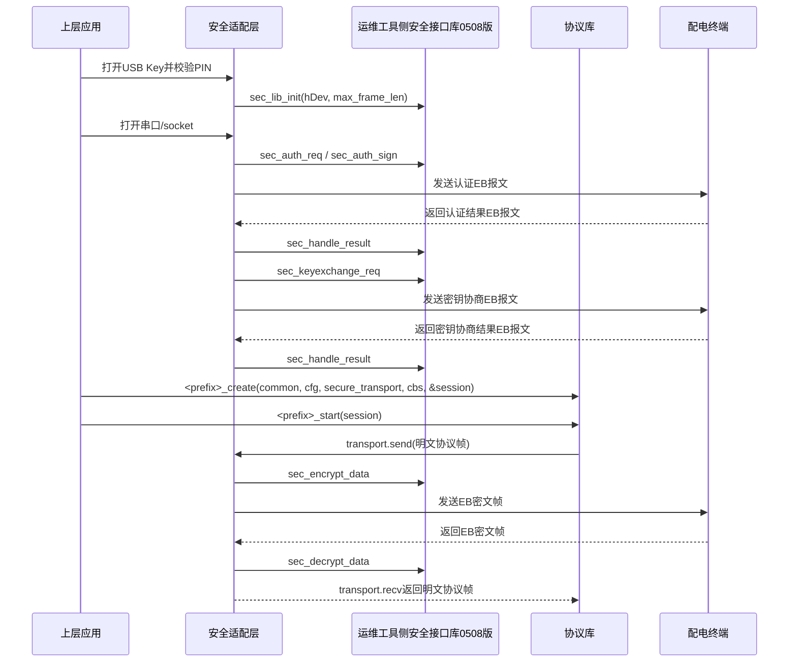
```mermaid
sequenceDiagram
    participant 应用 as 上层应用
    participant 安全 as 安全适配层
    participant 安全库 as 运维工具侧安全接口库0508版
    participant 库 as 协议库
    participant 终端 as 配电终端

    应用->>安全: 打开USB Key并校验PIN
    安全->>安全库: sec_lib_init(hDev, max_frame_len)
    应用->>安全: 打开串口/socket
    安全->>安全库: sec_auth_req / sec_auth_sign
    安全->>终端: 发送认证EB报文
    终端-->>安全: 返回认证结果EB报文
    安全->>安全库: sec_handle_result
    安全->>安全库: sec_keyexchange_req
    安全->>终端: 发送密钥协商EB报文
    终端-->>安全: 返回密钥协商结果EB报文
    安全->>安全库: sec_handle_result
    应用->>库: <prefix>_create(common, cfg, secure_transport, cbs, &session)
    应用->>库: <prefix>_start(session)
    库->>安全: transport.send(明文协议帧)
    安全->>安全库: sec_encrypt_data
    安全->>终端: 发送EB密文帧
    终端-->>安全: 返回EB密文帧
    安全->>安全库: sec_decrypt_data
    安全-->>库: transport.recv返回明文协议帧
```

安全适配层约束如下：

- 安全适配层负责调用 0508 版运维工具侧安全接口库，协议库只感知 `iec_transport_t` 中的明文 `send` 和 `recv`。
- 每次身份认证成功后，安全适配层应执行运维密钥协商，再允许协议库启动业务流程。
- 安全 transport 的 `send` 内部负责 `sec_encrypt_data` 和真实串口/socket 发送。
- 安全 transport 的 `recv` 内部负责接收完整 EB 报文、调用 `sec_decrypt_data` 并返回明文协议帧。
- 安全 transport 应将安全库原始错误码保留在诊断信息中，不应简单映射为协议错误。
- 链路断开后，安全状态应失效；恢复业务前应重新建链、认证和密钥协商。
- 证书导入、证书导出、终端初始证书回写、密钥恢复、USB Key 登录、软件授权、可信验签和安全审计属于安全适配层或上层工具职责；协议库不得直接导出 `sec_*`、`SG_*` 等安全库函数包装接口。

### 7.3 点表上报流程

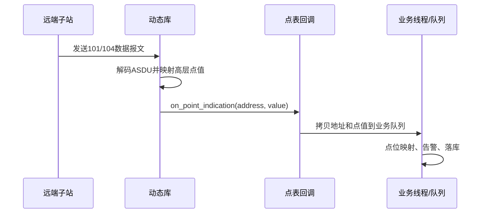
```mermaid
sequenceDiagram
    participant 子站 as 远端子站
    participant 库 as 动态库
    participant 回调 as 点表回调
    participant 业务 as 业务线程/队列

    子站->>库: 发送101/104数据报文
    库->>库: 解码ASDU并映射高层点值
    库->>回调: on_point_indication(address, value)
    回调->>业务: 拷贝地址和点值到业务队列
    业务->>业务: 点位映射、告警、落库
```

```c
/* 点表回调: 高层对象通过地址 + 点值的组合上送给业务层。 */
static void on_point_indication(
    iec_session_t *session,                  /* 触发回调的会话 */
    const iec_point_address_t *address,      /* 协议原生地址 */
    const iec_point_value_t *value,          /* 已解码的高层点值 */
    void *user_context)                      /* create 时注册的用户上下文 */
{
    (void)session;
    (void)user_context;

    /* 业务层通常先按点值类型做快速分流。 */
    if (value->point_type == IEC_POINT_SINGLE) {
        /* 将遥信更新转发给业务队列, 避免在回调线程里做重处理。 */
    }
}
```

推荐处理步骤如下：

1. 在回调中快速判定 `point_type`。
2. 将 `address` 与 `value` 拷贝到业务队列。
3. 业务线程做点位映射、告警和落库。
4. 回调线程尽快返回，避免阻塞后续收发。

### 7.4 原始 ASDU 旁路流程

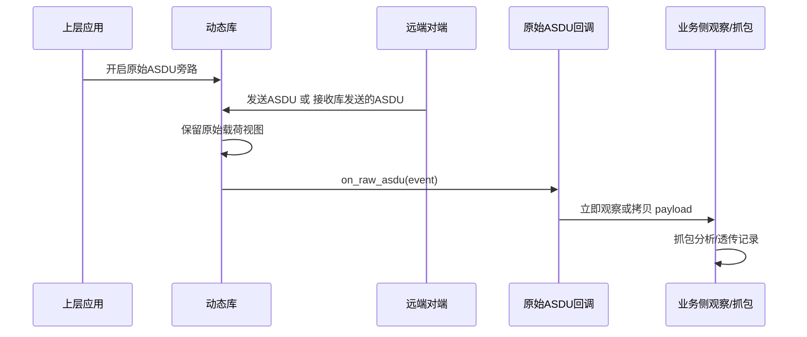
```mermaid
sequenceDiagram
    participant 应用 as 上层应用
    participant 库 as 动态库
    participant 对端 as 远端对端
    participant 回调 as 原始ASDU回调
    participant 业务 as 业务侧观察/抓包

    应用->>库: 开启原始ASDU旁路
    对端->>库: 发送ASDU 或 接收库发送的ASDU
    库->>库: 保留原始载荷视图
    库->>回调: on_raw_asdu(event)
    回调->>业务: 立即观察或拷贝 payload
    业务->>业务: 抓包分析/透传记录
```

```c
/* 原始 ASDU 回调: 用于联调抓包或观察未纳入高层对象的报文。 */
static void on_raw_asdu(
    iec_session_t *session,                  /* 触发回调的会话 */
    const iec_raw_asdu_event_t *event,       /* 原始 ASDU 事件视图 */
    void *user_context)                      /* create 时注册的用户上下文 */
{
    (void)session;
    (void)user_context;

    /* 如需长期保存报文，可在回调里立即拷贝 payload。 */
    /* 将 event->payload 拷贝到抓包环形缓冲区。 */
}
```

推荐处理步骤如下：

1. 推荐在调试、联调或特殊透传场景开启旁路。
2. 回调中以轻量级拷贝或摘要记录为宜。
3. 业务层如需长期保存报文，可立即复制 `payload`。
4. 技术方案附录 F 的通信报文监视是终端侧串口/网口监视能力，通过 `0xF012`、`0xF013`、`0xF014`、`0xF015` 扩展参数交互，不等同于 `on_raw_asdu`。
5. `on_raw_asdu` 只观察协议库自身收发的 ASDU 明文视图，不承诺提供终端侧串口/网口报文、EB 密文报文或明文/密文对照记录；若产品需要附录 F 报文监视，应在后续单独定义高层报文监视 API 或明确通过参数接口承载。

### 7.5 参数读取流程

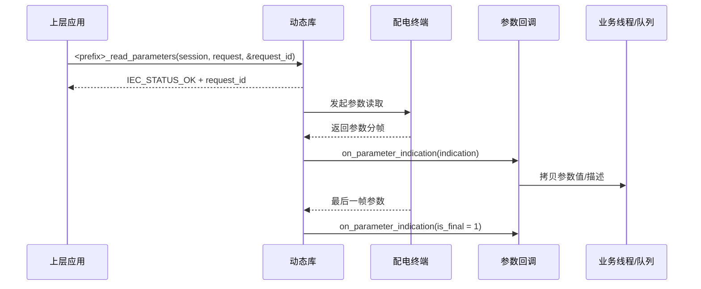
```mermaid
sequenceDiagram
    participant 应用 as 上层应用
    participant 库 as 动态库
    participant 终端 as 配电终端
    participant 回调 as 参数回调
    participant 业务 as 业务线程/队列

    应用->>库: <prefix>_read_parameters(session, request, &request_id)
    库-->>应用: IEC_STATUS_OK + request_id
    库->>终端: 发起参数读取
    终端-->>库: 返回参数分帧
    库->>回调: on_parameter_indication(indication)
    回调->>业务: 拷贝参数值/描述
    终端-->>库: 最后一帧参数
    库->>回调: on_parameter_indication(is_final = 1)
```

```c
/* 读取运行参数，并同时拉取参数描述信息，用于首屏建模。 */
iec_parameter_read_request_t req = {
    .common_address = 1,                        /* 目标公共地址 */
    .read_mode = IEC_PARAMETER_READ_BY_SCOPE,  /* 按参数域读取 */
    .scope = IEC_PARAMETER_SCOPE_RUNNING,      /* 运行参数 */
    .group_name = NULL,                        /* 不按分组过滤 */
    .start_address = 0,                        /* 非地址范围模式时忽略 */
    .end_address = 0,                          /* 非地址范围模式时忽略 */
    .setting_group = 0,                        /* 0 表示当前定值区 */
    .include_descriptor = 1                    /* 同时返回参数描述信息 */
};

uint32_t request_id = 0;
iec101_read_parameters(session, &req, &request_id);

static void on_parameter_indication(
    iec_session_t *session,
    const iec_parameter_indication_t *indication,
    void *user_context)
{
    (void)session;
    (void)user_context;

    /* 首次建模场景下可以同时缓存参数值与参数描述。 */
    if (indication->has_descriptor) {
        /* 缓存参数名称、单位、范围和模板能力。 */
    }

    /* 将参数值拷贝到业务队列，避免在回调线程做重处理。 */
    if (indication->is_final) {
        /* 标记该 request_id 对应的参数读取完成。 */
    }
}
```

推荐处理步骤如下：

1. 首次接入终端时可设置 `include_descriptor = 1`，同时获取参数描述信息。
2. 频繁刷新场景只拉取参数值，避免重复传输参数元数据。
3. 上层按 `request_id` 归并一轮参数读取返回，并以 `is_final` 作为完成标识。

### 7.6 参数写入与回读校验流程

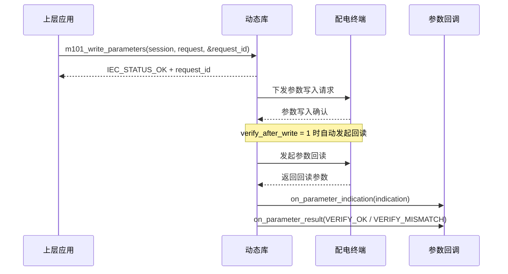
```mermaid
sequenceDiagram
    participant 应用 as 上层应用
    participant 库 as 动态库
    participant 终端 as 配电终端
    participant 回调 as 参数回调

    应用->>库: m101_write_parameters(session, request, &request_id)
    库-->>应用: IEC_STATUS_OK + request_id
    库->>终端: 下发参数写入请求
    终端-->>库: 参数写入确认
    Note over 库,终端: verify_after_write = 1 时自动发起回读
    库->>终端: 发起参数回读
    终端-->>库: 返回回读参数
    库->>回调: on_parameter_indication(indication)
    库->>回调: on_parameter_result(VERIFY_OK / VERIFY_MISMATCH)
```

```c
iec_parameter_item_t items[2] = {
    {
        .parameter_id = 0x8020,                 /* 电流死区 */
        .address = 0x8020,
        .scope = IEC_PARAMETER_SCOPE_RUNNING,
        .value_type = IEC_PARAMETER_VALUE_FLOAT,
        .value.float_value = 0.05f
    },
    {
        .parameter_id = 0x8021,                 /* 交流电压死区 */
        .address = 0x8021,
        .scope = IEC_PARAMETER_SCOPE_RUNNING,
        .value_type = IEC_PARAMETER_VALUE_FLOAT,
        .value.float_value = 0.01f
    }
};

iec_parameter_write_request_t write_req = {
    .common_address = 1,
    .setting_group = 0,                         /* 当前定值区 */
    .items = items,
    .item_count = 2,
    .verify_after_write = 1                    /* 写后自动回读校验 */
};

uint32_t request_id = 0;
m101_write_parameters(session, &write_req, &request_id);

static void on_parameter_result(
    iec_session_t *session,
    const iec_parameter_result_t *result,
    void *user_context)
{
    (void)session;
    (void)user_context;

    if (result->operation == IEC_PARAMETER_OPERATION_WRITE &&
        result->result == IEC_PARAMETER_RESULT_ACCEPTED) {
        /* 参数写入已被接受，等待自动回读校验结果。 */
    }

    if (result->operation == IEC_PARAMETER_OPERATION_VERIFY &&
        result->result == IEC_PARAMETER_RESULT_VERIFY_MISMATCH) {
        /* 标记模板下发失败，并提示上层查看具体回读值。 */
    }
}
```

推荐处理步骤如下：

1. 模板下发场景下建议始终开启 `verify_after_write`。
2. 对重要参数可在写入完成后再次调用 `m101_verify_parameters` 做显式抽查。
3. 当出现 `VERIFY_MISMATCH` 时，应结合 `on_parameter_indication` 中的回读值做差异定位。

### 7.7 定值区切换流程

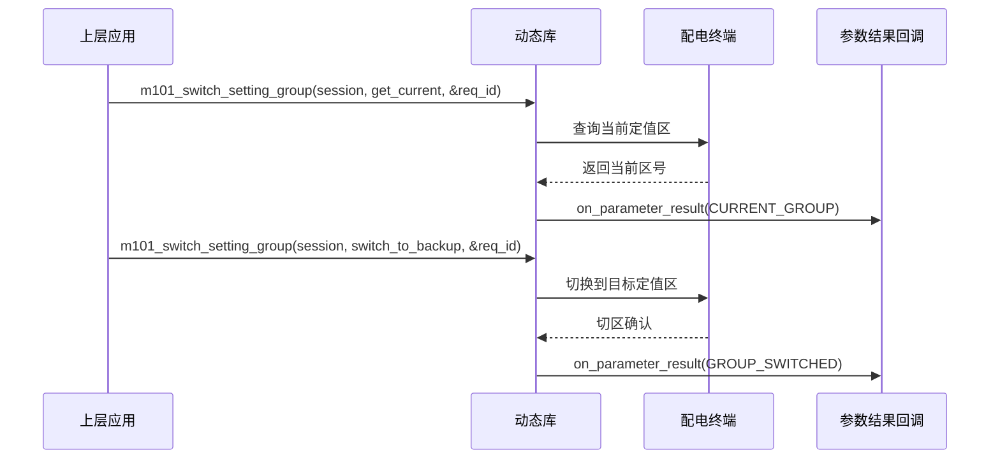
```mermaid
sequenceDiagram
    participant 应用 as 上层应用
    participant 库 as 动态库
    participant 终端 as 配电终端
    participant 回调 as 参数结果回调

    应用->>库: m101_switch_setting_group(session, get_current, &req_id)
    库->>终端: 查询当前定值区
    终端-->>库: 返回当前区号
    库->>回调: on_parameter_result(CURRENT_GROUP)
    应用->>库: m101_switch_setting_group(session, switch_to_backup, &req_id)
    库->>终端: 切换到目标定值区
    终端-->>库: 切区确认
    库->>回调: on_parameter_result(GROUP_SWITCHED)
```

```c
iec_setting_group_request_t group_req = {
    .common_address = 1,
    .action = IEC_SETTING_GROUP_ACTION_SWITCH, /* 切换动作 */
    .target_group = 2                          /* 目标定值区 */
};

uint32_t group_request_id = 0;
m101_switch_setting_group(session, &group_req, &group_request_id);
```

推荐处理步骤如下：

1. 修改多定值区参数前，先查询当前区或显式执行切区。
2. 切区成功后再发起 `m101_read_parameters` 或 `m101_write_parameters`，避免上层误操作到错误区。
3. 对“当前区”和“目标区”的展示由上层根据 `request_id` 和结果码维护。

### 7.8 终端自描述获取流程

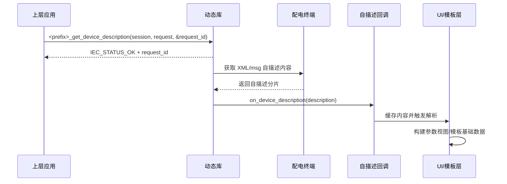
```mermaid
sequenceDiagram
    participant 应用 as 上层应用
    participant 库 as 动态库
    participant 终端 as 配电终端
    participant 回调 as 自描述回调
    participant 业务 as UI/模板层

    应用->>库: <prefix>_get_device_description(session, request, &request_id)
    库-->>应用: IEC_STATUS_OK + request_id
    库->>终端: 获取 XML/msg 自描述内容
    终端-->>库: 返回自描述分片
    库->>回调: on_device_description(description)
    回调->>业务: 缓存内容并触发解析
    业务->>业务: 构建参数视图/模板基础数据
```

```c
iec_device_description_request_t desc_req = {
    .common_address = 1,
    .preferred_format = IEC_DEVICE_DESCRIPTION_FORMAT_XML,
    .max_content_size = 64 * 1024
};

uint32_t desc_request_id = 0;
iec101_get_device_description(session, &desc_req, &desc_request_id);

static void on_device_description(
    iec_session_t *session,
    const iec_device_description_t *description,
    void *user_context)
{
    (void)session;
    (void)user_context;

    /* 若内容分片返回，应按 request_id 聚合后再交给 XML/msg 解析层。 */
    if (description->is_complete) {
        /* 触发模型解析和界面生成。 */
    }
}
```

推荐处理步骤如下：

1. 自描述内容获取应优先发生在首次连接和设备模型变更场景。
2. 动态库只负责把 XML 或 msg 内容安全取回，不负责解析成最终界面。
3. 上层可基于自描述内容构建参数模板、点表映射和界面分组信息。

### 7.9 文件目录召唤流程

以下流程以支持文件服务的终端为例；若目标协议库或终端能力不支持该能力，库应返回明确的 `IEC_STATUS_UNSUPPORTED` 或异步结果码。

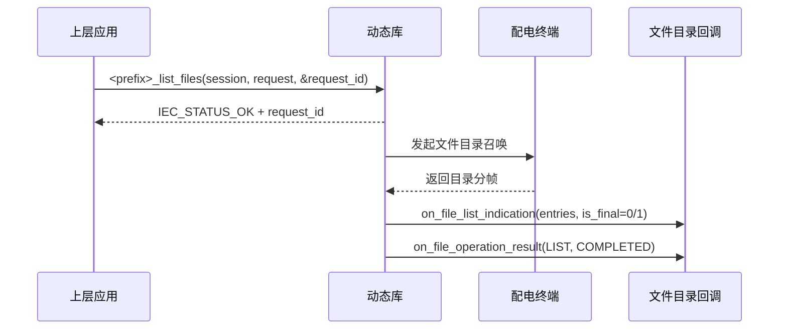
```mermaid
sequenceDiagram
    participant 应用 as 上层应用
    participant 库 as 动态库
    participant 终端 as 配电终端
    participant 回调 as 文件目录回调

    应用->>库: <prefix>_list_files(session, request, &request_id)
    库-->>应用: IEC_STATUS_OK + request_id
    库->>终端: 发起文件目录召唤
    终端-->>库: 返回目录分帧
    库->>回调: on_file_list_indication(entries, is_final=0/1)
    库->>回调: on_file_operation_result(LIST, COMPLETED)
```

```c
iec_file_list_request_t list_req = {
    .common_address = 1,
    .directory_name = "/maint",
    .include_details = 1
};

uint32_t list_request_id = 0;
m101_list_files(session, &list_req, &list_request_id);
```

推荐处理步骤如下：

1. 首次目录召唤建议开启 `include_details = 1`，同时获取大小、时间戳和校验摘要。
2. `on_file_list_indication` 负责分帧返回目录项，`on_file_operation_result` 负责标记本次目录请求是否最终完成。
3. 目录项和字符串字段仅在回调期间有效，若上层需要用于界面展示或后续传输，应立即拷贝。

### 7.10 文件读取与断点续传流程

以下流程用于从终端读取文件，并在链路中断后依据最近已确认偏移恢复传输。

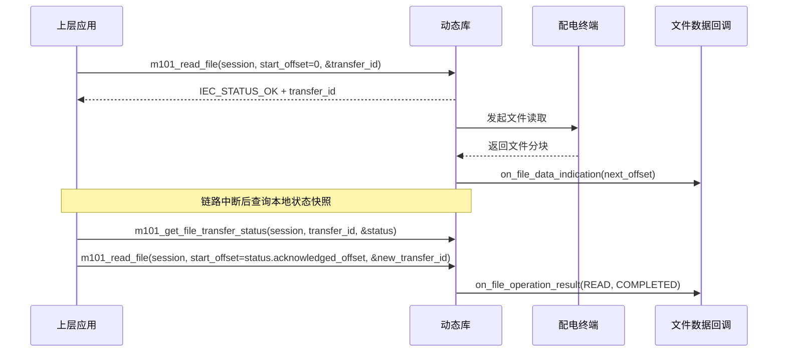
```mermaid
sequenceDiagram
    participant 应用 as 上层应用
    participant 库 as 动态库
    participant 终端 as 配电终端
    participant 回调 as 文件数据回调

    应用->>库: m101_read_file(session, start_offset=0, &transfer_id)
    库-->>应用: IEC_STATUS_OK + transfer_id
    库->>终端: 发起文件读取
    终端-->>库: 返回文件分块
    库->>回调: on_file_data_indication(next_offset)
    Note over 应用,库: 链路中断后查询本地状态快照
    应用->>库: m101_get_file_transfer_status(session, transfer_id, &status)
    应用->>库: m101_read_file(session, start_offset=status.acknowledged_offset, &new_transfer_id)
    库->>回调: on_file_operation_result(READ, COMPLETED)
```

```c
iec_file_read_request_t read_req = {
    .common_address = 1,
    .directory_name = "/maint",
    .file_name = "terminal.xml",
    .start_offset = 0,
    .max_chunk_size = 1024,                  /* 运维101场景下建议按 1024 字节窗口读取 */
    .expected_file_size = 0
};

uint32_t read_transfer_id = 0;
m101_read_file(session, &read_req, &read_transfer_id);

static void on_file_data_indication(
    iec_session_t *session,
    const iec_file_data_indication_t *indication,
    void *user_context)
{
    (void)session;
    (void)user_context;

    /* 立即拷贝当前数据块并记录 next_offset, 供断点续传恢复使用。 */
    (void)indication;
}

iec_file_transfer_status_t read_status;
m101_get_file_transfer_status(session, read_transfer_id, &read_status);
if (read_status.is_resumable) {
    read_req.start_offset = read_status.acknowledged_offset;
    m101_read_file(session, &read_req, &read_transfer_id);
}
```

推荐处理步骤如下：

1. 文件读取过程中应始终以 `next_offset` 或 `acknowledged_offset` 作为唯一可信恢复点。
2. 回调内不要直接写磁盘或做大块解压，宜先拷贝到业务缓冲区，再交给后台线程处理。
3. 若 `on_file_operation_result` 返回 `OFFSET_MISMATCH`，应重新同步目录信息或按终端当前偏移重新发起读取。

### 7.11 文件写入与断点续传流程

以下流程以运维101库为例，展示如何向终端写入文件并按已确认偏移续传。

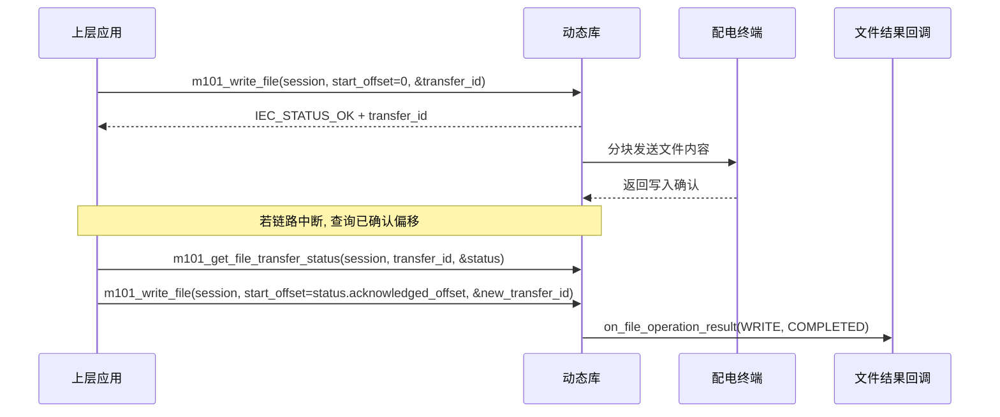
```mermaid
sequenceDiagram
    participant 应用 as 上层应用
    participant 库 as 动态库
    participant 终端 as 配电终端
    participant 回调 as 文件结果回调

    应用->>库: m101_write_file(session, start_offset=0, &transfer_id)
    库-->>应用: IEC_STATUS_OK + transfer_id
    库->>终端: 分块发送文件内容
    终端-->>库: 返回写入确认
    Note over 应用,库: 若链路中断, 查询已确认偏移
    应用->>库: m101_get_file_transfer_status(session, transfer_id, &status)
    应用->>库: m101_write_file(session, start_offset=status.acknowledged_offset, &new_transfer_id)
    库->>回调: on_file_operation_result(WRITE, COMPLETED)
```

```c
const uint8_t *content = file_blob;
uint32_t content_size = file_blob_size;

iec_file_write_request_t write_req = {
    .common_address = 1,
    .directory_name = "/data",
    .file_name = "record.dat",
    .start_offset = 0,
    .total_size = content_size,
    .content = content,
    .content_size = content_size,
    .preferred_chunk_size = 1024,            /* 运维101场景下建议按 1024 字节窗口写入 */
    .overwrite_existing = 1
};

uint32_t write_transfer_id = 0;
m101_write_file(session, &write_req, &write_transfer_id);

iec_file_transfer_status_t write_status;
m101_get_file_transfer_status(session, write_transfer_id, &write_status);
if (write_status.is_resumable && write_status.acknowledged_offset < content_size) {
    write_req.start_offset = write_status.acknowledged_offset;
    write_req.content = content + write_status.acknowledged_offset;
    write_req.content_size = content_size - write_status.acknowledged_offset;
    m101_write_file(session, &write_req, &write_transfer_id);
}
```

推荐处理步骤如下：

1. 文件写入的 `total_size` 始终描述远端完整目标文件大小，即使当前只是续传窗口。
2. 续传时只更新 `start_offset`、`content` 和 `content_size`，不要修改目标文件名和总大小。
3. 运维101文件写入场景下建议以 `1024` 字节作为单块发送窗口上限，超过部分由库自动拆分并推进偏移。
4. 文件写入最终成功、失败、取消或否定确认都以 `on_file_operation_result` 为准。

### 7.12 程序升级流程

以下流程以运维101库为例，展示程序升级高层状态机。升级包可信验签、MD5/SM3 校验和用户确认由上层在调用前完成。

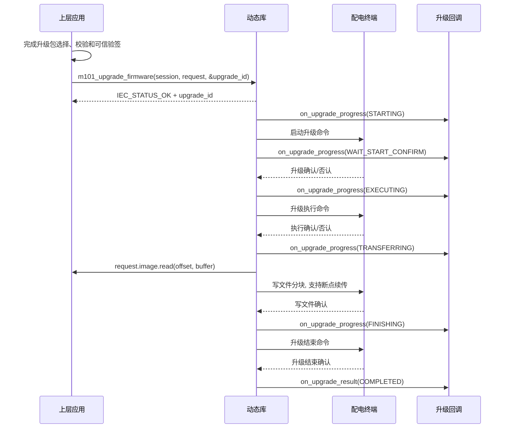
```mermaid
sequenceDiagram
    participant 应用 as 上层应用
    participant 库 as 动态库
    participant 终端 as 配电终端
    participant 回调 as 升级回调

    应用->>应用: 完成升级包选择、校验和可信验签
    应用->>库: m101_upgrade_firmware(session, request, &upgrade_id)
    库-->>应用: IEC_STATUS_OK + upgrade_id
    库->>回调: on_upgrade_progress(STARTING)
    库->>终端: 启动升级命令
    库->>回调: on_upgrade_progress(WAIT_START_CONFIRM)
    终端-->>库: 升级确认/否认
    库->>回调: on_upgrade_progress(EXECUTING)
    库->>终端: 升级执行命令
    终端-->>库: 执行确认/否认
    库->>回调: on_upgrade_progress(TRANSFERRING)
    库->>应用: request.image.read(offset, buffer)
    库->>终端: 写文件分块, 支持断点续传
    终端-->>库: 写文件确认
    库->>回调: on_upgrade_progress(FINISHING)
    库->>终端: 升级结束命令
    终端-->>库: 升级结束确认
    库->>回调: on_upgrade_result(COMPLETED)
```

```c
typedef struct firmware_image {
    const uint8_t *data;
    uint32_t size;
    const char *md5_text;
} firmware_image_t;

static int read_upgrade_chunk(
    void *ctx,
    uint32_t offset,
    uint8_t *buffer,
    uint32_t capacity,
    uint32_t *out_len)
{
    const firmware_image_t *image = (const firmware_image_t *)ctx;
    if (offset >= image->size) {
        *out_len = 0;
        return 0;
    }

    uint32_t remain = image->size - offset;
    uint32_t n = remain < capacity ? remain : capacity;
    memcpy(buffer, image->data + offset, n);
    *out_len = n;
    return 0;
}

iec_upgrade_request_t upgrade_req = {
    .common_address = 1,
    .remote_directory = "/upgrade",
    .remote_file_name = "fw.bin",
    .image = {
        .ctx = &firmware_image,
        .total_size = firmware_image.size,
        .read = read_upgrade_chunk
    },
    .preferred_chunk_size = 1024,
    .checksum_text = firmware_image.md5_text,
    .overwrite_existing = 1,
    .command_timeout_ms = 3000,
    .transfer_timeout_ms = 30000
};

uint32_t upgrade_id = 0;
m101_upgrade_firmware(session, &upgrade_req, &upgrade_id);
```

推荐处理步骤如下：

1. 调用前由上层完成升级包来源校验、可信验签、散列计算和用户确认。
2. `iec_upgrade_image_source_t.read` 必须能够按任意已确认偏移读取升级包内容，以支持断点续传。
3. 升级进度只以 `on_upgrade_progress` 为准；最终完成、失败或取消只以 `on_upgrade_result` 为准。
4. 若用户取消升级，调用 `<prefix>_cancel_upgrade`，库内部负责发送升级撤销命令或返回不支持结果。
5. 升级成功后终端可能自动重启，链路断开应通过 `on_link_event` 独立上报。

### 7.13 恢复出厂设置与设备重启流程

以下流程以运维101库为例，展示恢复出厂设置这类扩展遥控的调用边界。技术方案将恢复出厂设置定义为单点或双点遥控，且以“遥控合闸”语义触发，因此协议库不新增独立恢复出厂设置函数。

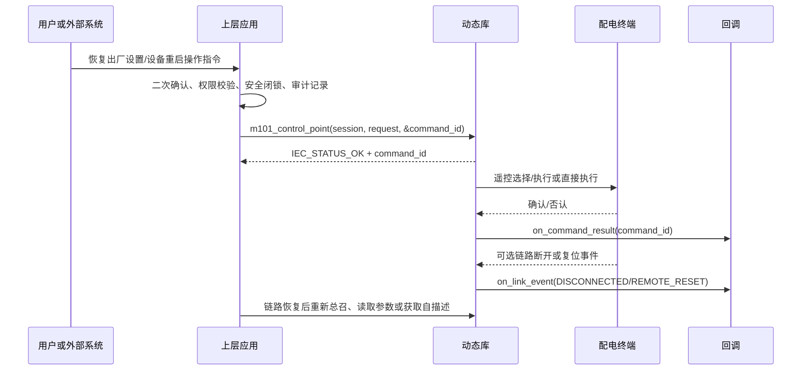
```mermaid
sequenceDiagram
    participant 指令 as 用户或外部系统
    participant 应用 as 上层应用
    participant 库 as 动态库
    participant 终端 as 配电终端
    participant 回调 as 回调

    指令->>应用: 恢复出厂设置/设备重启操作指令
    应用->>应用: 二次确认、权限校验、安全闭锁、审计记录
    应用->>库: m101_control_point(session, request, &command_id)
    库-->>应用: IEC_STATUS_OK + command_id
    库->>终端: 遥控选择/执行或直接执行
    终端-->>库: 确认/否认
    库->>回调: on_command_result(command_id)
    终端-->>库: 可选链路断开或复位事件
    库->>回调: on_link_event(DISCONNECTED/REMOTE_RESET)
    应用->>库: 链路恢复后重新总召、读取参数或获取自描述
```

```c
/* factory_reset_addr 来自终端自描述、点表模板或技术方案附录 G 的扩展遥控配置。 */
uint32_t factory_reset_addr = 0;

iec_command_request_t factory_reset_req = {
    .address = {
        .common_address = 1,
        .information_object_address = factory_reset_addr,
        .type_id = 0,
        .cause_of_transmission = 0,
        .originator_address = 0
    },
    .command_type = IEC_COMMAND_DOUBLE,
    .semantic = IEC_COMMAND_SEMANTIC_FACTORY_RESET,
    .mode = IEC_COMMAND_MODE_SELECT,
    .qualifier = 0,
    .execute_on_ack = 1,
    .timeout_ms = 3000,
    .value.doubled = 2 /* 合闸/执行语义，实际取值以终端点表定义为准。 */
};

uint32_t command_id = 0;
m101_control_point(session, &factory_reset_req, &command_id);
```

推荐处理步骤如下：

1. 上层收到恢复出厂设置或设备重启指令后，先完成操作确认、权限校验、安全闭锁和审计记录，再调用 `<prefix>_control_point`。
2. 恢复出厂设置使用 `IEC_COMMAND_SEMANTIC_FACTORY_RESET`，设备重启或复位进程使用 `IEC_COMMAND_SEMANTIC_DEVICE_REBOOT`。
3. 命令类型仍按终端点表选择 `IEC_COMMAND_SINGLE` 或 `IEC_COMMAND_DOUBLE`，命令值按终端定义的合闸/执行语义填写。
4. `on_command_result` 表示终端对遥控命令的确认、否认或超时，不表示恢复后参数已经重新读取完成。
5. 若终端重启或恢复出厂设置导致链路断开，上层应等待 `on_link_event` 和重连流程完成后重新总召、读取参数或获取自描述内容。

### 7.14 时钟读取流程

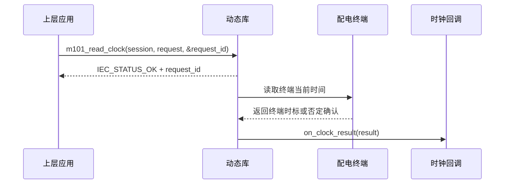
```mermaid
sequenceDiagram
    participant 应用 as 上层应用
    participant 库 as 动态库
    participant 终端 as 配电终端
    participant 回调 as 时钟回调

    应用->>库: m101_read_clock(session, request, &request_id)
    库-->>应用: IEC_STATUS_OK + request_id
    库->>终端: 读取终端当前时间
    终端-->>库: 返回终端时标或否定确认
    库->>回调: on_clock_result(result)
```

```c
static void on_clock_result(
    iec_session_t *session,
    const iec_clock_result_t *result,
    void *user_context)
{
    (void)session;
    (void)user_context;

    if (result->operation == IEC_CLOCK_OPERATION_READ &&
        result->result == IEC_CLOCK_RESULT_ACCEPTED &&
        result->has_timestamp) {
        /* 将 result->timestamp 拷贝到业务线程，用于展示或与本机时间比较。 */
    }
}

iec_clock_read_request_t read_clock_req = {
    .common_address = 1
};

uint32_t request_id = 0;
m101_read_clock(session, &read_clock_req, &request_id);
```

推荐处理步骤如下：

1. 主动读取终端当前时间使用 `<prefix>_read_clock`，校时使用 `<prefix>_clock_sync`。
2. 两类操作都通过 `on_clock_result` 返回最终结果。
3. 读时钟成功时，`iec_clock_result_t.has_timestamp` 为真，`timestamp` 字段携带终端当前时间。
4. 若目标协议或终端不支持主动读时钟，库应返回 `IEC_STATUS_UNSUPPORTED` 或通过 `IEC_CLOCK_RESULT_UNSUPPORTED` 上报。

### 7.15 配置校验、运行期选项与状态查询流程

本流程用于覆盖创建前配置静态校验、运行期间选项调整和会话状态查询。配置校验函数是具体协议前缀函数，不使用 `<prefix>` 占位写法。

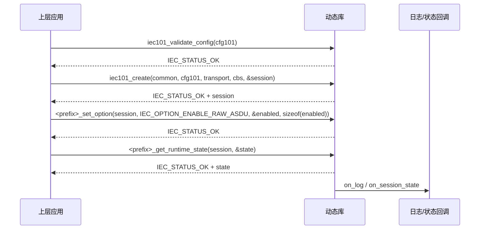
```mermaid
sequenceDiagram
    participant 应用 as 上层应用
    participant 库 as 动态库
    participant 回调 as 日志/状态回调

    应用->>库: iec101_validate_config(cfg101)
    库-->>应用: IEC_STATUS_OK
    应用->>库: iec101_create(common, cfg101, transport, cbs, &session)
    库-->>应用: IEC_STATUS_OK + session
    应用->>库: <prefix>_set_option(session, IEC_OPTION_ENABLE_RAW_ASDU, &enabled, sizeof(enabled))
    库-->>应用: IEC_STATUS_OK
    应用->>库: <prefix>_get_runtime_state(session, &state)
    库-->>应用: IEC_STATUS_OK + state
    库->>回调: on_log / on_session_state
```

```c
iec_status_t st = iec101_validate_config(&cfg101);
if (st != IEC_STATUS_OK) {
    /* 配置静态校验失败, 不应继续 create。 */
}

iec101_create(&common, &cfg101, &transport, &cbs, &session);

uint8_t enabled = 1;
iec101_set_option(
    session,
    IEC_OPTION_ENABLE_RAW_ASDU,
    &enabled,
    sizeof(enabled));

iec_runtime_state_t state = IEC_RUNTIME_CREATED;
iec101_get_runtime_state(session, &state);
```

推荐处理步骤如下：

1. 创建会话前可调用 `iec101_validate_config`、`m101_validate_config` 或 `iec104_validate_config` 做静态校验。
2. `<prefix>_set_option` 只用于文档声明允许运行期修改的选项，不能替代 `<prefix>_create` 阶段确定的协议字段长度、transport 和回调集合。
3. `<prefix>_get_runtime_state` 返回调用时刻的本地状态快照，不保证状态在返回后保持不变。
4. 若选项修改会影响回调行为，上层应在业务侧记录配置变更时间点，便于排查联调问题。

### 7.16 会话停止与销毁流程

本流程用于覆盖正常退出路径。停止会话和释放会话句柄是两个独立步骤，调用方应先停止再销毁。

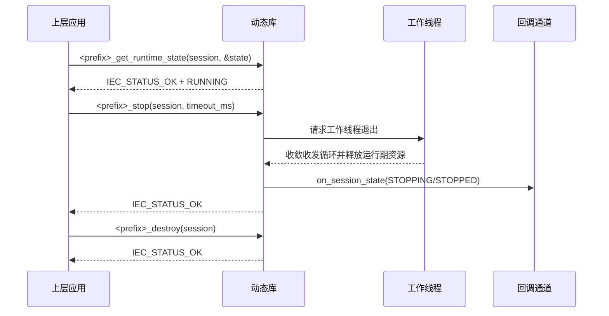
```mermaid
sequenceDiagram
    participant 应用 as 上层应用
    participant 库 as 动态库
    participant 线程 as 工作线程
    participant 回调 as 回调通道

    应用->>库: <prefix>_get_runtime_state(session, &state)
    库-->>应用: IEC_STATUS_OK + RUNNING
    应用->>库: <prefix>_stop(session, timeout_ms)
    库->>线程: 请求工作线程退出
    线程-->>库: 收敛收发循环并释放运行期资源
    库->>回调: on_session_state(STOPPING/STOPPED)
    库-->>应用: IEC_STATUS_OK
    应用->>库: <prefix>_destroy(session)
    库-->>应用: IEC_STATUS_OK
```

```c
iec_runtime_state_t state;
iec101_get_runtime_state(session, &state);

if (state == IEC_RUNTIME_RUNNING) {
    iec101_stop(session, 5000);
}

iec101_destroy(session);
session = NULL;
```

推荐处理步骤如下：

1. `<prefix>_stop` 负责退出工作线程和运行期协议流程，`<prefix>_destroy` 负责释放会话对象。
2. `<prefix>_stop` 返回超时时，上层应避免立即释放 transport 真实通信资源，可先根据状态和日志确认线程是否仍在退出。
3. `<prefix>_destroy` 成功后句柄立即失效，上层必须清空或移除缓存的 `iec_session_t *`。
4. 若会话处于 `IEC_RUNTIME_FAULTED`，仍可按停止、销毁路径收敛资源；是否重建会话由上层决定。

### 7.17 总召、电度量召唤与单点读取流程

本流程用于覆盖主动获取点表数据的三类入口。持续上送走 `on_point_indication`，主动召唤和单点读取也通过同一个点表回调返回高层点值。

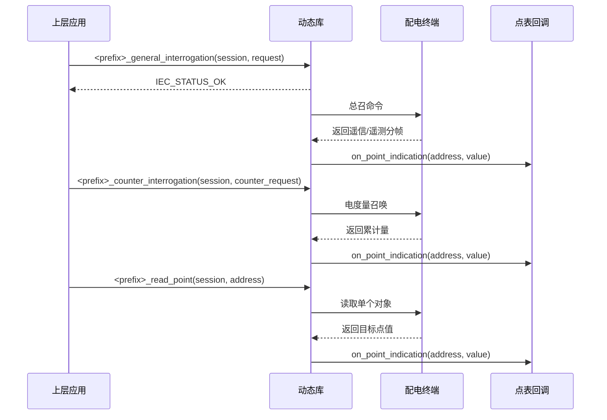
```mermaid
sequenceDiagram
    participant 应用 as 上层应用
    participant 库 as 动态库
    participant 终端 as 配电终端
    participant 回调 as 点表回调

    应用->>库: <prefix>_general_interrogation(session, request)
    库-->>应用: IEC_STATUS_OK
    库->>终端: 总召命令
    终端-->>库: 返回遥信/遥测分帧
    库->>回调: on_point_indication(address, value)
    应用->>库: <prefix>_counter_interrogation(session, counter_request)
    库->>终端: 电度量召唤
    终端-->>库: 返回累计量
    库->>回调: on_point_indication(address, value)
    应用->>库: <prefix>_read_point(session, address)
    库->>终端: 读取单个对象
    终端-->>库: 返回目标点值
    库->>回调: on_point_indication(address, value)
```

```c
iec_interrogation_request_t gi_req = {
    .common_address = 1,
    .qualifier = 20
};
iec101_general_interrogation(session, &gi_req);

iec_counter_interrogation_request_t ci_req = {
    .common_address = 1,
    .qualifier = 5,
    .freeze = 0
};
iec101_counter_interrogation(session, &ci_req);

iec_point_address_t point_addr = {
    .common_address = 1,
    .information_object_address = 0x4001,
    .type_id = 0,
    .cause_of_transmission = 0,
    .originator_address = 0
};
iec101_read_point(session, &point_addr);
```

推荐处理步骤如下：

1. 建链完成或缓存失效后优先使用 `<prefix>_general_interrogation` 刷新全量点表状态。
2. 电度量或累计量刷新使用 `<prefix>_counter_interrogation`，不要用普通总召替代电度量召唤语义。
3. 对少量点位人工刷新或诊断时使用 `<prefix>_read_point`。
4. 三类请求的同步返回只表示请求被接收，业务结果仍以 `on_point_indication` 和链路事件为准。

### 7.18 原始 ASDU 主动发送流程

本流程用于覆盖 `<prefix>_send_raw_asdu`。该接口仅面向联调、扩展报文验证或受控透传，不作为常规业务主路径。

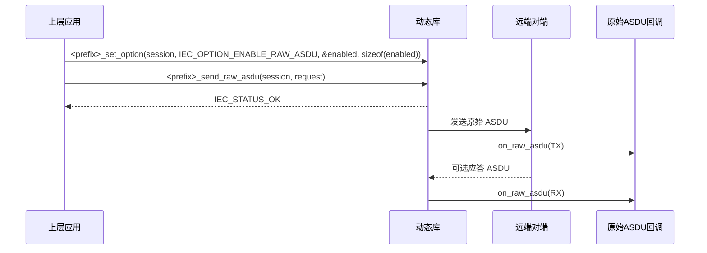
```mermaid
sequenceDiagram
    participant 应用 as 上层应用
    participant 库 as 动态库
    participant 对端 as 远端对端
    participant 回调 as 原始ASDU回调

    应用->>库: <prefix>_set_option(session, IEC_OPTION_ENABLE_RAW_ASDU, &enabled, sizeof(enabled))
    应用->>库: <prefix>_send_raw_asdu(session, request)
    库-->>应用: IEC_STATUS_OK
    库->>对端: 发送原始 ASDU
    库->>回调: on_raw_asdu(TX)
    对端-->>库: 可选应答 ASDU
    库->>回调: on_raw_asdu(RX)
```

```c
static const uint8_t payload[] = {
    0x64, 0x01, 0x06, 0x00, 0x01, 0x00
};

iec_raw_asdu_tx_t raw_req = {
    .payload = payload,
    .payload_size = sizeof(payload),
    .bypass_high_level_validation = 0
};

iec101_send_raw_asdu(session, &raw_req);
```

推荐处理步骤如下：

1. 使用前应明确开启原始 ASDU 旁路或注册 `on_raw_asdu`，便于观察发送和对端响应。
2. 默认保持 `bypass_high_level_validation = 0`，仅在明确验证厂商扩展报文时再开启绕过高层对象约束。
3. `<prefix>_send_raw_asdu` 不应替代点表、参数、文件、升级或时钟等高层接口。
4. 原始 ASDU 旁路只观察协议库自身收发的明文 ASDU，不覆盖安全 EB 密文报文或终端侧串口/网口监视。

### 7.19 文件传输取消流程

本流程用于覆盖正在进行的文件读写取消。目录召唤通常通过请求超时或最终结果收敛；读写传输可通过传输 ID 主动取消。

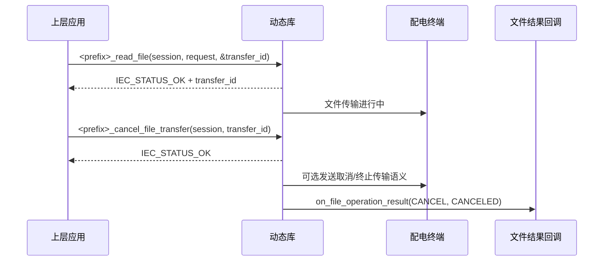
```mermaid
sequenceDiagram
    participant 应用 as 上层应用
    participant 库 as 动态库
    participant 终端 as 配电终端
    participant 回调 as 文件结果回调

    应用->>库: <prefix>_read_file(session, request, &transfer_id)
    库-->>应用: IEC_STATUS_OK + transfer_id
    库->>终端: 文件传输进行中
    应用->>库: <prefix>_cancel_file_transfer(session, transfer_id)
    库-->>应用: IEC_STATUS_OK
    库->>终端: 可选发送取消/终止传输语义
    库->>回调: on_file_operation_result(CANCEL, CANCELED)
```

```c
uint32_t transfer_id = 0;
m101_read_file(session, &read_req, &transfer_id);

/* 用户取消、链路策略切换或业务超时后发起取消。 */
m101_cancel_file_transfer(session, transfer_id);

iec_file_transfer_status_t status;
m101_get_file_transfer_status(session, transfer_id, &status);
```

推荐处理步骤如下：

1. 只有已获得 `transfer_id` 的文件读取或写入请求才适合调用 `<prefix>_cancel_file_transfer`。
2. 取消请求同步返回 `IEC_STATUS_OK` 只表示库已接受取消动作，最终状态以 `on_file_operation_result` 为准。
3. 取消后可通过 `<prefix>_get_file_transfer_status` 查询本地快照，用于展示已确认偏移或判断是否允许后续续传。
4. 若目标协议或终端不支持显式取消，库应返回 `IEC_STATUS_UNSUPPORTED` 或通过文件结果回调给出不支持/失败诊断。

## 8. 运行约束与设计说明

### 8.1 生命周期约束

- `<prefix>_create` 成功后会话状态为 `IEC_RUNTIME_CREATED`。
- `<prefix>_start` 触发状态流转 `CREATED -> STARTING -> RUNNING`。
- `<prefix>_stop` 触发状态流转 `RUNNING -> STOPPING -> STOPPED`。
- 运行过程中遇到严重不可恢复异常时，会话可进入 `IEC_RUNTIME_FAULTED`。

### 8.2 C 接口与内存所有权约束

- 所有导出函数使用 C ABI。
- `iec_session_t` 为 opaque handle，禁止用户栈上构造或复制。
- 公共结构体直接按头文件定义传递，调用方与动态库应基于同一版本头文件编译。
- 用户传入 `<prefix>_create` 的配置结构体、协议配置、transport 和回调结构体，在函数返回后可释放，动态库内部应完成必要拷贝。
- `iec_transport_t.ctx` 指向的上下文和真实通信资源必须在会话运行期间保持有效；资源打开、关闭和所有权由 transport 提供方负责。
- 用户传入的字符串参数在对应 API 返回前必须有效，返回后是否长期保留由库内部拷贝决定。
- 回调收到的事件数据由动态库持有，在回调执行窗口内供调用方读取和拷贝。
- 文件写入请求中的 `content` 只表达本次待发送窗口；调用方可选择一次性提供完整内容，也可在续传场景下提供剩余窗口。
- 程序升级请求中的 `iec_upgrade_image_source_t.ctx` 和 `read` 回调由上层持有，必须在 `on_upgrade_result` 最终回调前保持有效。
- 接口返回模式统一采用调用方缓冲区和回调只读视图。

### 8.3 错误处理约束

同步返回码用于描述调用级别结果，包括：

- 参数非法。
- 当前状态与调用语义不匹配。
- 预留能力或当前实现范围外的能力。
- 资源不足。
- 底层 I/O 提交失败。

异步事件用于描述运行期结果，包括：

- 链路连接建立和断开。
- 重连开始和恢复。
- 对端复位。
- 运行期协议错误。
- 命令应答结果。
- 参数写入、参数校验和定值区切换结果。
- 文件目录召唤、文件读取、文件写入和取消结果。
- 程序升级阶段进度、完成、失败和取消结果。
- 校时和时钟读取结果。
- 日志和告警信息。

推荐约定如下：

- 同步返回 `IEC_STATUS_OK` 表示请求已进入处理流程，业务动作的完成情况通过后续回调体现。
- 命令下发最终结果以 `on_command_result` 为准。
- 参数写入、参数校验和定值区切换最终结果以 `on_parameter_result` 为准。
- 文件目录、文件读取、文件写入和取消最终结果以 `on_file_operation_result` 为准；若出现协议否定确认、传送原因异常或厂商扩展错误，应优先读取其中的诊断字段。
- 程序升级最终结果以 `on_upgrade_result` 为准；升级状态机中的文件传输细节由 `on_upgrade_progress` 汇总呈现。
- 校时和时钟读取最终结果以 `on_clock_result` 为准。
- 运行期链路变化和协议事件通过异步回调通知上层。

### 8.4 高层数据主路径与原始旁路关系

- 高层点表接口是默认主路径，业务系统应优先依赖 `on_point_indication`。
- 参数接口是独立主路径，参数读取和参数写入不应通过点表接口或遥控接口拼装实现。
- 文件接口是独立主路径，目录召唤、文件传输和断点续传不应通过 `<prefix>_send_raw_asdu` 或自定义旁路报文暴露给上层。
- 程序升级接口是独立高层主路径，启动升级、执行升级、文件写入和升级结束不应要求上层手工拼装多个底层调用。
- 时钟接口是独立主路径，校时和读取终端当前时间不应通过 `<prefix>_send_raw_asdu` 或参数接口拼装实现。
- 原始 ASDU 旁路作为调试抓包、扩展报文观察和受控透传通道。
- 原始 ASDU 旁路不等同于技术方案附录 F 的终端侧通信报文监视；后者涉及终端监视串口/网口报文以及明文/密文对照展示，应由独立高层报文监视能力或上层/安全适配层承接。
- 即使开启原始 ASDU 旁路，高层解码成功的报文仍继续生成高层事件。
- `bypass_high_level_validation` 作用于高层对象约束，协议帧基础合法性检查保持有效。

### 8.5 参数与文件接口边界

- 动态库负责参数读取、参数写入、回读校验、定值区切换、自描述获取以及协议字段与高层参数对象之间的映射。
- 动态库负责文件目录召唤、文件读取、文件写入、传输状态维护、取消和断点续传恢复点管理。
- 动态库负责程序升级协议状态机、升级命令封装、文件写入阶段编排、升级结束命令和升级结果归并。
- 动态库负责校时和读取终端当前时间的协议交互以及结果回调。
- 参数模板文件的导入、导出、版本管理和落盘由上层应用负责，不纳入动态库职责范围。
- 本地文件的落盘、缓存目录管理、升级包来源校验、可信验签、散列计算和断点内容持久化由上层应用负责，不纳入动态库职责范围。
- 证书导入导出、终端初始证书回写、密钥恢复、USB Key 登录、软件授权、可信验签和安全审计由安全适配层或上层应用负责，不纳入协议层 SDK 职责范围。
- 自描述内容的 XML 或 msg 解析、参数分组展示、界面控件生成和参数变更审计由上层应用负责。
- 无线模块、电源模块、线损模块在接口层统一视为参数域，避免为具体业务模块重复设计函数族。
- `<prefix>_read_point` 适合点表对象读取，不负责表达“读取全部运行参数”“读取某定值区全部参数”这类参数语义。
- 点表在线读取、修改和点表模板下发校验属于参数接口范畴，使用 `IEC_PARAMETER_SCOPE_POINT_TABLE` 表达点表配置域；实时点值召测和上送仍属于点表接口范畴。
- `<prefix>_control_point` 适合遥控、设定值命令、恢复出厂设置和设备重启等以遥控格式承载的扩展运维命令，不承担模板下发、参数批量写入和回读校验职责。
- 恢复出厂设置和设备重启的操作确认、权限控制、安全闭锁、无线运维模式限制和审计落库属于上层应用职责；动态库只负责已确认命令的协议封装、发送、确认/否认解析和结果回调。
- 通用文件 API 负责目录、数据块和续传偏移等高层文件语义；`<prefix>_get_device_description` 继续承担终端模型文件的专用获取入口。
