# 配电终端统一运维工具协议层 SDK 接口设计

## 1. 文档目的

本文档定义 `dtu-unified-maintenance-sdk` 的 `IEC 60870-5-101` / `IEC 60870-5-104` 协议层动态库接口草案，用于接口冻结、实现对齐和跨平台交付。

目标动态库产物包括 Windows `.dll`、Linux `.so` 和 Android `.so`。

本文档聚焦主站侧能力，采用以下设计原则：

- 对外暴露统一核心接口，公共前缀使用 `iec_`。
- 协议差异通过扩展配置和少量扩展函数承载，101 使用 `iec101_` 前缀，104 使用 `iec104_` 前缀。
- 公共对象模型固定为单会话句柄，内部状态机实现由库内部维护。
- 对外 ABI 使用 C ABI，便于 C/C++ 及其他语言绑定。
- 数据接口以高层点表对象为主，同时保留原始 ASDU 旁路能力。
- 参数读取、批量写入、回读校验、定值区切换、文件目录召唤、文件读写和断点续传等统一运维能力通过独立高层接口承载。
- 错误处理采用同步返回码 + 异步事件回调组合模型。

## 2. 适用范围

本文档当前聚焦主站侧 101/104 跨平台协议层动态库接口及 101 运维扩展能力，覆盖以下能力：

- 101 主站会话创建、启动、停止、销毁。
- 104 主站会话创建、启动、停止、销毁。
- 运维101 profile 建模与标准 101 共享同一套会话生命周期和扩展配置骨架。
- 点表上送事件建模，包括单点、双点、遥测、累计量等常见对象。
- 参数读取、批量写入、回读校验、定值区管理和终端自描述获取。
- 文件目录召唤、文件读取、文件写入、状态查询、取消和断点续传。
- 遥控、总召、电度量召唤、时钟同步等主站侧典型操作。
- 原始 ASDU 观察和透传发送能力。
- 链路状态、异常、日志、命令结果、参数结果、文件目录结果和文件传输结果等异步事件回调。

## 3. API 总览

### 3.1 设计总原则

- 公共 API 负责生命周期、运行控制、点表事件、命令、旁路和统一错误语义。
- 101/104 差异只放在各自扩展配置中，不把串口细节或 TCP 细节泄漏到公共接口。
- 运维101 作为 `IEC_PROTOCOL_101` 下的 profile 承载，不新增第三种公共协议枚举。
- 文件目录、文件读写和断点续传保持公共 `iec_` API 命名，不把运维101专用报文细节暴露给上层。
- 公共结构体保持轻量字段布局，沿用项目既有接入习惯，不引入额外版本握手字段。
- 所有回调都在 `iec_create` 阶段注册，由库内工作线程触发。
- 参数模板导入导出和界面生成由上层应用负责，动态库负责参数对象建模和协议交互。

### 3.2 核心函数总表

以下核心函数均为公共 API，统一适用于 101/104；当目标协议 profile 或终端能力不支持某项运维能力时，动态库应返回明确的 `IEC_STATUS_UNSUPPORTED` 或异步结果码。

| API | 用途 | 关键输入 | 同步返回含义 | 关联异步结果 |
| --- | --- | --- | --- | --- |
| `iec_create` | 创建会话对象并拷贝配置 | 公共配置、协议扩展配置、回调集合 | 表示会话对象初始化阶段是否完成 | 无 |
| `iec_destroy` | 销毁会话对象 | 会话句柄 | 表示资源释放阶段是否完成 | 无 |
| `iec_get_protocol` | 查询当前会话协议类型 | 会话句柄 | 是否成功写出协议枚举 | 无 |
| `iec_get_status` | 查询当前运行状态 | 会话句柄 | 是否成功写出状态枚举 | 无 |
| `iec_set_option` | 修改允许运行时变更的选项 | 选项枚举、值缓冲区 | 是否成功接受配置更新 | 部分改动会影响后续回调行为 |
| `iec_get_option` | 查询当前选项值 | 选项枚举、输出缓冲区 | 是否成功读取当前值 | 无 |
| `iec_start` | 启动工作线程并开始链路建立 | 会话句柄 | 启动请求是否被接受 | `on_session_state`、`on_link_event` |
| `iec_stop` | 请求停止并等待会话退出 | 会话句柄、停止超时 | 停止请求是否完成 | `on_session_state` |
| `iec_general_interrogation` | 发起总召 | 总召请求结构体 | 请求是否被接受 | `on_point_indication`、`on_link_event` |
| `iec_counter_interrogation` | 发起电度量召唤 | 电度量召唤请求结构体 | 请求是否被接受 | `on_point_indication`、`on_link_event` |
| `iec_read_point` | 按地址读取单个对象 | 点位地址 | 请求是否被接受 | `on_point_indication`、`on_link_event` |
| `iec_control_point` | 下发遥控或设定值命令 | 命令请求结构体 | 请求是否被接受并生成命令 ID | `on_command_result` |
| `iec_get_device_description` | 获取终端自描述内容 | 自描述请求结构体 | 请求是否被接受并生成请求 ID | `on_device_description` |
| `iec_read_parameters` | 读取参数或参数分组 | 参数读取请求结构体 | 请求是否被接受并生成请求 ID | `on_parameter_indication` |
| `iec_write_parameters` | 批量写入参数 | 参数写入请求结构体 | 请求是否被接受并生成请求 ID | `on_parameter_result` |
| `iec_verify_parameters` | 按期望值回读校验参数 | 参数校验请求结构体 | 请求是否被接受并生成请求 ID | `on_parameter_result`、`on_parameter_indication` |
| `iec_switch_setting_group` | 查询或切换定值区 | 定值区请求结构体 | 请求是否被接受并生成请求 ID | `on_parameter_result` |
| `iec_list_files` | 召唤远端文件目录 | 文件目录请求结构体 | 请求是否被接受并生成请求 ID | `on_file_list_indication`、`on_file_operation_result` |
| `iec_read_file` | 读取远端文件，支持按偏移续传 | 文件读取请求结构体 | 请求是否被接受并生成传输 ID | `on_file_data_indication`、`on_file_operation_result` |
| `iec_write_file` | 写入远端文件，支持按偏移续传 | 文件写入请求结构体 | 请求是否被接受并生成传输 ID | `on_file_operation_result` |
| `iec_get_file_transfer_status` | 查询文件传输本地状态快照 | 传输 ID | 是否成功写出当前状态视图 | 无 |
| `iec_cancel_file_transfer` | 请求取消进行中的文件传输 | 传输 ID | 取消请求是否被接受 | `on_file_operation_result` |
| `iec_clock_sync` | 发送校时命令 | 校时请求结构体 | 请求是否被接受 | `on_link_event`、日志回调 |
| `iec_send_raw_asdu` | 主动透传原始 ASDU | 原始发送请求结构体 | 请求是否被接受 | `on_raw_asdu`、`on_link_event` |

### 3.3 关键回调总表

| 回调 | 触发时机 | 主要用途 | 线程语义 |
| --- | --- | --- | --- |
| `on_session_state` | 生命周期状态变化时 | 观测会话从创建到运行、停止的状态流转 | 由库内工作线程触发 |
| `on_link_event` | 建链、断链、重连、链路异常时 | 感知链路健康状态 | 由库内工作线程触发 |
| `on_point_indication` | 收到高层点表对象时 | 接收单点、双点、遥测、累计量等对象 | 由库内工作线程触发 |
| `on_command_result` | 命令收到确认、否认或超时时 | 获取命令最终结果 | 由库内工作线程触发 |
| `on_device_description` | 收到终端自描述内容时 | 接收 XML 或 msg 自描述文件并供上层解析 | 由库内工作线程触发 |
| `on_file_list_indication` | 收到文件目录分帧结果时 | 接收目录项并构建远端文件视图 | 由库内工作线程触发 |
| `on_file_data_indication` | 收到文件读取数据块时 | 接收文件块、推进偏移并支撑断点续传 | 由库内工作线程触发 |
| `on_file_operation_result` | 文件目录、文件读写或取消完成时 | 获取文件类请求的最终结果 | 由库内工作线程触发 |
| `on_parameter_indication` | 收到参数读取结果时 | 接收参数值和可选参数描述信息 | 由库内工作线程触发 |
| `on_parameter_result` | 参数写入、校验、切区完成时 | 获取参数类请求的最终结果 | 由库内工作线程触发 |
| `on_raw_asdu` | 启用旁路且收发原始 ASDU 时 | 调试抓包、特殊报文透传 | 由库内工作线程触发 |
| `on_log` | 产生日志时 | 联调、排障和接入监控 | 由库内工作线程触发 |

### 3.4 关键结构体总表

| 结构体 | 作用 | 关键字段 |
| --- | --- | --- |
| `iec_session_config_t` | 公共配置 | `protocol`、超时、重连间隔、日志等级、`user_context` |
| `iec_callbacks_t` | 回调集合 | 状态、链路、点表、命令、自描述、文件目录、文件数据、文件结果、参数、原始 ASDU、日志回调 |
| `iec_point_address_t` | 协议原生地址 | 公共地址、信息体地址、类型标识、传送原因 |
| `iec_point_value_t` | 高层点值 | 点值类型、质量位、时间戳、实际数据 |
| `iec_command_request_t` | 控制命令 | 目标地址、命令类型、命令模式、命令值 |
| `iec_parameter_item_t` | 单个参数值对象 | 参数 ID、地址、参数域、值类型、当前值 |
| `iec_parameter_descriptor_t` | 参数元数据 | 名称、分组、范围、缺省值、模板/校验能力 |
| `iec_parameter_read_request_t` | 参数读取请求 | 读取模式、参数域、地址范围、定值区 |
| `iec_parameter_write_request_t` | 参数写入请求 | 参数数组、目标定值区、写后校验开关 |
| `iec_device_description_t` | 自描述内容事件 | 格式、内容视图、分片完成标记 |
| `iec_file_list_request_t` | 文件目录请求 | 目录名、是否附带详情 |
| `iec_file_entry_t` | 单个目录项 | 文件名、文件大小、时间戳、校验摘要 |
| `iec_file_list_indication_t` | 文件目录结果 | 目录项数组、数量、结束标记 |
| `iec_file_read_request_t` | 文件读取请求 | 目录名、文件名、起始偏移、块大小 |
| `iec_file_write_request_t` | 文件写入请求 | 文件名、总大小、起始偏移、待发送内容 |
| `iec_file_data_indication_t` | 文件数据块事件 | 当前偏移、下一偏移、数据块视图 |
| `iec_file_transfer_status_t` | 文件传输状态快照 | 传输方向、状态、已确认偏移、是否可续传、最近一次底层错误信息 |
| `iec_file_operation_result_t` | 文件操作结果 | 操作类型、结果码、最终偏移、总大小、协议诊断细节 |
| `iec_raw_asdu_event_t` | 原始报文事件 | 收发方向、类型标识、公共地址、载荷视图 |
| `iec101_master_config_t` | 101 扩展配置 | profile、串口、链路地址、字段长度、重发参数 |
| `iec104_master_config_t` | 104 扩展配置 | 远端地址、端口、连接模式、K/W/T 参数 |

### 3.5 对外句柄与头文件骨架

```c
#ifdef __cplusplus
extern "C" {
#endif

/* 对外通过不透明会话句柄访问会话，内部状态机和资源布局由库内部维护。 */
typedef struct iec_session iec_session_t;

#ifdef __cplusplus
}
#endif
```

## 4. 公共 API 详细定义

### 4.1 会话管理与运行控制

#### iec_create

```c
/**
 * @brief 创建会话对象。
 *
 * 根据公共配置、协议扩展配置和回调集合创建一个新的会话实例。
 * 本函数仅表示对象创建阶段是否成功，不表示链路已经建立或启动完成；
 * 链路状态通过后续启动流程及异步回调体现。
 *
 * @param[in]  config
 *     公共配置，定义协议类型、超时和用户上下文。
 * @param[in]  protocol_config
 *     协议扩展配置。
 *     当 `config->protocol` 为 `IEC_PROTOCOL_101` 时，应指向 101 配置结构；
 *     当 `config->protocol` 为 `IEC_PROTOCOL_104` 时，应指向 104 配置结构。
 * @param[in]  callbacks
 *     异步回调集合。创建成功后，库内部持有其副本。
 * @param[out] out_session
 *     输出会话句柄地址。成功时写入新建会话对象。
 *
 * @return 创建阶段的执行结果。
 * @retval IEC_STATUS_OK 创建成功。
 *
 * @pre `config != NULL`
 * @pre `protocol_config != NULL`
 * @pre `callbacks != NULL`
 * @pre `out_session != NULL`
 * @post 成功时 `*out_session != NULL`
 *
 * @note 物理连接、串口打开和工作线程启动由 `iec_start` 承担。
 */
iec_status_t iec_create(
    const iec_session_config_t *config,
    const void *protocol_config,
    const iec_callbacks_t *callbacks,
    iec_session_t **out_session);
```

#### iec_destroy

```c
/**
 * @brief 销毁会话对象。
 *
 * 释放会话对象及其关联资源。
 * 支持在 `CREATED`、`STOPPED` 或 `FAULTED` 状态下调用。
 *
 * @param[in] session 待销毁的会话句柄。
 *
 * @return 销毁阶段的执行结果。
 * @retval IEC_STATUS_OK 销毁成功。
 *
 * @post 成功后 `session` 立即失效，调用方不得再次使用。
 * @note 停止流程由 `iec_stop` 承担，本函数仅负责资源释放。
 */
iec_status_t iec_destroy(iec_session_t *session);
```

#### iec_get_protocol

```c
/**
 * @brief 查询当前会话的协议类型。
 *
 * @param[in]  session      目标会话句柄。
 * @param[out] out_protocol 协议类型输出地址。成功时写入 `IEC_PROTOCOL_101`
 *                          或 `IEC_PROTOCOL_104`。
 *
 * @return 查询阶段的执行结果。
 * @retval IEC_STATUS_OK 查询成功。
 */
iec_status_t iec_get_protocol(
    const iec_session_t *session,
    iec_protocol_t *out_protocol);
```

#### iec_get_status

```c
/**
 * @brief 查询当前运行状态。
 *
 * @param[in]  session   目标会话句柄。
 * @param[out] out_state 运行状态输出地址。成功时写入当前生命周期状态。
 *
 * @return 查询阶段的执行结果。
 * @retval IEC_STATUS_OK 查询成功。
 */
iec_status_t iec_get_status(
    const iec_session_t *session,
    iec_runtime_state_t *out_state);
```

#### iec_set_option

```c
/**
 * @brief 修改运行时可变选项。
 *
 * @param[in] session    目标会话句柄。
 * @param[in] option     选项标识，应从文档声明的可动态修改项中选择。
 * @param[in] value      选项值缓冲区。
 * @param[in] value_size `value` 对应的缓冲区大小。
 *
 * @return 修改阶段的执行结果。
 * @retval IEC_STATUS_OK 修改成功。
 *
 * @note `value` 和 `value_size` 由调用方提供，库内部会立即读取所需内容，
 *       调用返回后无需继续保持该缓冲区有效。
 */
iec_status_t iec_set_option(
    iec_session_t *session,
    iec_option_t option,
    const void *value,
    uint32_t value_size);
```

#### iec_get_option

```c
/**
 * @brief 查询运行时选项。
 *
 * @param[in]      session          目标会话句柄。
 * @param[in]      option           选项标识。
 * @param[out]     value            选项值输出缓冲区。
 * @param[in,out]  inout_value_size 输入输出大小参数。
 *                                  调用前写入缓冲区大小；
 *                                  调用后返回实际写入大小或所需大小。
 *
 * @return 查询阶段的执行结果。
 * @retval IEC_STATUS_OK 查询成功。
 */
iec_status_t iec_get_option(
    const iec_session_t *session,
    iec_option_t option,
    void *value,
    uint32_t *inout_value_size);
```

#### iec_start

```c
/**
 * @brief 启动会话。
 *
 * 创建内部工作线程和 I/O 上下文。
 * 对 101 执行串口打开与主站建链；
 * 对 104 执行 TCP 主站建链或相应连接模式准备。
 *
 * @param[in] session 待启动的会话句柄。
 *
 * @return 启动阶段的执行结果。
 * @retval IEC_STATUS_OK 启动请求已进入执行流程。
 *
 * @note 返回成功仅表示启动请求已被接受，最终运行状态通过异步回调体现。
 */
iec_status_t iec_start(iec_session_t *session);
```

#### iec_stop

```c
/**
 * @brief 停止会话。
 *
 * 请求会话退出并等待内部线程收敛。
 *
 * @param[in] session    待停止的会话句柄。
 * @param[in] timeout_ms 停止等待窗口，单位为毫秒。
 *
 * @return 停止阶段的执行结果。
 * @retval IEC_STATUS_OK      停止流程已完成。
 * @retval IEC_STATUS_TIMEOUT 等待窗口结束，但停止流程仍可能继续收敛。
 */
iec_status_t iec_stop(
    iec_session_t *session,
    uint32_t timeout_ms);
```

行为约束如下：

- `iec_create` 覆盖参数校验和对象初始化，物理连接、串口打开和工作线程启动由 `iec_start` 承担。
- `iec_start` 成功返回表示启动请求已进入执行流程，链路建立结果由后续回调体现。
- `iec_stop` 负责请求退出并等待线程收敛，句柄释放由 `iec_destroy` 承担。
- `iec_destroy` 负责资源释放阶段。

### 4.2 数据面、命令与旁路接口

#### iec_general_interrogation

```c
/**
 * @brief 发起总召。
 *
 * @param[in] session 目标会话句柄。
 * @param[in] request 总召请求，描述目标公共地址和总召限定词。
 *
 * @return 请求提交阶段的执行结果。
 * @retval IEC_STATUS_OK 请求已进入发送流程。
 *
 * @note 成功返回仅表示请求已进入发送流程，后续数据通过点表回调异步返回。
 */
iec_status_t iec_general_interrogation(
    iec_session_t *session,
    const iec_interrogation_request_t *request);
```

#### iec_counter_interrogation

```c
/**
 * @brief 发起电度量召唤。
 *
 * @param[in] session 目标会话句柄。
 * @param[in] request 电度量召唤请求，描述目标公共地址、召唤限定词和冻结语义。
 *
 * @return 请求提交阶段的执行结果。
 * @retval IEC_STATUS_OK 请求已进入发送流程。
 *
 * @note 成功返回仅表示请求已进入发送流程，后续结果通过异步回调体现。
 */
iec_status_t iec_counter_interrogation(
    iec_session_t *session,
    const iec_counter_interrogation_request_t *request);
```

#### iec_read_point

```c
/**
 * @brief 按单点地址读取对象。
 *
 * @param[in] session 目标会话句柄。
 * @param[in] address 点位地址，采用协议原生地址建模，直接表达公共地址和信息体地址。
 *
 * @return 请求提交阶段的执行结果。
 * @retval IEC_STATUS_OK 请求已进入发送流程。
 *
 * @note 成功返回仅表示请求已进入发送流程，读取结果通过异步回调体现。
 */
iec_status_t iec_read_point(
    iec_session_t *session,
    const iec_point_address_t *address);
```

#### iec_control_point

```c
/**
 * @brief 下发控制命令或设定值命令。
 *
 * @param[in]  session        目标会话句柄。
 * @param[in]  request        命令请求，描述目标地址、命令类型、命令模式和命令值。
 * @param[out] out_command_id 命令 ID 输出地址。成功时由库生成，用于关联异步命令结果。
 *
 * @return 请求提交阶段的执行结果。
 * @retval IEC_STATUS_OK 请求已进入发送流程。
 *
 * @note 命令最终结果以 `on_command_result` 回调为准。
 */
iec_status_t iec_control_point(
    iec_session_t *session,
    const iec_command_request_t *request,
    uint32_t *out_command_id);
```

#### iec_clock_sync

```c
/**
 * @brief 发送校时命令。
 *
 * @param[in] session 目标会话句柄。
 * @param[in] request 校时请求，可指定固定时间戳，也可要求库在发送时自动采集系统时间。
 *
 * @return 请求提交阶段的执行结果。
 * @retval IEC_STATUS_OK 请求已进入发送流程。
 *
 * @note 成功返回仅表示请求已进入发送流程，后续状态主要通过链路事件或日志体现。
 */
iec_status_t iec_clock_sync(
    iec_session_t *session,
    const iec_clock_sync_request_t *request);
```

#### iec_send_raw_asdu

```c
/**
 * @brief 发送原始 ASDU。
 *
 * @param[in] session 目标会话句柄。
 * @param[in] request 原始 ASDU 发送请求，提供只读负载视图和旁路控制标志。
 *
 * @return 请求提交阶段的执行结果。
 * @retval IEC_STATUS_OK 请求已进入发送流程。
 *
 * @note 默认执行基础安全检查，`bypass_high_level_validation` 仅影响高层对象约束。
 * @note 后续报文观察结果可通过 `on_raw_asdu` 或 `on_link_event` 回调体现。
 */
iec_status_t iec_send_raw_asdu(
    iec_session_t *session,
    const iec_raw_asdu_tx_t *request);
```

行为约束如下：

- 高层数据接口是主路径，点表对象通过 `on_point_indication` 返回。
- `iec_control_point` 的最终结果以 `on_command_result` 为准。
- 原始 ASDU 旁路作为扩展和排障通道，与高层对象模型并行存在。

### 4.3 参数接口

#### iec_get_device_description

```c
/**
 * @brief 获取终端自描述内容。
 *
 * @param[in]  session        目标会话句柄。
 * @param[in]  request        自描述请求，描述目标公共地址、内容格式偏好和最大期望长度。
 * @param[out] out_request_id 请求 ID 输出地址。成功时由库生成，用于关联异步结果。
 *
 * @return 请求提交阶段的执行结果。
 * @retval IEC_STATUS_OK 请求已进入发送流程。
 *
 * @note 自描述内容通过 `on_device_description` 回调异步返回。
 */
iec_status_t iec_get_device_description(
    iec_session_t *session,
    const iec_device_description_request_t *request,
    uint32_t *out_request_id);
```

#### iec_read_parameters

```c
/**
 * @brief 读取参数。
 *
 * @param[in]  session        目标会话句柄。
 * @param[in]  request        参数读取请求，支持读取全部参数、按参数域读取、按分组读取或按地址范围读取。
 * @param[out] out_request_id 请求 ID 输出地址。成功时由库生成，用于关联异步结果。
 *
 * @return 请求提交阶段的执行结果。
 * @retval IEC_STATUS_OK 请求已进入发送流程。
 *
 * @note 读取结果通过 `on_parameter_indication` 回调分帧返回。
 */
iec_status_t iec_read_parameters(
    iec_session_t *session,
    const iec_parameter_read_request_t *request,
    uint32_t *out_request_id);
```

#### iec_write_parameters

```c
/**
 * @brief 批量写入参数。
 *
 * @param[in]  session        目标会话句柄。
 * @param[in]  request        参数写入请求，提供目标定值区、参数数组和写后校验控制位。
 * @param[out] out_request_id 请求 ID 输出地址。成功时由库生成，用于关联异步结果。
 *
 * @return 请求提交阶段的执行结果。
 * @retval IEC_STATUS_OK 请求已进入发送流程。
 *
 * @note 写入最终结果以 `on_parameter_result` 回调为准。
 */
iec_status_t iec_write_parameters(
    iec_session_t *session,
    const iec_parameter_write_request_t *request,
    uint32_t *out_request_id);
```

#### iec_verify_parameters

```c
/**
 * @brief 发起参数回读校验。
 *
 * @param[in]  session        目标会话句柄。
 * @param[in]  request        参数校验请求，提供期望值数组和目标定值区。
 * @param[out] out_request_id 请求 ID 输出地址。成功时由库生成，用于关联异步结果。
 *
 * @return 请求提交阶段的执行结果。
 * @retval IEC_STATUS_OK 请求已进入发送流程。
 *
 * @note 校验过程中回读的参数值通过 `on_parameter_indication` 返回，校验结论通过
 *       `on_parameter_result` 返回。
 */
iec_status_t iec_verify_parameters(
    iec_session_t *session,
    const iec_parameter_verify_request_t *request,
    uint32_t *out_request_id);
```

#### iec_switch_setting_group

```c
/**
 * @brief 查询或切换定值区。
 *
 * @param[in]  session        目标会话句柄。
 * @param[in]  request        定值区请求，支持查询当前区和切换目标区。
 * @param[out] out_request_id 请求 ID 输出地址。成功时由库生成，用于关联异步结果。
 *
 * @return 请求提交阶段的执行结果。
 * @retval IEC_STATUS_OK 请求已进入发送流程。
 *
 * @note 结果通过 `on_parameter_result` 回调返回。
 */
iec_status_t iec_switch_setting_group(
    iec_session_t *session,
    const iec_setting_group_request_t *request,
    uint32_t *out_request_id);
```

行为约束如下：

- 参数读取、写入、校验和定值区管理均通过专用参数接口承载，不复用 `iec_read_point` 或 `iec_control_point`。
- 参数模板导入导出由上层应用负责，动态库只负责参数对象和协议交互，不承担模板文件持久化职责。
- `iec_write_parameters` 的 `verify_after_write` 只表示库在写入成功后继续发起回读校验，不代表同步返回时已经完成校验。
- `iec_verify_parameters` 用于模板下发后的显式回读校验，也可用于上层对关键参数做抽查。
- `iec_switch_setting_group` 只建模当前区查询和切换动作，不在接口层扩展定值区批量管理策略。
- `iec_get_device_description` 负责从终端取回 XML 或 msg 自描述内容，解析、缓存和界面生成由上层应用负责。

### 4.4 文件接口

#### iec_list_files

```c
/**
 * @brief 召唤远端文件目录。
 *
 * @param[in]  session        目标会话句柄。
 * @param[in]  request        文件目录请求，描述目标公共地址、目录名和是否附带文件详情。
 * @param[out] out_request_id 请求 ID 输出地址。成功时由库生成，用于关联异步结果。
 *
 * @return 请求提交阶段的执行结果。
 * @retval IEC_STATUS_OK 请求已进入发送流程。
 *
 * @note 目录项通过 `on_file_list_indication` 分帧返回，目录请求最终结果通过
 *       `on_file_operation_result` 返回。
 */
iec_status_t iec_list_files(
    iec_session_t *session,
    const iec_file_list_request_t *request,
    uint32_t *out_request_id);
```

#### iec_read_file

```c
/**
 * @brief 读取远端文件，支持按偏移断点续传。
 *
 * @param[in]  session         目标会话句柄。
 * @param[in]  request         文件读取请求，提供文件名、起始偏移和期望块大小。
 * @param[out] out_transfer_id 传输 ID 输出地址。成功时由库生成，用于关联进度与最终结果。
 *
 * @return 请求提交阶段的执行结果。
 * @retval IEC_STATUS_OK 请求已进入发送流程。
 *
 * @note 文件数据块通过 `on_file_data_indication` 回调返回，最终结果通过
 *       `on_file_operation_result` 回调返回。
 */
iec_status_t iec_read_file(
    iec_session_t *session,
    const iec_file_read_request_t *request,
    uint32_t *out_transfer_id);
```

#### iec_write_file

```c
/**
 * @brief 写入远端文件，支持按偏移断点续传。
 *
 * @param[in]  session         目标会话句柄。
 * @param[in]  request         文件写入请求，提供目标文件名、总大小、起始偏移和待发送内容窗口。
 * @param[out] out_transfer_id 传输 ID 输出地址。成功时由库生成，用于关联状态与最终结果。
 *
 * @return 请求提交阶段的执行结果。
 * @retval IEC_STATUS_OK 请求已进入发送流程。
 *
 * @note `request->content` 与 `request->content_size` 描述本次待发送窗口。
 *       若需要断点续传，调用方可在后续重新发起 `iec_write_file`，
 *       并使用新的 `start_offset` 与剩余内容窗口。
 */
iec_status_t iec_write_file(
    iec_session_t *session,
    const iec_file_write_request_t *request,
    uint32_t *out_transfer_id);
```

#### iec_get_file_transfer_status

```c
/**
 * @brief 查询文件传输状态快照。
 *
 * @param[in]  session      目标会话句柄。
 * @param[in]  transfer_id  传输 ID。
 * @param[out] out_status   文件传输状态输出地址。成功时写入当前本地状态视图。
 *
 * @return 查询阶段的执行结果。
 * @retval IEC_STATUS_OK 查询成功。
 *
 * @note 本函数返回库内维护的本地状态快照，不主动触发远端轮询。
 */
iec_status_t iec_get_file_transfer_status(
    const iec_session_t *session,
    uint32_t transfer_id,
    iec_file_transfer_status_t *out_status);
```

#### iec_cancel_file_transfer

```c
/**
 * @brief 请求取消当前文件传输。
 *
 * @param[in] session     目标会话句柄。
 * @param[in] transfer_id 传输 ID。
 *
 * @return 请求提交阶段的执行结果。
 * @retval IEC_STATUS_OK 取消请求已进入处理流程。
 *
 * @note 取消是否最终生效以 `on_file_operation_result` 回调为准。
 */
iec_status_t iec_cancel_file_transfer(
    iec_session_t *session,
    uint32_t transfer_id);
```

行为约束如下：

- 文件目录、文件读取、文件写入和断点续传属于统一高层运维能力，不通过 `iec_send_raw_asdu` 直接暴露。
- `start_offset = 0` 表示首次完整传输；非零偏移表示调用方根据已确认偏移发起断点续传。
- 当 `iec101_master_config_t.profile = IEC101_PROFILE_MAINTENANCE` 时，文件传输单块数据长度应按运维101的 `1024` 字节扩展上限建模；标准101场景仍应遵守传统 `255` 字节边界。
- 若上层给出的 `max_chunk_size` 或 `preferred_chunk_size` 超过当前协议 profile 可承载上限，库内部应自动裁剪或分块，不要求调用方手工按帧拆分。
- `iec_get_file_transfer_status` 只提供当前会话内可见的本地状态快照，适合外部轮询读取进度或恢复点。
- 文件读写最终结果统一以 `on_file_operation_result` 为准；调用返回 `IEC_STATUS_OK` 仅表示请求已被受理。
- 若对端返回否定确认、传送原因异常或厂商扩展错误，库应尽量填充 `iec_file_operation_result_t.cause_of_transmission`、`native_error_code` 和 `detail_message`，便于上层排障。
- 文件接口与自描述接口并行存在；`iec_get_device_description` 仍负责终端模型文件的专用获取语义，不要求上层自行拼装文件传输报文。

## 5. 公共类型与回调

### 5.1 协议、状态、返回码与运行时选项

```c
typedef enum iec_protocol {
    IEC_PROTOCOL_101 = 1, /* 101 主站会话 */
    IEC_PROTOCOL_104 = 2  /* 104 主站会话 */
} iec_protocol_t;

typedef enum iec_runtime_state {
    IEC_RUNTIME_CREATED = 0,  /* create 完成, 等待启动 */
    IEC_RUNTIME_STARTING = 1, /* 正在启动链路和工作线程 */
    IEC_RUNTIME_RUNNING = 2,  /* 已进入正常运行态 */
    IEC_RUNTIME_STOPPING = 3, /* 正在执行停止流程 */
    IEC_RUNTIME_STOPPED = 4,  /* 已停止, 可安全销毁 */
    IEC_RUNTIME_FAULTED = 5   /* 进入故障态, 由上层决定恢复或销毁 */
} iec_runtime_state_t;

typedef enum iec_status {
    IEC_STATUS_OK = 0,               /* 同步调用成功 */
    IEC_STATUS_INVALID_ARGUMENT = 1, /* 参数非法 */
    IEC_STATUS_UNSUPPORTED = 2,      /* 预留能力或当前实现范围外的能力 */
    IEC_STATUS_BAD_STATE = 3,        /* 当前生命周期状态与调用语义不匹配 */
    IEC_STATUS_TIMEOUT = 4,          /* 同步等待超时 */
    IEC_STATUS_NO_MEMORY = 5,        /* 内存不足 */
    IEC_STATUS_IO_ERROR = 6,         /* 底层 I/O 错误 */
    IEC_STATUS_PROTOCOL_ERROR = 7,   /* 协议处理错误 */
    IEC_STATUS_BUSY = 8,             /* 当前对象忙, 暂不可重入 */
    IEC_STATUS_INTERNAL_ERROR = 9    /* 内部未分类错误 */
} iec_status_t;

typedef enum iec_option {
    IEC_OPTION_LOG_LEVEL = 1,             /* 日志等级, 允许运行时修改 */
    IEC_OPTION_RECONNECT_INTERVAL_MS = 2, /* 重连间隔, 允许运行时修改 */
    IEC_OPTION_COMMAND_TIMEOUT_MS = 3,    /* 命令超时, 允许运行时修改 */
    IEC_OPTION_ENABLE_RAW_ASDU = 4        /* 是否启用原始 ASDU 旁路, 允许运行时修改 */
} iec_option_t;
```

协议建模约束如下：

- 运维101场景仍归属于 `IEC_PROTOCOL_101`，不额外引入第三种公共协议枚举。
- 若 `iec101_master_config_t.profile` 取 `IEC101_PROFILE_MAINTENANCE`，`iec_get_protocol` 仍返回 `IEC_PROTOCOL_101`。

以下参数在 `iec_create` 阶段确定：

- 协议类型。
- 回调集合。
- 用户上下文指针。
- 101 串口与链路层地址参数。
- 104 远端地址、端口、超时和连接模式参数。
- 公共地址长度、信息体地址长度等协议建模参数。

### 5.2 点位地址与点值模型

```c
typedef struct iec_point_address {
    uint16_t common_address;              /* ASDU 公共地址 */
    uint32_t information_object_address;  /* 信息体地址 */
    uint8_t type_id;                      /* 类型标识 */
    uint8_t cause_of_transmission;        /* 传送原因 */
    uint8_t originator_address;           /* 发起者地址 */
} iec_point_address_t;

typedef enum iec_point_type {
    IEC_POINT_SINGLE = 1,               /* 单点信息 */
    IEC_POINT_DOUBLE = 2,               /* 双点信息 */
    IEC_POINT_STEP = 3,                 /* 步位值 */
    IEC_POINT_MEASURED_NORMALIZED = 4,  /* 归一化遥测 */
    IEC_POINT_MEASURED_SCALED = 5,      /* 标度化遥测 */
    IEC_POINT_MEASURED_SHORT_FLOAT = 6, /* 短浮点遥测 */
    IEC_POINT_INTEGRATED_TOTAL = 7,     /* 累计量 */
    IEC_POINT_BITSTRING32 = 8           /* 32 位比特串 */
} iec_point_type_t;

typedef struct iec_timestamp {
    uint16_t msec;       /* 毫秒值 */
    uint8_t minute;      /* 分 */
    uint8_t hour;        /* 时 */
    uint8_t day;         /* 日 */
    uint8_t month;       /* 月 */
    uint8_t year;        /* 年, 按规约约定保存 */
    uint8_t invalid;     /* 时间有效性标志 */
} iec_timestamp_t;

typedef union iec_point_data {
    uint8_t single;           /* 单点值 */
    uint8_t doubled;          /* 双点值 */
    int16_t scaled;           /* 标度化数值 */
    float short_float;        /* 短浮点数值 */
    int32_t integrated_total; /* 累计量 */
    uint32_t bitstring32;     /* 32 位比特串 */
    int8_t step;              /* 步位值 */
} iec_point_data_t;

typedef struct iec_point_value {
    iec_point_type_t point_type; /* 点值类型 */
    uint8_t quality;             /* 质量位集合 */
    uint8_t has_timestamp;       /* 是否携带时标 */
    uint8_t is_sequence;         /* 是否来自连续信息体序列 */
    iec_point_data_t data;       /* 具体点值数据 */
    iec_timestamp_t timestamp;   /* 时标, 当 has_timestamp != 0 时有效 */
} iec_point_value_t;
```

当前高层点表覆盖以下对象：

- 单点遥信
- 双点遥信
- 归一化遥测
- 标度化遥测
- 短浮点遥测
- 累计量
- 步位值
- 32 位比特串

### 5.3 命令、召唤、校时与原始 ASDU 模型

```c
typedef enum iec_command_type {
    IEC_COMMAND_SINGLE = 1,          /* 单命令 */
    IEC_COMMAND_DOUBLE = 2,          /* 双命令 */
    IEC_COMMAND_STEP = 3,            /* 步调节命令 */
    IEC_COMMAND_SETPOINT_SCALED = 4, /* 标度化设定值 */
    IEC_COMMAND_SETPOINT_FLOAT = 5   /* 浮点设定值 */
} iec_command_type_t;

typedef enum iec_command_mode {
    IEC_COMMAND_MODE_DIRECT = 1,  /* 直接执行 */
    IEC_COMMAND_MODE_SELECT = 2,  /* 选择阶段 */
    IEC_COMMAND_MODE_EXECUTE = 3, /* 执行阶段 */
    IEC_COMMAND_MODE_CANCEL = 4   /* 撤销选择 */
} iec_command_mode_t;

typedef union iec_command_data {
    uint8_t single;    /* 单命令值 */
    uint8_t doubled;   /* 双命令值 */
    int16_t scaled;    /* 标度化设定值 */
    float short_float; /* 浮点设定值 */
    int8_t step;       /* 步调节值 */
} iec_command_data_t;

typedef struct iec_command_request {
    iec_point_address_t address;     /* 目标点位地址 */
    iec_command_type_t command_type; /* 命令类型 */
    iec_command_mode_t mode;         /* 命令模式 */
    uint8_t qualifier;               /* 命令限定词 */
    uint8_t execute_on_ack;          /* 是否在确认后继续执行本地流程 */
    uint16_t timeout_ms;             /* 本次命令自定义超时 */
    iec_command_data_t value;        /* 命令值 */
} iec_command_request_t;

typedef struct iec_interrogation_request {
    uint16_t common_address; /* 目标公共地址 */
    uint8_t qualifier;       /* 总召限定词 */
} iec_interrogation_request_t;

typedef struct iec_counter_interrogation_request {
    uint16_t common_address; /* 目标公共地址 */
    uint8_t qualifier;       /* 电度量召唤限定词 */
    uint8_t freeze;          /* 冻结语义 */
} iec_counter_interrogation_request_t;

typedef struct iec_clock_sync_request {
    uint16_t common_address;         /* 目标公共地址 */
    uint8_t use_current_system_time; /* 是否由库自动填充当前系统时间 */
    iec_timestamp_t timestamp;       /* 指定时标, 当 use_current_system_time == 0 时使用 */
} iec_clock_sync_request_t;

typedef enum iec_raw_asdu_direction {
    IEC_RAW_ASDU_RX = 1, /* 接收方向 */
    IEC_RAW_ASDU_TX = 2  /* 发送方向 */
} iec_raw_asdu_direction_t;

typedef struct iec_raw_asdu_event {
    iec_raw_asdu_direction_t direction;  /* 收发方向 */
    uint16_t common_address;             /* 公共地址 */
    uint8_t type_id;                     /* 类型标识 */
    uint8_t cause_of_transmission;       /* 传送原因 */
    const uint8_t *payload;              /* 原始载荷视图, 在当前回调期间有效 */
    uint32_t payload_size;               /* 原始载荷长度 */
    uint64_t monotonic_ns;               /* 单调时钟时间戳 */
} iec_raw_asdu_event_t;

typedef struct iec_raw_asdu_tx {
    const uint8_t *payload;              /* 待发送原始载荷 */
    uint32_t payload_size;               /* 待发送长度 */
    uint8_t bypass_high_level_validation; /* 是否绕过高层对象约束 */
} iec_raw_asdu_tx_t;
```

### 5.4 参数、自描述与文件模型

```c
typedef enum iec_device_description_format {
    IEC_DEVICE_DESCRIPTION_FORMAT_AUTO = 0, /* 由库按终端能力选择 */
    IEC_DEVICE_DESCRIPTION_FORMAT_XML = 1,  /* XML 自描述 */
    IEC_DEVICE_DESCRIPTION_FORMAT_MSG = 2   /* msg 自描述 */
} iec_device_description_format_t;

typedef struct iec_device_description_request {
    uint16_t common_address;                     /* 目标公共地址 */
    iec_device_description_format_t preferred_format; /* 内容格式偏好 */
    uint32_t max_content_size;                  /* 上层期望的最大内容长度 */
} iec_device_description_request_t;

typedef struct iec_device_description {
    uint32_t request_id;                        /* 与请求 ID 对应 */
    uint16_t common_address;                    /* 目标公共地址 */
    iec_device_description_format_t format;     /* 实际返回格式 */
    const uint8_t *content;                     /* 自描述内容视图 */
    uint32_t content_size;                      /* 当前分片长度 */
    uint8_t is_complete;                        /* 是否已接收完整内容 */
} iec_device_description_t;

typedef enum iec_file_operation {
    IEC_FILE_OPERATION_LIST = 1,   /* 文件目录召唤 */
    IEC_FILE_OPERATION_READ = 2,   /* 文件读取 */
    IEC_FILE_OPERATION_WRITE = 3,  /* 文件写入 */
    IEC_FILE_OPERATION_CANCEL = 4  /* 取消文件传输 */
} iec_file_operation_t;

typedef enum iec_file_transfer_direction {
    IEC_FILE_TRANSFER_DIRECTION_READ = 1,  /* 远端到本地 */
    IEC_FILE_TRANSFER_DIRECTION_WRITE = 2  /* 本地到远端 */
} iec_file_transfer_direction_t;

typedef enum iec_file_transfer_state {
    IEC_FILE_TRANSFER_STATE_ACCEPTED = 1,  /* 请求已被受理 */
    IEC_FILE_TRANSFER_STATE_RUNNING = 2,   /* 正在传输 */
    IEC_FILE_TRANSFER_STATE_COMPLETED = 3, /* 已完成 */
    IEC_FILE_TRANSFER_STATE_CANCELED = 4,  /* 已取消 */
    IEC_FILE_TRANSFER_STATE_FAILED = 5     /* 传输失败 */
} iec_file_transfer_state_t;

typedef enum iec_file_result_code {
    IEC_FILE_RESULT_ACCEPTED = 1,          /* 请求被受理 */
    IEC_FILE_RESULT_COMPLETED = 2,         /* 传输完成 */
    IEC_FILE_RESULT_CANCELED = 3,          /* 传输被取消 */
    IEC_FILE_RESULT_REJECTED = 4,          /* 对端拒绝 */
    IEC_FILE_RESULT_NEGATIVE_CONFIRM = 5,  /* 收到否定确认 */
    IEC_FILE_RESULT_OFFSET_MISMATCH = 6,   /* 偏移不匹配 */
    IEC_FILE_RESULT_TIMEOUT = 7,           /* 文件请求超时 */
    IEC_FILE_RESULT_PROTOCOL_ERROR = 8,    /* 协议处理错误 */
    IEC_FILE_RESULT_NOT_FOUND = 9          /* 目标文件不存在 */
} iec_file_result_code_t;

typedef struct iec_file_list_request {
    uint16_t common_address;                /* 目标公共地址 */
    const char *directory_name;             /* 目录名或路径 */
    uint8_t include_details;                /* 是否附带文件详情 */
} iec_file_list_request_t;

typedef struct iec_file_entry {
    const char *directory_name;             /* 所属目录 */
    const char *file_name;                  /* 文件名 */
    uint32_t file_size;                     /* 文件大小 */
    uint64_t modified_timestamp_ms;         /* 最后修改时间戳 */
    uint8_t is_directory;                   /* 是否为目录 */
    uint8_t is_read_only;                   /* 是否只读 */
    const char *checksum_text;              /* 可选校验摘要文本 */
} iec_file_entry_t;

typedef struct iec_file_list_indication {
    uint32_t request_id;                    /* 与目录请求 ID 对应 */
    uint16_t common_address;                /* 目标公共地址 */
    const char *directory_name;             /* 当前目录 */
    const iec_file_entry_t *entries;        /* 目录项数组视图 */
    uint32_t entry_count;                   /* 本帧目录项数量 */
    uint8_t is_final;                       /* 是否为最后一帧 */
} iec_file_list_indication_t;

typedef struct iec_file_read_request {
    uint16_t common_address;                /* 目标公共地址 */
    const char *directory_name;             /* 文件所在目录 */
    const char *file_name;                  /* 目标文件名 */
    uint32_t start_offset;                  /* 起始偏移, 0 表示首次读取 */
    uint32_t max_chunk_size;                /* 期望分块大小 */
    uint32_t expected_file_size;            /* 上层已知的总大小, 0 表示未知 */
} iec_file_read_request_t;

typedef struct iec_file_write_request {
    uint16_t common_address;                /* 目标公共地址 */
    const char *directory_name;             /* 文件所在目录 */
    const char *file_name;                  /* 目标文件名 */
    uint32_t start_offset;                  /* 起始偏移, 0 表示首次写入 */
    uint32_t total_size;                    /* 远端目标文件总大小 */
    const uint8_t *content;                 /* 本次待发送内容窗口 */
    uint32_t content_size;                  /* 本次待发送窗口大小 */
    uint32_t preferred_chunk_size;          /* 建议分块大小 */
    uint8_t overwrite_existing;             /* 是否允许覆盖已有文件 */
} iec_file_write_request_t;

typedef struct iec_file_data_indication {
    uint32_t transfer_id;                   /* 文件传输 ID */
    iec_file_transfer_direction_t direction; /* 传输方向 */
    uint16_t common_address;                /* 目标公共地址 */
    const char *directory_name;             /* 文件所在目录 */
    const char *file_name;                  /* 文件名 */
    uint32_t total_size;                    /* 文件总大小 */
    uint32_t current_offset;                /* 当前块起始偏移 */
    uint32_t next_offset;                   /* 下一个建议偏移 */
    const uint8_t *data;                    /* 当前数据块视图 */
    uint32_t data_size;                     /* 当前数据块大小 */
    uint8_t is_final;                       /* 是否为最后一块 */
} iec_file_data_indication_t;

typedef struct iec_file_transfer_status {
    uint32_t transfer_id;                   /* 文件传输 ID */
    iec_file_transfer_direction_t direction; /* 传输方向 */
    iec_file_transfer_state_t state;        /* 当前状态 */
    uint16_t common_address;                /* 目标公共地址 */
    const char *directory_name;             /* 文件所在目录 */
    const char *file_name;                  /* 文件名 */
    uint32_t total_size;                    /* 文件总大小 */
    uint32_t acknowledged_offset;           /* 已确认偏移 */
    uint8_t is_resumable;                   /* 是否可按当前偏移续传 */
    iec_file_result_code_t last_result;     /* 最近一次结果码 */
    uint8_t last_cause_of_transmission;     /* 最近一次协议传送原因, 0 表示未知 */
    int32_t last_native_error_code;         /* 最近一次底层或厂商扩展错误码 */
} iec_file_transfer_status_t;

typedef struct iec_file_operation_result {
    uint32_t request_id;                    /* 与目录请求 ID 对应, 非目录时可为 0 */
    uint32_t transfer_id;                   /* 与传输 ID 对应, 非读写时可为 0 */
    iec_file_operation_t operation;         /* 对应操作 */
    iec_file_transfer_direction_t direction; /* 传输方向, 非读写时可忽略 */
    iec_file_result_code_t result;          /* 结果码 */
    uint16_t common_address;                /* 目标公共地址 */
    const char *directory_name;             /* 文件所在目录 */
    const char *file_name;                  /* 文件名 */
    uint32_t final_offset;                  /* 最终确认偏移 */
    uint32_t total_size;                    /* 文件总大小 */
    uint8_t cause_of_transmission;          /* 协议传送原因, 0 表示未知 */
    int32_t native_error_code;              /* 底层或厂商扩展错误码 */
    const char *detail_message;             /* 可选诊断文本 */
    uint8_t is_final;                       /* 是否为最终结果 */
} iec_file_operation_result_t;

typedef enum iec_parameter_scope {
    IEC_PARAMETER_SCOPE_ALL = 0,      /* 全部参数 */
    IEC_PARAMETER_SCOPE_FIXED = 1,    /* 固有参数 */
    IEC_PARAMETER_SCOPE_RUNNING = 2,  /* 运行参数 */
    IEC_PARAMETER_SCOPE_ACTION = 3,   /* 动作参数 */
    IEC_PARAMETER_SCOPE_WIRELESS = 4, /* 无线模块参数 */
    IEC_PARAMETER_SCOPE_POWER = 5,    /* 电源模块参数 */
    IEC_PARAMETER_SCOPE_LINE_LOSS = 6 /* 线损模块参数 */
} iec_parameter_scope_t;

typedef enum iec_parameter_access {
    IEC_PARAMETER_ACCESS_READ_ONLY = 1,  /* 只读 */
    IEC_PARAMETER_ACCESS_WRITE_ONLY = 2, /* 只写 */
    IEC_PARAMETER_ACCESS_READ_WRITE = 3  /* 可读可写 */
} iec_parameter_access_t;

typedef enum iec_parameter_value_type {
    IEC_PARAMETER_VALUE_BOOL = 1,   /* 布尔值 */
    IEC_PARAMETER_VALUE_INT = 2,    /* 有符号整型 */
    IEC_PARAMETER_VALUE_UINT = 3,   /* 无符号整型 */
    IEC_PARAMETER_VALUE_FLOAT = 4,  /* 浮点型 */
    IEC_PARAMETER_VALUE_ENUM = 5,   /* 枚举值 */
    IEC_PARAMETER_VALUE_STRING = 6  /* 字符串 */
} iec_parameter_value_type_t;

typedef union iec_parameter_scalar {
    uint8_t bool_value;       /* 布尔值 */
    int32_t int_value;        /* 有符号整型 */
    uint32_t uint_value;      /* 无符号整型 */
    float float_value;        /* 浮点值 */
    uint32_t enum_value;      /* 枚举索引值 */
    const char *string_value; /* 字符串值 */
} iec_parameter_scalar_t;

typedef struct iec_parameter_item {
    uint32_t parameter_id;                    /* 参数标识 */
    uint32_t address;                         /* 参数地址 */
    iec_parameter_scope_t scope;             /* 参数域 */
    iec_parameter_value_type_t value_type;   /* 参数值类型 */
    iec_parameter_scalar_t value;            /* 当前值或待写入值 */
} iec_parameter_item_t;

typedef struct iec_parameter_descriptor {
    uint32_t parameter_id;                    /* 参数标识 */
    uint32_t address;                         /* 参数地址 */
    iec_parameter_scope_t scope;             /* 参数域 */
    iec_parameter_value_type_t value_type;   /* 参数值类型 */
    iec_parameter_access_t access;           /* 读写属性 */
    const char *name;                         /* 参数名称 */
    const char *group_name;                   /* 参数分组名 */
    const char *unit;                         /* 单位 */
    double min_value;                         /* 最小值 */
    double max_value;                         /* 最大值 */
    double step_value;                        /* 建议步长 */
    const char *default_value_text;           /* 缺省值文本 */
    uint8_t supports_template;                /* 是否支持模板 */
    uint8_t supports_verify;                  /* 是否支持回读校验 */
} iec_parameter_descriptor_t;

typedef enum iec_parameter_read_mode {
    IEC_PARAMETER_READ_ALL = 1,             /* 读取全部参数 */
    IEC_PARAMETER_READ_BY_SCOPE = 2,        /* 按参数域读取 */
    IEC_PARAMETER_READ_BY_GROUP = 3,        /* 按分组读取 */
    IEC_PARAMETER_READ_BY_ADDRESS_RANGE = 4 /* 按地址范围读取 */
} iec_parameter_read_mode_t;

typedef struct iec_parameter_read_request {
    uint16_t common_address;                 /* 目标公共地址 */
    iec_parameter_read_mode_t read_mode;     /* 读取模式 */
    iec_parameter_scope_t scope;             /* 目标参数域 */
    const char *group_name;                  /* 分组名 */
    uint32_t start_address;                  /* 起始地址 */
    uint32_t end_address;                    /* 结束地址 */
    uint8_t setting_group;                   /* 目标定值区, 0 表示当前区 */
    uint8_t include_descriptor;              /* 是否同时返回参数描述信息 */
} iec_parameter_read_request_t;

typedef struct iec_parameter_write_request {
    uint16_t common_address;                 /* 目标公共地址 */
    uint8_t setting_group;                   /* 目标定值区, 0 表示当前区 */
    const iec_parameter_item_t *items;       /* 待写入参数数组 */
    uint32_t item_count;                     /* 参数数量 */
    uint8_t verify_after_write;              /* 写入后是否自动回读校验 */
} iec_parameter_write_request_t;

typedef struct iec_parameter_verify_request {
    uint16_t common_address;                 /* 目标公共地址 */
    uint8_t setting_group;                   /* 目标定值区, 0 表示当前区 */
    const iec_parameter_item_t *expected_items; /* 期望值数组 */
    uint32_t item_count;                     /* 参数数量 */
} iec_parameter_verify_request_t;

typedef enum iec_setting_group_action {
    IEC_SETTING_GROUP_ACTION_GET_CURRENT = 1, /* 查询当前定值区 */
    IEC_SETTING_GROUP_ACTION_SWITCH = 2       /* 切换到目标定值区 */
} iec_setting_group_action_t;

typedef struct iec_setting_group_request {
    uint16_t common_address;                   /* 目标公共地址 */
    iec_setting_group_action_t action;         /* 定值区动作 */
    uint8_t target_group;                      /* 目标定值区 */
} iec_setting_group_request_t;

typedef enum iec_parameter_operation {
    IEC_PARAMETER_OPERATION_READ = 1,         /* 参数读取 */
    IEC_PARAMETER_OPERATION_WRITE = 2,        /* 参数写入 */
    IEC_PARAMETER_OPERATION_VERIFY = 3,       /* 参数校验 */
    IEC_PARAMETER_OPERATION_SWITCH_GROUP = 4  /* 定值区操作 */
} iec_parameter_operation_t;

typedef enum iec_parameter_result_code {
    IEC_PARAMETER_RESULT_ACCEPTED = 1,        /* 请求被接受 */
    IEC_PARAMETER_RESULT_REJECTED = 2,        /* 请求被拒绝 */
    IEC_PARAMETER_RESULT_VERIFY_OK = 3,       /* 回读校验一致 */
    IEC_PARAMETER_RESULT_VERIFY_MISMATCH = 4, /* 回读校验不一致 */
    IEC_PARAMETER_RESULT_READ_ONLY = 5,       /* 参数只读 */
    IEC_PARAMETER_RESULT_OUT_OF_RANGE = 6,    /* 参数越限 */
    IEC_PARAMETER_RESULT_GROUP_SWITCHED = 7,  /* 定值区切换成功 */
    IEC_PARAMETER_RESULT_TIMEOUT = 8,         /* 参数请求超时 */
    IEC_PARAMETER_RESULT_PROTOCOL_ERROR = 9,  /* 协议处理错误 */
    IEC_PARAMETER_RESULT_CURRENT_GROUP = 10   /* 当前定值区返回 */
} iec_parameter_result_code_t;

typedef struct iec_parameter_indication {
    uint32_t request_id;                       /* 与请求 ID 对应 */
    iec_parameter_operation_t operation;       /* 对应操作 */
    uint8_t setting_group;                     /* 当前定值区 */
    uint8_t is_final;                          /* 是否为该次读取最后一条 */
    uint8_t has_descriptor;                    /* 是否附带参数描述信息 */
    iec_parameter_item_t item;                 /* 参数值对象 */
    iec_parameter_descriptor_t descriptor;     /* 参数描述对象 */
} iec_parameter_indication_t;

typedef struct iec_parameter_result {
    uint32_t request_id;                       /* 与请求 ID 对应 */
    iec_parameter_operation_t operation;       /* 对应操作 */
    iec_parameter_result_code_t result;        /* 结果码 */
    uint32_t parameter_id;                     /* 关联参数 ID */
    uint32_t address;                          /* 关联参数地址 */
    uint8_t setting_group;                     /* 当前或目标定值区 */
    uint8_t is_final;                          /* 是否为最终结果 */
} iec_parameter_result_t;
```

参数、自描述与文件模型约束如下：

- `iec_parameter_scope_t` 用于统一表达固有参数、运行参数、动作参数和各类模块参数，不在接口层为无线、电源、线损单独派生函数族。
- `iec_parameter_descriptor_t` 用于承载参数名称、范围、缺省值和模板/校验能力，便于上层构建模板和参数编辑界面。
- `iec_parameter_item_t` 只表达当前参数值；若上层需要保留参数名称、单位等元数据，应结合 `descriptor` 一并缓存。
- `include_descriptor` 适合首次建模或模板加载场景；频繁轮询场景下可关闭以减少冗余数据。
- `setting_group` 统一使用 `0` 表示当前定值区，上层无需预先知道实际区号即可发起读取或写入。
- `iec_file_list_request_t` 和 `iec_file_list_indication_t` 只表达目录召唤语义，不承担文件内容传输职责。
- `start_offset = 0` 表示首次完整传输；调用方可使用 `iec_file_data_indication_t.next_offset` 或 `iec_file_transfer_status_t.acknowledged_offset` 作为断点续传恢复点。
- 运维101文件传输场景下，单块数据窗口建议不超过 `1024` 字节；标准101场景下，单块数据窗口建议不超过 `255` 字节。
- `iec_file_write_request_t.total_size` 描述远端目标文件总长度，`content_size` 描述本次待发送窗口长度；上层可一次性提供完整文件，也可在续传场景只提供剩余窗口。
- `iec_file_operation_result_t.cause_of_transmission`、`native_error_code` 和 `detail_message` 用于承接否定确认、传送原因失败、偏移非法等诊断细节；`detail_message` 为空时，上层至少应结合 `result` 与 `cause_of_transmission` 做错误归因。
- `iec_file_list_indication_t.entries`、`iec_file_data_indication_t.data` 以及文件回调结果中的字符串字段仅在当前回调期间有效，若需跨线程保留应立即拷贝。

### 5.5 回调类型与回调集合

```c
typedef enum iec_link_event {
    IEC_LINK_EVENT_CONNECTING = 1,   /* 正在建链 */
    IEC_LINK_EVENT_CONNECTED = 2,    /* 建链成功 */
    IEC_LINK_EVENT_DISCONNECTED = 3, /* 链路断开 */
    IEC_LINK_EVENT_RECONNECTING = 4, /* 正在重连 */
    IEC_LINK_EVENT_REMOTE_RESET = 5, /* 对端复位或链路重置 */
    IEC_LINK_EVENT_LINK_ERROR = 6    /* 链路或传输错误 */
} iec_link_event_t;

typedef enum iec_log_level {
    IEC_LOG_ERROR = 1, /* 错误日志 */
    IEC_LOG_WARN = 2,  /* 警告日志 */
    IEC_LOG_INFO = 3,  /* 常规信息 */
    IEC_LOG_DEBUG = 4  /* 调试信息 */
} iec_log_level_t;

typedef enum iec_command_result_code {
    IEC_COMMAND_RESULT_ACCEPTED = 1,         /* 对端接受命令 */
    IEC_COMMAND_RESULT_REJECTED = 2,         /* 对端拒绝命令 */
    IEC_COMMAND_RESULT_TIMEOUT = 3,          /* 命令等待超时 */
    IEC_COMMAND_RESULT_NEGATIVE_CONFIRM = 4, /* 收到否定确认 */
    IEC_COMMAND_RESULT_PROTOCOL_ERROR = 5    /* 协议层处理异常 */
} iec_command_result_code_t;

typedef struct iec_command_result {
    uint32_t command_id;              /* 与 control_point 返回的命令 ID 对应 */
    iec_command_result_code_t result; /* 命令结果 */
    iec_point_address_t address;      /* 目标点位地址 */
    uint8_t is_final;                 /* 是否最终结果 */
} iec_command_result_t;

/**
 * @brief 生命周期状态回调。
 *
 * @param[in] session      触发回调的会话句柄。
 * @param[in] state        新的会话状态。
 * @param[in] user_context 用户上下文，原样来自 `iec_session_config_t.user_context`。
 */
typedef void (*iec_on_session_state_fn)(
    iec_session_t *session,
    iec_runtime_state_t state,
    void *user_context);

/**
 * @brief 链路事件回调。
 *
 * @param[in] session      触发回调的会话句柄。
 * @param[in] event        链路事件类型。
 * @param[in] reason       本次事件对应的返回码或错误原因。
 * @param[in] user_context 用户上下文，原样来自 `iec_session_config_t.user_context`。
 */
typedef void (*iec_on_link_event_fn)(
    iec_session_t *session,
    iec_link_event_t event,
    iec_status_t reason,
    void *user_context);

/**
 * @brief 点表上送回调。
 *
 * @param[in] session      触发回调的会话句柄。
 * @param[in] address      点位地址视图，在当前回调期间有效。
 * @param[in] value        点值视图，在当前回调期间有效。
 * @param[in] user_context 用户上下文，原样来自 `iec_session_config_t.user_context`。
 *
 * @note `address` 和 `value` 仅在当前回调期间有效，适合立即解析或拷贝到业务队列。
 */
typedef void (*iec_on_point_indication_fn)(
    iec_session_t *session,
    const iec_point_address_t *address,
    const iec_point_value_t *value,
    void *user_context);

/**
 * @brief 命令结果回调。
 *
 * @param[in] session      触发回调的会话句柄。
 * @param[in] result       命令结果视图，用于表达确认、否认或超时等状态。
 * @param[in] user_context 用户上下文，原样来自 `iec_session_config_t.user_context`。
 */
typedef void (*iec_on_command_result_fn)(
    iec_session_t *session,
    const iec_command_result_t *result,
    void *user_context);

/**
 * @brief 终端自描述回调。
 *
 * @param[in] session      触发回调的会话句柄。
 * @param[in] description  自描述内容视图。
 * @param[in] user_context 用户上下文，原样来自 `iec_session_config_t.user_context`。
 *
 * @note `description->content` 仅在当前回调期间有效，若需长期保留应立即拷贝。
 */
typedef void (*iec_on_device_description_fn)(
    iec_session_t *session,
    const iec_device_description_t *description,
    void *user_context);

/**
 * @brief 文件目录结果回调。
 *
 * @param[in] session      触发回调的会话句柄。
 * @param[in] indication   目录项视图。
 * @param[in] user_context 用户上下文，原样来自 `iec_session_config_t.user_context`。
 *
 * @note `indication->entries` 及其中的字符串字段仅在当前回调期间有效。
 */
typedef void (*iec_on_file_list_indication_fn)(
    iec_session_t *session,
    const iec_file_list_indication_t *indication,
    void *user_context);

/**
 * @brief 文件数据块回调。
 *
 * @param[in] session      触发回调的会话句柄。
 * @param[in] indication   文件数据块视图。
 * @param[in] user_context 用户上下文，原样来自 `iec_session_config_t.user_context`。
 *
 * @note `indication->data` 仅在当前回调期间有效；若需持久化文件内容，应立即拷贝。
 */
typedef void (*iec_on_file_data_indication_fn)(
    iec_session_t *session,
    const iec_file_data_indication_t *indication,
    void *user_context);

/**
 * @brief 文件类操作结果回调。
 *
 * @param[in] session      触发回调的会话句柄。
 * @param[in] result       文件目录、文件读写或取消请求结果视图。
 * @param[in] user_context 用户上下文，原样来自 `iec_session_config_t.user_context`。
 */
typedef void (*iec_on_file_operation_result_fn)(
    iec_session_t *session,
    const iec_file_operation_result_t *result,
    void *user_context);

/**
 * @brief 参数读取结果回调。
 *
 * @param[in] session      触发回调的会话句柄。
 * @param[in] indication   参数值与参数描述视图。
 * @param[in] user_context 用户上下文，原样来自 `iec_session_config_t.user_context`。
 *
 * @note 若需要跨线程保留字符串类型参数值或参数描述，应在回调内立即拷贝。
 */
typedef void (*iec_on_parameter_indication_fn)(
    iec_session_t *session,
    const iec_parameter_indication_t *indication,
    void *user_context);

/**
 * @brief 参数操作结果回调。
 *
 * @param[in] session      触发回调的会话句柄。
 * @param[in] result       参数写入、校验或定值区切换结果视图。
 * @param[in] user_context 用户上下文，原样来自 `iec_session_config_t.user_context`。
 */
typedef void (*iec_on_parameter_result_fn)(
    iec_session_t *session,
    const iec_parameter_result_t *result,
    void *user_context);

/**
 * @brief 原始 ASDU 回调。
 *
 * @param[in] session      触发回调的会话句柄。
 * @param[in] event        原始 ASDU 事件视图。
 * @param[in] user_context 用户上下文，原样来自 `iec_session_config_t.user_context`。
 *
 * @note `event->payload` 仅在当前回调期间有效，适合即时观察或拷贝。
 */
typedef void (*iec_on_raw_asdu_fn)(
    iec_session_t *session,
    const iec_raw_asdu_event_t *event,
    void *user_context);

/**
 * @brief 日志回调。
 *
 * @param[in] session      触发回调的会话句柄。
 * @param[in] level        日志级别。
 * @param[in] message      只读日志字符串视图。
 * @param[in] user_context 用户上下文，原样来自 `iec_session_config_t.user_context`。
 *
 * @note 若需要跨线程保留 `message`，调用方应自行拷贝。
 */
typedef void (*iec_on_log_fn)(
    iec_session_t *session,
    iec_log_level_t level,
    const char *message,
    void *user_context);

typedef struct iec_callbacks {
    iec_on_session_state_fn on_session_state; /* 生命周期回调 */
    iec_on_link_event_fn on_link_event;       /* 链路事件回调 */
    iec_on_point_indication_fn on_point_indication; /* 点表回调 */
    iec_on_command_result_fn on_command_result; /* 命令结果回调 */
    iec_on_device_description_fn on_device_description; /* 自描述回调 */
    iec_on_file_list_indication_fn on_file_list_indication; /* 文件目录回调 */
    iec_on_file_data_indication_fn on_file_data_indication; /* 文件数据回调 */
    iec_on_file_operation_result_fn on_file_operation_result; /* 文件结果回调 */
    iec_on_parameter_indication_fn on_parameter_indication; /* 参数读取回调 */
    iec_on_parameter_result_fn on_parameter_result; /* 参数结果回调 */
    iec_on_raw_asdu_fn on_raw_asdu;           /* 原始 ASDU 回调 */
    iec_on_log_fn on_log;                     /* 日志回调 */
} iec_callbacks_t;
```

回调线程约束如下：

- 所有回调均由动态库内部工作线程触发。
- 同一会话内回调严格串行，不并发进入用户代码。
- 不同会话之间回调允许并发发生。
- 回调函数必须尽快返回，禁止执行长时间阻塞操作。
- 回调中采用业务队列、轻量级拷贝和异步处理模式最稳妥。
- 若需要跨线程保留回调中的地址、点值、参数描述、自描述内容、文件目录项、文件数据块、日志内容或原始 ASDU 数据，调用方应自行拷贝。

回调重入规则如下：

- `on_point_indication`、`on_command_result`、`on_file_list_indication`、`on_file_data_indication`、`on_file_operation_result`、`on_parameter_indication`、`on_parameter_result`、`on_raw_asdu` 允许在其他业务线程触发新的控制 API。
- 库内部保证线程安全，业务时序由上层状态机或串行控制线程协调。
- 生命周期控制 API 与回调之间的竞态由调用方控制。

## 6. 配置与协议扩展

### 6.1 公共配置

```c
typedef struct iec_session_config {
    iec_protocol_t protocol;        /* 协议类型, 在创建阶段确定 */
    void *user_context;             /* 用户上下文, 回调原样透传 */
    uint32_t startup_timeout_ms;    /* 启动等待窗口 */
    uint32_t stop_timeout_ms;       /* 停止等待窗口 */
    uint32_t reconnect_interval_ms; /* 重连间隔, 允许运行时修改 */
    uint32_t command_timeout_ms;    /* 默认命令超时, 允许运行时修改 */
    uint8_t enable_raw_asdu;        /* 是否开启原始 ASDU 旁路, 允许运行时修改 */
    uint8_t enable_log_callback;    /* 是否开启日志回调 */
    uint8_t initial_log_level;      /* 初始日志等级 */
} iec_session_config_t;
```

公共配置字段约束如下：

- `protocol` 为必填。
- `user_context` 透传给所有回调。
- `startup_timeout_ms` 和 `stop_timeout_ms` 定义同步等待窗口。
- `reconnect_interval_ms`、`command_timeout_ms`、`enable_raw_asdu` 允许运行时通过 `iec_set_option` 修改。
- `command_timeout_ms` 同时作为命令类请求、参数类请求和文件类请求的缺省等待窗口。
- `initial_log_level` 作为 `IEC_OPTION_LOG_LEVEL` 的初始值。

### 6.2 IEC 101 扩展配置

```c
typedef enum iec101_profile {
    IEC101_PROFILE_STANDARD = 1,    /* 标准 101 */
    IEC101_PROFILE_MAINTENANCE = 2  /* 运维 101 */
} iec101_profile_t;

typedef enum iec101_link_mode {
    IEC101_LINK_MODE_UNBALANCED = 1, /* 非平衡链路 */
    IEC101_LINK_MODE_BALANCED = 2    /* 平衡链路 */
} iec101_link_mode_t;

typedef enum iec101_parity {
    IEC101_PARITY_NONE = 0, /* 无校验 */
    IEC101_PARITY_EVEN = 1, /* 偶校验 */
    IEC101_PARITY_ODD = 2   /* 奇校验 */
} iec101_parity_t;

typedef struct iec101_master_config {
    iec101_profile_t profile;               /* 101 协议 profile */
    const char *serial_device;                /* 串口设备路径 */
    uint32_t baud_rate;                       /* 波特率 */
    uint8_t data_bits;                        /* 数据位 */
    uint8_t stop_bits;                        /* 停止位 */
    uint8_t parity;                           /* 奇偶校验方式 */
    iec101_link_mode_t link_mode;             /* 链路模式 */
    uint16_t link_address;                    /* 对端链路地址 */
    uint8_t link_address_length;              /* 链路地址长度 */
    uint8_t common_address_length;            /* 公共地址长度 */
    uint8_t information_object_address_length; /* 信息体地址长度 */
    uint8_t cot_length;                       /* 传送原因长度 */
    uint8_t use_single_char_ack;              /* 是否启用单字符确认 */
    uint32_t ack_timeout_ms;                  /* 确认超时 */
    uint32_t repeat_timeout_ms;               /* 重发间隔 */
    uint32_t repeat_count;                    /* 最大重发次数 */
} iec101_master_config_t;
```

101 扩展配置约束如下：

- `profile` 用于区分标准 101 与运维 101；运维101文件能力是否可用由 `profile` 与终端能力共同决定。
- 运维101 profile 在文件传输场景下支持将单块数据窗口从传统 `255` 字节扩展到 `1024` 字节；库内部应据此控制分块和续传偏移推进。
- `serial_device`、`baud_rate`、`data_bits`、`stop_bits`、`parity` 为串口必填项。
- `link_mode` 默认建议取 `IEC101_LINK_MODE_UNBALANCED`。
- `link_address_length`、`common_address_length`、`information_object_address_length`、`cot_length` 在创建阶段确定。
- `ack_timeout_ms`、`repeat_timeout_ms`、`repeat_count` 作为创建期参数管理。

### 6.3 IEC 104 扩展配置

```c
typedef enum iec104_connect_mode {
    IEC104_CONNECT_MODE_ACTIVE = 1,  /* 主动连接远端 */
    IEC104_CONNECT_MODE_PASSIVE = 2, /* 监听等待对端连接 */
    IEC104_CONNECT_MODE_AUTO = 3     /* 由库按策略自动选择 */
} iec104_connect_mode_t;

typedef struct iec104_master_config {
    const char *remote_host;                   /* 远端主机地址 */
    uint16_t remote_port;                      /* 远端端口 */
    uint16_t local_bind_port;                  /* 本地绑定端口 */
    const char *local_bind_host;               /* 本地绑定地址 */
    iec104_connect_mode_t connect_mode;        /* 连接模式 */
    uint8_t common_address_length;             /* 公共地址长度 */
    uint8_t information_object_address_length; /* 信息体地址长度 */
    uint8_t cot_length;                        /* 传送原因长度 */
    uint16_t k;                                /* 发送窗口 */
    uint16_t w;                                /* 接收确认窗口 */
    uint32_t t0_ms;                            /* 建链超时 */
    uint32_t t1_ms;                            /* 报文确认超时 */
    uint32_t t2_ms;                            /* 延迟确认超时 */
    uint32_t t3_ms;                            /* 空闲测试周期 */
} iec104_master_config_t;
```

104 扩展配置约束如下：

- `remote_host` 和 `remote_port` 用于主动连接场景。
- `local_bind_host` 和 `local_bind_port` 提供监听或指定本地地址的扩展入口。
- `connect_mode` 提供 `ACTIVE`、`PASSIVE`、`AUTO` 三种接口入口。
- 当前实现完整覆盖 `ACTIVE` 模式，其他模式保留为兼容扩展入口，接入方可通过 `IEC_STATUS_UNSUPPORTED` 获得明确反馈。
- `k`、`w`、`t0_ms`、`t1_ms`、`t2_ms`、`t3_ms` 作为创建期参数管理。

### 6.4 协议专用辅助函数

```c
/**
 * @brief 校验 101 扩展配置合法性。
 *
 * @param[in] config 待校验的 101 主站扩展配置。
 *
 * @return 配置校验阶段的执行结果。
 * @retval IEC_STATUS_OK 配置静态校验通过。
 *
 * @note 本函数仅执行参数静态校验，不做硬件访问，也不打开串口。
 */
iec_status_t iec101_validate_config(const iec101_master_config_t *config);

/**
 * @brief 校验 104 扩展配置合法性。
 *
 * @param[in] config 待校验的 104 主站扩展配置。
 *
 * @return 配置校验阶段的执行结果。
 * @retval IEC_STATUS_OK 配置静态校验通过。
 *
 * @note 本函数仅执行参数静态校验，不做地址解析，也不做连通性检查。
 */
iec_status_t iec104_validate_config(const iec104_master_config_t *config);
```

### 6.5 参数、自描述与文件传输协议映射约定

- 参数读取与参数写入统一映射到库内部参数通道，对上层保持协议无关；对接 101/104 时，库内部按 `TI=202`、`TI=203` 及对应传送原因完成封装和解析。
- 当 `iec_read_parameters` 选择“读取全部参数”时，库内部应优先采用 `VSQ=0x00` 的整表读取语义，并在最终分帧到达后发出 `is_final = 1` 的参数回调。
- 对于远程参数上送的结束判定，库内部应识别参数特征标识 `PI` 的后续状态位结束语义；上层只感知结构化参数事件，不直接感知原始字段。
- `iec_switch_setting_group` 在接口层只表达“查询当前区”和“切换目标区”两类动作，具体采用的 101/104 过程或厂商扩展过程由库内部封装。
- 当 `iec101_master_config_t.profile = IEC101_PROFILE_MAINTENANCE` 时，库内部可启用运维101专用文件目录、文件读写和升级类运维能力；标准101或104若目标终端不支持该能力，应返回明确的 `IEC_STATUS_UNSUPPORTED` 或异步结果码。
- 运维101文件传输采用从 `255` 字节扩展到 `1024` 字节的单块数据窗口语义；若上层请求更大块大小，库应自动拆分为多个 `1024` 字节以内的发送或接收窗口。
- 文件目录召唤通过统一文件通道返回 `iec_file_list_indication_t` 分帧结果，并以 `iec_file_operation_result_t` 作为目录请求最终结果。
- 文件读取与文件写入统一采用 `start_offset` 断点语义；首次传输使用 `start_offset = 0`，续传使用最近已确认的 `next_offset` 或 `acknowledged_offset`。
- `iec_get_file_transfer_status` 返回库内部维护的本地快照，适合外部轮询进度、恢复点和是否可续传状态，不要求上层自行跟踪协议分帧细节。
- 文件类异步结果除 `result` 外，还应尽量回填原始 `cause_of_transmission`、底层错误码和诊断文本，用于表达“传送原因失败”“否定确认”“厂商拒绝”等细粒度失败原因。
- `iec_get_device_description` 支持 XML 或 msg 自描述内容。库内部可通过专用文件传输通道或扩展 ASDU 通道获取，上层只接收最终的结构化内容视图。
- 即使 `iec_get_device_description` 底层复用了文件传输通道，上层仍应优先使用专用自描述 API，而不是用通用文件 API 自行拼装终端模型文件读取过程。
- 自描述文件建议控制在 64KB 以内。若终端返回分片内容，库内部负责重组，并通过 `iec_device_description_t.is_complete` 标记是否接收完成。

## 7. 最小调用流程

### 7.1 IEC 101 主站创建与启动流程

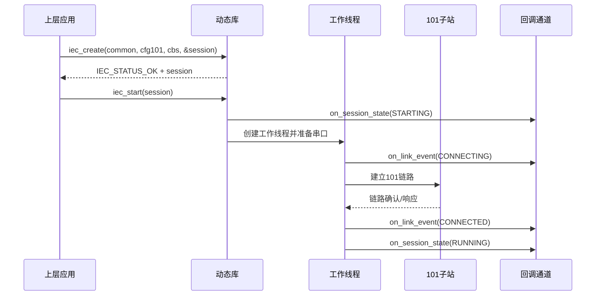

```c
/* 公共配置: 定义协议类型、超时、重连策略和回调上下文。 */
iec_session_config_t common = {
    .protocol = IEC_PROTOCOL_101,            /* 本会话选择 101 主站 */
    .user_context = app_ctx,                 /* 原样透传给所有回调 */
    .startup_timeout_ms = 3000,              /* 启动等待窗口 */
    .stop_timeout_ms = 3000,                 /* 停止等待窗口 */
    .reconnect_interval_ms = 1000,           /* 重连间隔, 允许运行时调整 */
    .command_timeout_ms = 2000,              /* 命令超时, 允许运行时调整 */
    .enable_raw_asdu = 0,                    /* 初始保持原始 ASDU 旁路关闭 */
    .enable_log_callback = 1,                /* 初始开启日志回调 */
    .initial_log_level = IEC_LOG_INFO        /* 日志初始等级 */
};

/* 101 扩展配置: 定义串口参数、链路模式和地址长度。 */
iec101_master_config_t cfg101 = {
    .profile = IEC101_PROFILE_STANDARD,       /* 当前流程按标准 101 展开 */
    .serial_device = "/dev/ttyS1",           /* 串口设备路径 */
    .baud_rate = 9600,                       /* 波特率 */
    .data_bits = 8,                          /* 数据位 */
    .stop_bits = 1,                          /* 停止位 */
    .parity = IEC101_PARITY_EVEN,            /* 奇偶校验方式 */
    .link_mode = IEC101_LINK_MODE_UNBALANCED, /* 链路模式 */
    .link_address = 1,                       /* 对端链路地址 */
    .link_address_length = 1,                /* 链路地址长度 */
    .common_address_length = 2,              /* 公共地址长度 */
    .information_object_address_length = 3,  /* 信息体地址长度 */
    .cot_length = 2,                         /* 传送原因长度 */
    .use_single_char_ack = 1,                /* 是否启用单字符确认 */
    .ack_timeout_ms = 1000,                  /* 等待确认超时 */
    .repeat_timeout_ms = 1000,               /* 重发间隔 */
    .repeat_count = 3                        /* 最大重发次数 */
};

/* 回调集合: 所有异步事件都在 create 阶段一次性注册。 */
iec_callbacks_t cbs = {
    .on_session_state = on_session_state,    /* 生命周期状态变化 */
    .on_link_event = on_link_event,          /* 链路事件 */
    .on_point_indication = on_point_indication, /* 高层点表上送 */
    .on_command_result = on_command_result,  /* 命令结果 */
    .on_device_description = on_device_description, /* 自描述回调 */
    .on_parameter_indication = on_parameter_indication, /* 参数读取回调 */
    .on_parameter_result = on_parameter_result, /* 参数结果回调 */
    .on_raw_asdu = NULL,                     /* 本例聚焦高层点表主路径 */
    .on_log = on_log                         /* 日志回调 */
};

/* 会话句柄由库分配, create 成功后由调用方持有。 */
iec_session_t *session = NULL;

/* create 完成参数校验和对象初始化，串口与链路在 start 阶段建立。 */
iec_create(&common, &cfg101, &cbs, &session);

/* start 创建工作线程并进入 101 主站建链流程。 */
iec_start(session);
```

典型事件顺序如下：

1. `on_session_state(STARTING)`
2. `on_link_event(CONNECTING)`
3. `on_link_event(CONNECTED)`
4. `on_session_state(RUNNING)`

### 7.2 IEC 104 主站创建与启动流程

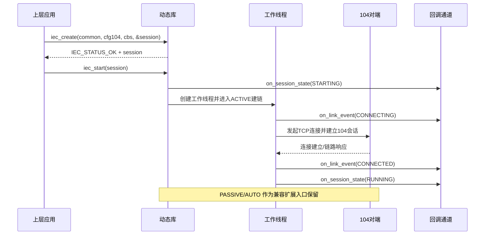

```c
/* 公共配置: 104 与 101 共用同一套公共配置结构。 */
iec_session_config_t common = {
    .protocol = IEC_PROTOCOL_104,            /* 本会话选择 104 主站 */
    .user_context = app_ctx,                 /* 原样透传给所有回调 */
    .startup_timeout_ms = 5000,              /* 启动等待窗口 */
    .stop_timeout_ms = 3000,                 /* 停止等待窗口 */
    .reconnect_interval_ms = 2000,           /* 重连间隔 */
    .command_timeout_ms = 3000,              /* 命令超时 */
    .enable_raw_asdu = 1,                    /* 104 联调阶段建议打开旁路 */
    .enable_log_callback = 1,                /* 开启日志回调 */
    .initial_log_level = IEC_LOG_INFO        /* 日志初始等级 */
};

/* 104 扩展配置: 定义远端地址、端口和 K/W/T 参数。 */
iec104_master_config_t cfg104 = {
    .remote_host = "192.168.1.10",           /* 远端主机地址 */
    .remote_port = 2404,                     /* 远端端口 */
    .local_bind_port = 0,                    /* 本地绑定端口, 0 表示系统分配 */
    .local_bind_host = NULL,                 /* 本地绑定地址, NULL 表示默认 */
    .connect_mode = IEC104_CONNECT_MODE_ACTIVE, /* 当前流程按主动连接模式展开 */
    .common_address_length = 2,              /* 公共地址长度 */
    .information_object_address_length = 3,  /* 信息体地址长度 */
    .cot_length = 2,                         /* 传送原因长度 */
    .k = 12,                                 /* 发送窗口 */
    .w = 8,                                  /* 接收确认窗口 */
    .t0_ms = 30000,                          /* 建链超时 */
    .t1_ms = 15000,                          /* 报文确认超时 */
    .t2_ms = 10000,                          /* 延迟确认超时 */
    .t3_ms = 20000                           /* 空闲测试周期 */
};

/* 回调集合: 104 场景下开启原始 ASDU 观察。 */
iec_callbacks_t cbs = {
    .on_session_state = on_session_state,    /* 生命周期状态变化 */
    .on_link_event = on_link_event,          /* 链路事件 */
    .on_point_indication = on_point_indication, /* 高层点表上送 */
    .on_command_result = on_command_result,  /* 命令结果 */
    .on_device_description = on_device_description, /* 自描述回调 */
    .on_parameter_indication = on_parameter_indication, /* 参数读取回调 */
    .on_parameter_result = on_parameter_result, /* 参数结果回调 */
    .on_raw_asdu = on_raw_asdu,              /* 原始 ASDU 旁路 */
    .on_log = on_log                         /* 日志回调 */
};

/* 句柄创建和启动流程与 101 保持一致。 */
iec_session_t *session = NULL;
iec_create(&common, &cfg104, &cbs, &session);
iec_start(session);
```

说明如下：

- `connect_mode` 提供 `ACTIVE`、`PASSIVE`、`AUTO` 三种接口入口，当前流程按 `ACTIVE` 模式展开。
- 当前实现完整覆盖 `ACTIVE` 模式，其余模式保留为兼容扩展入口，并通过 `IEC_STATUS_UNSUPPORTED` 提供明确反馈。
- 原始 ASDU 观察作为并行调试通道，与高层点表主路径协同工作。

### 7.3 点表上报流程

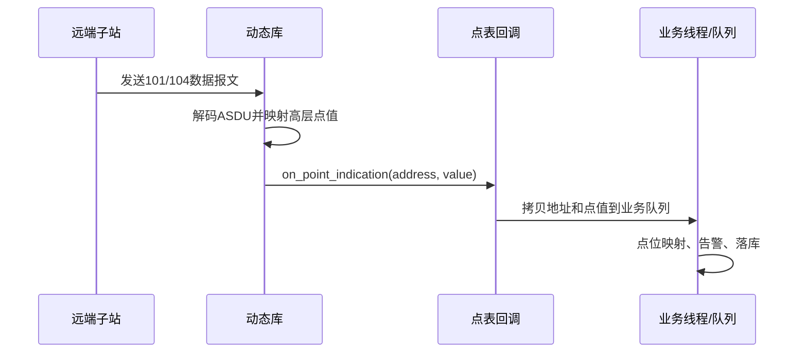

```c
/* 点表回调: 高层对象通过地址 + 点值的组合上送给业务层。 */
static void on_point_indication(
    iec_session_t *session,                  /* 触发回调的会话 */
    const iec_point_address_t *address,      /* 协议原生地址 */
    const iec_point_value_t *value,          /* 已解码的高层点值 */
    void *user_context)                      /* create 时注册的用户上下文 */
{
    (void)session;
    (void)user_context;

    /* 业务层通常先按点值类型做快速分流。 */
    if (value->point_type == IEC_POINT_SINGLE) {
        /* 将遥信更新转发给业务队列, 避免在回调线程里做重处理。 */
    }
}
```

推荐处理步骤如下：

1. 在回调中快速判定 `point_type`。
2. 将 `address` 与 `value` 拷贝到业务队列。
3. 业务线程做点位映射、告警和落库。
4. 回调线程尽快返回，避免阻塞后续收发。

### 7.4 原始 ASDU 旁路流程

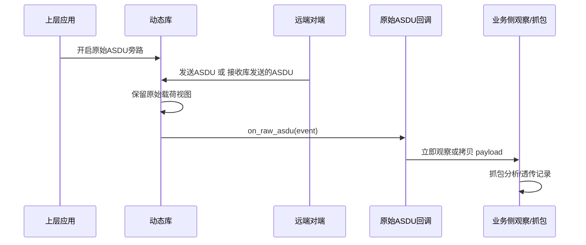

```c
/* 原始 ASDU 回调: 用于联调抓包或观察未纳入高层对象的报文。 */
static void on_raw_asdu(
    iec_session_t *session,                  /* 触发回调的会话 */
    const iec_raw_asdu_event_t *event,       /* 原始 ASDU 事件视图 */
    void *user_context)                      /* create 时注册的用户上下文 */
{
    (void)session;
    (void)user_context;

    /* 如需长期保存报文，可在回调里立即拷贝 payload。 */
    /* 将 event->payload 拷贝到抓包环形缓冲区。 */
}
```

推荐处理步骤如下：

1. 推荐在调试、联调或特殊透传场景开启旁路。
2. 回调中以轻量级拷贝或摘要记录为宜。
3. 业务层如需长期保存报文，可立即复制 `payload`。

### 7.5 参数读取流程

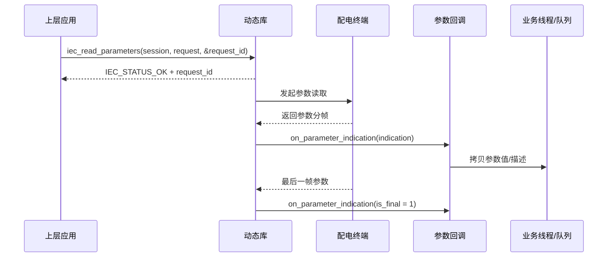

```c
/* 读取运行参数，并同时拉取参数描述信息，用于首屏建模。 */
iec_parameter_read_request_t req = {
    .common_address = 1,                        /* 目标公共地址 */
    .read_mode = IEC_PARAMETER_READ_BY_SCOPE,  /* 按参数域读取 */
    .scope = IEC_PARAMETER_SCOPE_RUNNING,      /* 运行参数 */
    .group_name = NULL,                        /* 不按分组过滤 */
    .start_address = 0,                        /* 非地址范围模式时忽略 */
    .end_address = 0,                          /* 非地址范围模式时忽略 */
    .setting_group = 0,                        /* 0 表示当前定值区 */
    .include_descriptor = 1                    /* 同时返回参数描述信息 */
};

uint32_t request_id = 0;
iec_read_parameters(session, &req, &request_id);

static void on_parameter_indication(
    iec_session_t *session,
    const iec_parameter_indication_t *indication,
    void *user_context)
{
    (void)session;
    (void)user_context;

    /* 首次建模场景下可以同时缓存参数值与参数描述。 */
    if (indication->has_descriptor) {
        /* 缓存参数名称、单位、范围和模板能力。 */
    }

    /* 将参数值拷贝到业务队列，避免在回调线程做重处理。 */
    if (indication->is_final) {
        /* 标记该 request_id 对应的参数读取完成。 */
    }
}
```

推荐处理步骤如下：

1. 首次接入终端时可设置 `include_descriptor = 1`，同时获取参数描述信息。
2. 频繁刷新场景只拉取参数值，避免重复传输参数元数据。
3. 上层按 `request_id` 归并一轮参数读取返回，并以 `is_final` 作为完成标识。

### 7.6 参数写入与回读校验流程

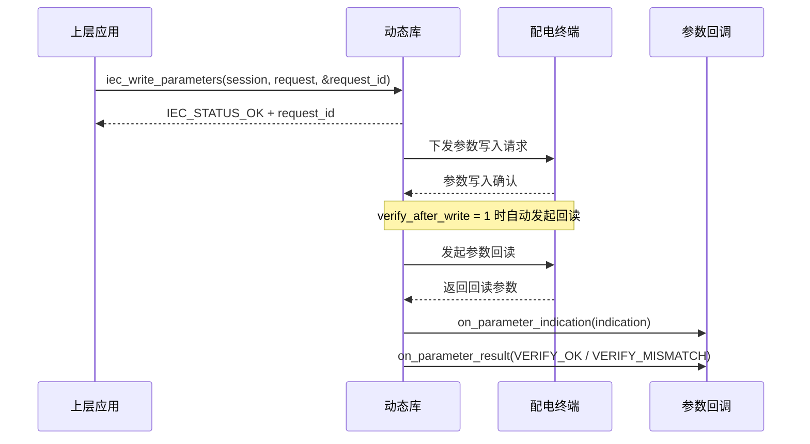

```c
iec_parameter_item_t items[2] = {
    {
        .parameter_id = 0x8020,                 /* 电流死区 */
        .address = 0x8020,
        .scope = IEC_PARAMETER_SCOPE_RUNNING,
        .value_type = IEC_PARAMETER_VALUE_FLOAT,
        .value.float_value = 0.05f
    },
    {
        .parameter_id = 0x8021,                 /* 交流电压死区 */
        .address = 0x8021,
        .scope = IEC_PARAMETER_SCOPE_RUNNING,
        .value_type = IEC_PARAMETER_VALUE_FLOAT,
        .value.float_value = 0.01f
    }
};

iec_parameter_write_request_t write_req = {
    .common_address = 1,
    .setting_group = 0,                         /* 当前定值区 */
    .items = items,
    .item_count = 2,
    .verify_after_write = 1                    /* 写后自动回读校验 */
};

uint32_t request_id = 0;
iec_write_parameters(session, &write_req, &request_id);

static void on_parameter_result(
    iec_session_t *session,
    const iec_parameter_result_t *result,
    void *user_context)
{
    (void)session;
    (void)user_context;

    if (result->operation == IEC_PARAMETER_OPERATION_WRITE &&
        result->result == IEC_PARAMETER_RESULT_ACCEPTED) {
        /* 参数写入已被接受，等待自动回读校验结果。 */
    }

    if (result->operation == IEC_PARAMETER_OPERATION_VERIFY &&
        result->result == IEC_PARAMETER_RESULT_VERIFY_MISMATCH) {
        /* 标记模板下发失败，并提示上层查看具体回读值。 */
    }
}
```

推荐处理步骤如下：

1. 模板下发场景下建议始终开启 `verify_after_write`。
2. 对重要参数可在写入完成后再次调用 `iec_verify_parameters` 做显式抽查。
3. 当出现 `VERIFY_MISMATCH` 时，应结合 `on_parameter_indication` 中的回读值做差异定位。

### 7.7 定值区切换流程

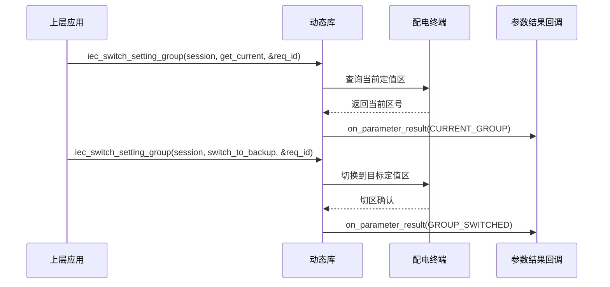

```c
iec_setting_group_request_t group_req = {
    .common_address = 1,
    .action = IEC_SETTING_GROUP_ACTION_SWITCH, /* 切换动作 */
    .target_group = 2                          /* 目标定值区 */
};

uint32_t group_request_id = 0;
iec_switch_setting_group(session, &group_req, &group_request_id);
```

推荐处理步骤如下：

1. 修改多定值区参数前，先查询当前区或显式执行切区。
2. 切区成功后再发起 `iec_read_parameters` 或 `iec_write_parameters`，避免上层误操作到错误区。
3. 对“当前区”和“目标区”的展示由上层根据 `request_id` 和结果码维护。

### 7.8 终端自描述获取流程

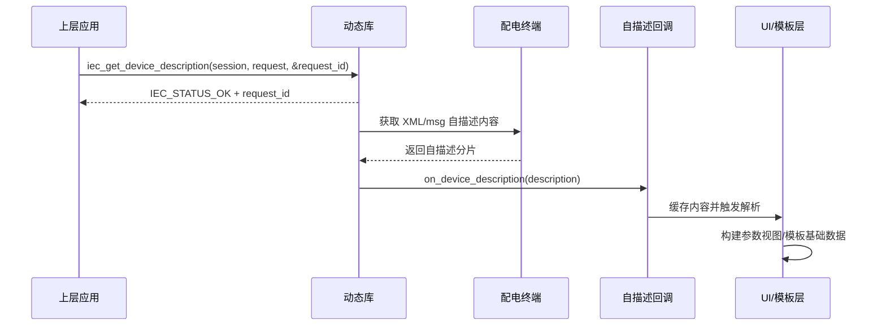

```c
iec_device_description_request_t desc_req = {
    .common_address = 1,
    .preferred_format = IEC_DEVICE_DESCRIPTION_FORMAT_XML,
    .max_content_size = 64 * 1024
};

uint32_t desc_request_id = 0;
iec_get_device_description(session, &desc_req, &desc_request_id);

static void on_device_description(
    iec_session_t *session,
    const iec_device_description_t *description,
    void *user_context)
{
    (void)session;
    (void)user_context;

    /* 若内容分片返回，应按 request_id 聚合后再交给 XML/msg 解析层。 */
    if (description->is_complete) {
        /* 触发模型解析和界面生成。 */
    }
}
```

推荐处理步骤如下：

1. 自描述内容获取应优先发生在首次连接和设备模型变更场景。
2. 动态库只负责把 XML 或 msg 内容安全取回，不负责解析成最终界面。
3. 上层可基于自描述内容构建参数模板、点表映射和界面分组信息。

### 7.9 文件目录召唤流程

以下流程以支持文件服务的终端为例；若目标终端或协议 profile 不支持该能力，库应返回明确的 `IEC_STATUS_UNSUPPORTED` 或异步结果码。

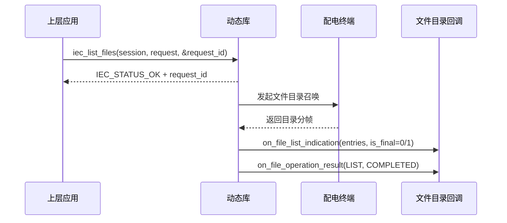

```c
iec_file_list_request_t list_req = {
    .common_address = 1,
    .directory_name = "/maint",
    .include_details = 1
};

uint32_t list_request_id = 0;
iec_list_files(session, &list_req, &list_request_id);
```

推荐处理步骤如下：

1. 首次目录召唤建议开启 `include_details = 1`，同时获取大小、时间戳和校验摘要。
2. `on_file_list_indication` 负责分帧返回目录项，`on_file_operation_result` 负责标记本次目录请求是否最终完成。
3. 目录项和字符串字段仅在回调期间有效，若上层需要用于界面展示或后续传输，应立即拷贝。

### 7.10 文件读取与断点续传流程

以下流程用于从终端读取文件，并在链路中断后依据最近已确认偏移恢复传输。

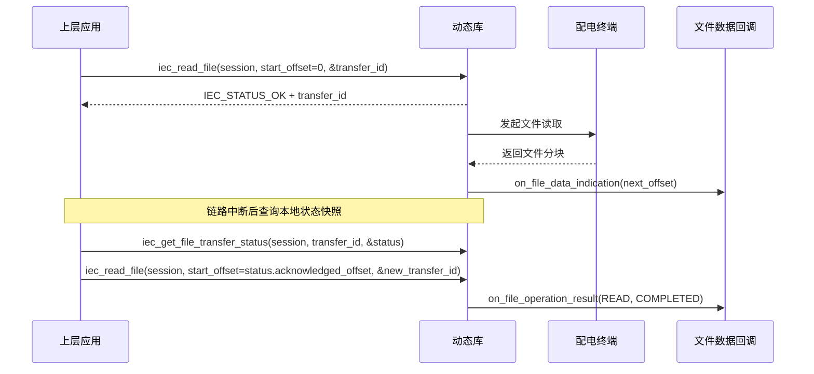

```c
iec_file_read_request_t read_req = {
    .common_address = 1,
    .directory_name = "/maint",
    .file_name = "terminal.xml",
    .start_offset = 0,
    .max_chunk_size = 1024,                  /* 运维101场景下建议按 1024 字节窗口读取 */
    .expected_file_size = 0
};

uint32_t read_transfer_id = 0;
iec_read_file(session, &read_req, &read_transfer_id);

static void on_file_data_indication(
    iec_session_t *session,
    const iec_file_data_indication_t *indication,
    void *user_context)
{
    (void)session;
    (void)user_context;

    /* 立即拷贝当前数据块并记录 next_offset, 供断点续传恢复使用。 */
    (void)indication;
}

iec_file_transfer_status_t read_status;
iec_get_file_transfer_status(session, read_transfer_id, &read_status);
if (read_status.is_resumable) {
    read_req.start_offset = read_status.acknowledged_offset;
    iec_read_file(session, &read_req, &read_transfer_id);
}
```

推荐处理步骤如下：

1. 文件读取过程中应始终以 `next_offset` 或 `acknowledged_offset` 作为唯一可信恢复点。
2. 回调内不要直接写磁盘或做大块解压，宜先拷贝到业务缓冲区，再交给后台线程处理。
3. 若 `on_file_operation_result` 返回 `OFFSET_MISMATCH`，应重新同步目录信息或按终端当前偏移重新发起读取。

### 7.11 文件写入与断点续传流程

以下流程以 `iec101_master_config_t.profile = IEC101_PROFILE_MAINTENANCE` 为例，展示如何向终端写入文件并按已确认偏移续传。

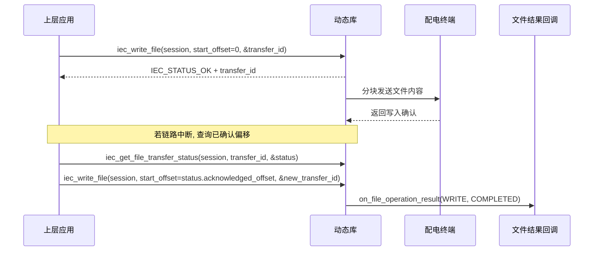

```c
const uint8_t *image = firmware_blob;
uint32_t image_size = firmware_blob_size;

iec_file_write_request_t write_req = {
    .common_address = 1,
    .directory_name = "/upgrade",
    .file_name = "fw.bin",
    .start_offset = 0,
    .total_size = image_size,
    .content = image,
    .content_size = image_size,
    .preferred_chunk_size = 1024,            /* 运维101场景下建议按 1024 字节窗口写入 */
    .overwrite_existing = 1
};

uint32_t write_transfer_id = 0;
iec_write_file(session, &write_req, &write_transfer_id);

iec_file_transfer_status_t write_status;
iec_get_file_transfer_status(session, write_transfer_id, &write_status);
if (write_status.is_resumable && write_status.acknowledged_offset < image_size) {
    write_req.start_offset = write_status.acknowledged_offset;
    write_req.content = image + write_status.acknowledged_offset;
    write_req.content_size = image_size - write_status.acknowledged_offset;
    iec_write_file(session, &write_req, &write_transfer_id);
}
```

推荐处理步骤如下：

1. 文件写入的 `total_size` 始终描述远端完整目标文件大小，即使当前只是续传窗口。
2. 续传时只更新 `start_offset`、`content` 和 `content_size`，不要修改目标文件名和总大小。
3. 运维101文件写入场景下建议以 `1024` 字节作为单块发送窗口上限，超过部分由库自动拆分并推进偏移。
4. 文件写入最终成功、失败、取消或否定确认都以 `on_file_operation_result` 为准。

## 8. 运行约束与设计说明

### 8.1 生命周期约束

- `iec_create` 成功后会话状态为 `IEC_RUNTIME_CREATED`。
- `iec_start` 触发状态流转 `CREATED -> STARTING -> RUNNING`。
- `iec_stop` 触发状态流转 `RUNNING -> STOPPING -> STOPPED`。
- 运行过程中遇到严重不可恢复异常时，会话可进入 `IEC_RUNTIME_FAULTED`。

### 8.2 C 接口与内存所有权约束

- 所有导出函数使用 C ABI。
- `iec_session_t` 为 opaque handle，禁止用户栈上构造或复制。
- 公共结构体直接按头文件定义传递，调用方与动态库应基于同一版本头文件编译。
- 用户传入 `iec_create` 的配置结构体和回调结构体，在函数返回后可释放，动态库内部应完成必要拷贝。
- 用户传入的字符串参数在 `iec_create` 返回前必须有效，返回后是否长期保留由库内部拷贝决定。
- 回调收到的事件数据由动态库持有，在回调执行窗口内供调用方读取和拷贝。
- 文件写入请求中的 `content` 只表达本次待发送窗口；调用方可选择一次性提供完整内容，也可在续传场景下提供剩余窗口。
- 接口返回模式统一采用调用方缓冲区和回调只读视图。

### 8.3 错误处理约束

同步返回码用于描述调用级别结果，包括：

- 参数非法。
- 当前状态与调用语义不匹配。
- 预留能力或当前实现范围外的能力。
- 资源不足。
- 底层 I/O 提交失败。

异步事件用于描述运行期结果，包括：

- 链路连接建立和断开。
- 重连开始和恢复。
- 对端复位。
- 运行期协议错误。
- 命令应答结果。
- 参数写入、参数校验和定值区切换结果。
- 文件目录召唤、文件读取、文件写入和取消结果。
- 日志和告警信息。

推荐约定如下：

- 同步返回 `IEC_STATUS_OK` 表示请求已进入处理流程，业务动作的完成情况通过后续回调体现。
- 命令下发最终结果以 `on_command_result` 为准。
- 参数写入、参数校验和定值区切换最终结果以 `on_parameter_result` 为准。
- 文件目录、文件读取、文件写入和取消最终结果以 `on_file_operation_result` 为准；若出现协议否定确认、传送原因异常或厂商扩展错误，应优先读取其中的诊断字段。
- 运行期链路变化和协议事件通过异步回调通知上层。

### 8.4 高层数据主路径与原始旁路关系

- 高层点表接口是默认主路径，业务系统应优先依赖 `on_point_indication`。
- 参数接口是独立主路径，参数读取和参数写入不应通过点表接口或遥控接口拼装实现。
- 文件接口是独立主路径，目录召唤、文件传输和断点续传不应通过 `iec_send_raw_asdu` 或自定义旁路报文暴露给上层。
- 原始 ASDU 旁路作为调试抓包、扩展报文观察和受控透传通道。
- 即使开启原始 ASDU 旁路，高层解码成功的报文仍继续生成高层事件。
- `bypass_high_level_validation` 作用于高层对象约束，底层安全检查保持有效。

### 8.5 参数与文件接口边界

- 动态库负责参数读取、参数写入、回读校验、定值区切换、自描述获取以及协议字段与高层参数对象之间的映射。
- 动态库负责文件目录召唤、文件读取、文件写入、传输状态维护、取消和断点续传恢复点管理。
- 参数模板文件的导入、导出、版本管理和落盘由上层应用负责，不纳入动态库职责范围。
- 本地文件的落盘、缓存目录管理、升级包来源校验和断点内容持久化由上层应用负责，不纳入动态库职责范围。
- 自描述内容的 XML 或 msg 解析、参数分组展示、界面控件生成和参数变更审计由上层应用负责。
- 无线模块、电源模块、线损模块在接口层统一视为参数域，避免为具体业务模块重复设计函数族。
- `iec_read_point` 适合点表对象读取，不负责表达“读取全部运行参数”“读取某定值区全部参数”这类参数语义。
- `iec_control_point` 适合遥控和设定值命令，不承担模板下发、参数批量写入和回读校验职责。
- 通用文件 API 负责目录、数据块和续传偏移等高层文件语义；`iec_get_device_description` 继续承担终端模型文件的专用获取入口。

## 9. 头文件组织建议

建议对外头文件按以下方式拆分：

- `include/iec/iec_types.h`
- `include/iec/iec_api.h`
- `include/iec/iec101_api.h`
- `include/iec/iec104_api.h`

建议组织原则如下：

- `iec_types.h` 放公共枚举、结构体、参数对象、文件对象和回调类型。
- `iec_api.h` 放公共生命周期、运行控制、数据面接口、参数接口和文件接口。
- `iec101_api.h` 放 101 扩展配置、profile 枚举、校验函数和未来专用能力。
- `iec104_api.h` 放 104 扩展配置、校验函数和未来专用能力。
